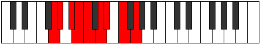

# Mode Thydyllic

## Links

- [Documentation](index.md)
- [Scales Index](Scales.md)
- [Modes Index](Modes.md)
- [Chords Index](Chords.md)

## Parent Scale

[Ionoptyllic](ScaleIonoptyllic.md)

## Number

[1467](https://ianring.com/musictheory/scales/1467)

## Perfection

- 6 Perfect notes
- 2 Perfect notes

## Perfection Profile

[true true true false true false true true]

## Permutations

| Tonic | Notes | Signature | Illustration | Audio |
|-------|-------|-----------|--------------|-------|
| [C](ModeCNaturalThydyllic.md) | C, C#, D#, **E**, F, **G**, G#, A#, C | C |  | [midi](ModeCNaturalThydyllic.mid) [ogg](ModeCNaturalThydyllic.ogg) |
| [C#](ModeCSharpThydyllic.md) | C#, D, E, **F**, F#, **G#**, A, B, C# | C |  | [midi](ModeCSharpThydyllic.mid) [ogg](ModeCSharpThydyllic.ogg) |
| [Db](ModeDFlatThydyllic.md) | Db, D, E, **F**, Gb, **Ab**, A, B, Db | C |  | [midi](ModeDFlatThydyllic.mid) [ogg](ModeDFlatThydyllic.ogg) |
| [D](ModeDNaturalThydyllic.md) | D, D#, F, **F#**, G, **A**, A#, C, D | C |  | [midi](ModeDNaturalThydyllic.mid) [ogg](ModeDNaturalThydyllic.ogg) |
| [D#](ModeDSharpThydyllic.md) | D#, E, F#, **G**, G#, **A#**, B, C#, D# | C |  | [midi](ModeDSharpThydyllic.mid) [ogg](ModeDSharpThydyllic.ogg) |
| [Eb](ModeEFlatThydyllic.md) | Eb, E, Gb, **G**, Ab, **Bb**, B, Db, Eb | C |  | [midi](ModeEFlatThydyllic.mid) [ogg](ModeEFlatThydyllic.ogg) |
| [E](ModeENaturalThydyllic.md) | E, F, G, **G#**, A, **B**, C, D, E | C |  | [midi](ModeENaturalThydyllic.mid) [ogg](ModeENaturalThydyllic.ogg) |
| [F](ModeFNaturalThydyllic.md) | F, F#, G#, **A**, A#, **C**, C#, D#, F | C |  | [midi](ModeFNaturalThydyllic.mid) [ogg](ModeFNaturalThydyllic.ogg) |
| [F#](ModeFSharpThydyllic.md) | F#, G, A, **A#**, B, **C#**, D, E, F# | C |  | [midi](ModeFSharpThydyllic.mid) [ogg](ModeFSharpThydyllic.ogg) |
| [Gb](ModeGFlatThydyllic.md) | Gb, G, A, **Bb**, B, **Db**, D, E, Gb | C |  | [midi](ModeGFlatThydyllic.mid) [ogg](ModeGFlatThydyllic.ogg) |
| [G](ModeGNaturalThydyllic.md) | G, G#, A#, **B**, C, **D**, D#, F, G | C |  | [midi](ModeGNaturalThydyllic.mid) [ogg](ModeGNaturalThydyllic.ogg) |
| [G#](ModeGSharpThydyllic.md) | G#, A, B, **C**, C#, **D#**, E, F#, G# | C |  | [midi](ModeGSharpThydyllic.mid) [ogg](ModeGSharpThydyllic.ogg) |
| [Ab](ModeAFlatThydyllic.md) | Ab, A, B, **C**, Db, **Eb**, E, Gb, Ab | C |  | [midi](ModeAFlatThydyllic.mid) [ogg](ModeAFlatThydyllic.ogg) |
| [A](ModeANaturalThydyllic.md) | A, A#, C, **C#**, D, **E**, F, G, A | C |  | [midi](ModeANaturalThydyllic.mid) [ogg](ModeANaturalThydyllic.ogg) |
| [A#](ModeASharpThydyllic.md) | A#, B, C#, **D**, D#, **F**, F#, G#, A# | C |  | [midi](ModeASharpThydyllic.mid) [ogg](ModeASharpThydyllic.ogg) |
| [Bb](ModeBFlatThydyllic.md) | Bb, B, Db, **D**, Eb, **F**, Gb, Ab, Bb | C |  | [midi](ModeBFlatThydyllic.mid) [ogg](ModeBFlatThydyllic.ogg) |
| [B](ModeBNaturalThydyllic.md) | B, C, D, **D#**, E, **F#**, G, A, B | C |  | [midi](ModeBNaturalThydyllic.mid) [ogg](ModeBNaturalThydyllic.ogg) |
