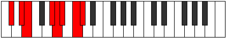

# Mode Thygian

## Links

- [Documentation](index.md)
- [Scales Index](Scales.md)
- [Modes Index](Modes.md)
- [Chords Index](Chords.md)

## Parent Scale

[Aeolathian](ScaleAeolathian.md)

## Number

[2957](https://ianring.com/musictheory/scales/2957)

## Perfection

- 4 Perfect notes
- 3 Perfect notes

## Perfection Profile

[true true false true true false false]

## Permutations

| Tonic | Notes | Signature | Illustration | Audio |
|-------|-------|-----------|--------------|-------|
| [C](ModeCNaturalThygian.md) | C, D, **Eb**, F##, G#, **A**, **B**, C | C |  | [midi](ModeCNaturalThygian.mid) [ogg](ModeCNaturalThygian.ogg) |
| [C#](ModeCSharpThygian.md) | C#, D#, **E**, F###, G##, **A#**, **B#**, C# | C |  | [midi](ModeCSharpThygian.mid) [ogg](ModeCSharpThygian.ogg) |
| [Db](ModeDFlatThygian.md) | Db, Eb, **Fb**, G#, A, **Bb**, **C**, Db | C |  | [midi](ModeDFlatThygian.mid) [ogg](ModeDFlatThygian.ogg) |
| [D](ModeDNaturalThygian.md) | D, E, **F**, G##, A#, **B**, **C#**, D | C |  | [midi](ModeDNaturalThygian.mid) [ogg](ModeDNaturalThygian.ogg) |
| [D#](ModeDSharpThygian.md) | D#, E#, **F#**, G###, A##, **B#**, **C##**, D# | C |  | [midi](ModeDSharpThygian.mid) [ogg](ModeDSharpThygian.ogg) |
| [Eb](ModeEFlatThygian.md) | Eb, F, **Gb**, A#, B, **C**, **D**, Eb | C |  | [midi](ModeEFlatThygian.mid) [ogg](ModeEFlatThygian.ogg) |
| [E](ModeENaturalThygian.md) | E, F#, **G**, A##, B#, **C#**, **D#**, E | C |  | [midi](ModeENaturalThygian.mid) [ogg](ModeENaturalThygian.ogg) |
| [F](ModeFNaturalThygian.md) | F, G, **Ab**, B#, C#, **D**, **E**, F | C |  | [midi](ModeFNaturalThygian.mid) [ogg](ModeFNaturalThygian.ogg) |
| [F#](ModeFSharpThygian.md) | F#, G#, **A**, B##, C##, **D#**, **E#**, F# | C |  | [midi](ModeFSharpThygian.mid) [ogg](ModeFSharpThygian.ogg) |
| [Gb](ModeGFlatThygian.md) | Gb, Ab, **Bbb**, C#, D, **Eb**, **F**, Gb | C |  | [midi](ModeGFlatThygian.mid) [ogg](ModeGFlatThygian.ogg) |
| [G](ModeGNaturalThygian.md) | G, A, **Bb**, C##, D#, **E**, **F#**, G | C |  | [midi](ModeGNaturalThygian.mid) [ogg](ModeGNaturalThygian.ogg) |
| [G#](ModeGSharpThygian.md) | G#, A#, **B**, C###, D##, **E#**, **F##**, G# | C |  | [midi](ModeGSharpThygian.mid) [ogg](ModeGSharpThygian.ogg) |
| [Ab](ModeAFlatThygian.md) | Ab, Bb, **Cb**, D#, E, **F**, **G**, Ab | C |  | [midi](ModeAFlatThygian.mid) [ogg](ModeAFlatThygian.ogg) |
| [A](ModeANaturalThygian.md) | A, B, **C**, D##, E#, **F#**, **G#**, A | C |  | [midi](ModeANaturalThygian.mid) [ogg](ModeANaturalThygian.ogg) |
| [A#](ModeASharpThygian.md) | A#, B#, **C#**, D###, E##, **F##**, **G##**, A# | C |  | [midi](ModeASharpThygian.mid) [ogg](ModeASharpThygian.ogg) |
| [Bb](ModeBFlatThygian.md) | Bb, C, **Db**, E#, F#, **G**, **A**, Bb | C |  | [midi](ModeBFlatThygian.mid) [ogg](ModeBFlatThygian.ogg) |
| [B](ModeBNaturalThygian.md) | B, C#, **D**, E##, F##, **G#**, **A#**, B | C |  | [midi](ModeBNaturalThygian.mid) [ogg](ModeBNaturalThygian.ogg) |
