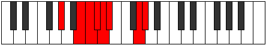

# Mode Thylian

## Links

- [Documentation](index.md)
- [Scales Index](Scales.md)
- [Modes Index](Modes.md)
- [Chords Index](Chords.md)

## Parent Scale

[Parian](ScaleParian.md)

## Number

[2297](https://ianring.com/musictheory/scales/2297)

## Perfection

- 4 Perfect notes
- 3 Perfect notes

## Perfection Profile

[true false true true false false true]

## Permutations

| Tonic | Notes | Signature | Illustration | Audio |
|-------|-------|-----------|--------------|-------|
| [C](ModeCNaturalThylian.md) | C, **D#**, E, F, **Gb**, **Abb**, B, C | C |  | [midi](ModeCNaturalThylian.mid) [ogg](ModeCNaturalThylian.ogg) |
| [C#](ModeCSharpThylian.md) | C#, **D##**, E#, F#, **G**, **Ab**, B#, C# | C |  | [midi](ModeCSharpThylian.mid) [ogg](ModeCSharpThylian.ogg) |
| [Db](ModeDFlatThylian.md) | Db, **E**, F, Gb, **Abb**, **Bbbb**, C, Db | C |  | [midi](ModeDFlatThylian.mid) [ogg](ModeDFlatThylian.ogg) |
| [D](ModeDNaturalThylian.md) | D, **E#**, F#, G, **Ab**, **Bbb**, C#, D | C |  | [midi](ModeDNaturalThylian.mid) [ogg](ModeDNaturalThylian.ogg) |
| [D#](ModeDSharpThylian.md) | D#, **E##**, F##, G#, **A**, **Bb**, C##, D# | C |  | [midi](ModeDSharpThylian.mid) [ogg](ModeDSharpThylian.ogg) |
| [Eb](ModeEFlatThylian.md) | Eb, **F#**, G, Ab, **Bbb**, **Cbb**, D, Eb | C |  | [midi](ModeEFlatThylian.mid) [ogg](ModeEFlatThylian.ogg) |
| [E](ModeENaturalThylian.md) | E, **F##**, G#, A, **Bb**, **Cb**, D#, E | C |  | [midi](ModeENaturalThylian.mid) [ogg](ModeENaturalThylian.ogg) |
| [F](ModeFNaturalThylian.md) | F, **G#**, A, Bb, **Cb**, **Dbb**, E, F | C |  | [midi](ModeFNaturalThylian.mid) [ogg](ModeFNaturalThylian.ogg) |
| [F#](ModeFSharpThylian.md) | F#, **G##**, A#, B, **C**, **Db**, E#, F# | C |  | [midi](ModeFSharpThylian.mid) [ogg](ModeFSharpThylian.ogg) |
| [Gb](ModeGFlatThylian.md) | Gb, **A**, Bb, Cb, **Dbb**, **Ebbb**, F, Gb | C |  | [midi](ModeGFlatThylian.mid) [ogg](ModeGFlatThylian.ogg) |
| [G](ModeGNaturalThylian.md) | G, **A#**, B, C, **Db**, **Ebb**, F#, G | C |  | [midi](ModeGNaturalThylian.mid) [ogg](ModeGNaturalThylian.ogg) |
| [G#](ModeGSharpThylian.md) | G#, **A##**, B#, C#, **D**, **Eb**, F##, G# | C |  | [midi](ModeGSharpThylian.mid) [ogg](ModeGSharpThylian.ogg) |
| [Ab](ModeAFlatThylian.md) | Ab, **B**, C, Db, **Ebb**, **Fbb**, G, Ab | C |  | [midi](ModeAFlatThylian.mid) [ogg](ModeAFlatThylian.ogg) |
| [A](ModeANaturalThylian.md) | A, **B#**, C#, D, **Eb**, **Fb**, G#, A | C |  | [midi](ModeANaturalThylian.mid) [ogg](ModeANaturalThylian.ogg) |
| [A#](ModeASharpThylian.md) | A#, **B##**, C##, D#, **E**, **F**, G##, A# | C |  | [midi](ModeASharpThylian.mid) [ogg](ModeASharpThylian.ogg) |
| [Bb](ModeBFlatThylian.md) | Bb, **C#**, D, Eb, **Fb**, **Gbb**, A, Bb | C |  | [midi](ModeBFlatThylian.mid) [ogg](ModeBFlatThylian.ogg) |
| [B](ModeBNaturalThylian.md) | B, **C##**, D#, E, **F**, **Gb**, A#, B | C |  | [midi](ModeBNaturalThylian.mid) [ogg](ModeBNaturalThylian.ogg) |
