# Mode Thylimic

## Links

- [Documentation](README.md)
- [Scales Index](Scales.md)
- [Modes Index](Modes.md)
- [Chords Index](Chords.md)

## Parent Scale

[Dagimic](ScaleDagimic.md)

## Number

[1613](https://ianring.com/musictheory/scales/1613)

## Transposition

2, 1, 3, 3, 1, 2

## Chord Pattern

II⁺, IV⁺, v⁰, VI⁺

## Perfection

- 2 Perfect notes
- 4 Perfect notes

## Perfection Profile

false, true, true, false, false, false

## Permutations

| Tonic | Notes | Signature | Illustration | Audio |
|-------|-------|-----------|--------------|-------|
| [C](ModeCNaturalThylimic.md) | **C**, D, Eb, **F#**, **G##**, **A#**, **C** | C | 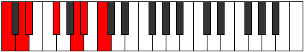 | [midi](https://github.com/edipermadi/music/blob/main/docs/ModeCNaturalThylimic.mid?raw=true) |
| [C#](ModeCSharpThylimic.md) | **C#**, D#, E, **F##**, **G###**, **A##**, **C#** | C | 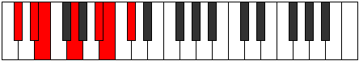 | [midi](https://github.com/edipermadi/music/blob/main/docs/ModeCSharpThylimic.mid?raw=true) |
| [Db](ModeDFlatThylimic.md) | **Db**, Eb, Fb, **G**, **A#**, **B**, **Db** | C |  | [midi](https://github.com/edipermadi/music/blob/main/docs/ModeDFlatThylimic.mid?raw=true) |
| [D](ModeDNaturalThylimic.md) | **D**, E, F, **G#**, **A##**, **B#**, **D** | C | 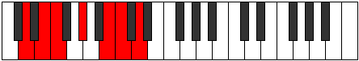 | [midi](https://github.com/edipermadi/music/blob/main/docs/ModeDNaturalThylimic.mid?raw=true) |
| [D#](ModeDSharpThylimic.md) | **D#**, E#, F#, **G##**, **A###**, **B##**, **D#** | C | 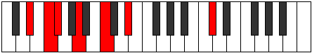 | [midi](https://github.com/edipermadi/music/blob/main/docs/ModeDSharpThylimic.mid?raw=true) |
| [Eb](ModeEFlatThylimic.md) | **Eb**, F, Gb, **A**, **B#**, **C#**, **Eb** | C | 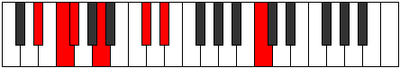 | [midi](https://github.com/edipermadi/music/blob/main/docs/ModeEFlatThylimic.mid?raw=true) |
| [E](ModeENaturalThylimic.md) | **E**, F#, G, **A#**, **B##**, **C##**, **E** | C | 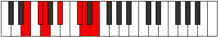 | [midi](https://github.com/edipermadi/music/blob/main/docs/ModeENaturalThylimic.mid?raw=true) |
| [F](ModeFNaturalThylimic.md) | **F**, G, Ab, **B**, **C##**, **D#**, **F** | C | 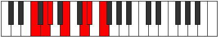 | [midi](https://github.com/edipermadi/music/blob/main/docs/ModeFNaturalThylimic.mid?raw=true) |
| [F#](ModeFSharpThylimic.md) | **F#**, G#, A, **B#**, **C###**, **D##**, **F#** | C | 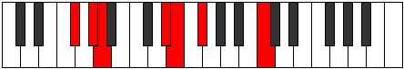 | [midi](https://github.com/edipermadi/music/blob/main/docs/ModeFSharpThylimic.mid?raw=true) |
| [Gb](ModeGFlatThylimic.md) | **Gb**, Ab, Bbb, **C**, **D#**, **E**, **Gb** | C | 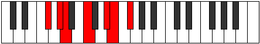 | [midi](https://github.com/edipermadi/music/blob/main/docs/ModeGFlatThylimic.mid?raw=true) |
| [G](ModeGNaturalThylimic.md) | **G**, A, Bb, **C#**, **D##**, **E#**, **G** | C | 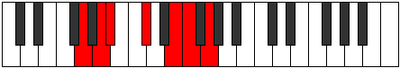 | [midi](https://github.com/edipermadi/music/blob/main/docs/ModeGNaturalThylimic.mid?raw=true) |
| [G#](ModeGSharpThylimic.md) | **G#**, A#, B, **C##**, **D###**, **E##**, **G#** | C | 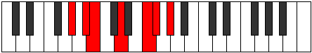 | [midi](https://github.com/edipermadi/music/blob/main/docs/ModeGSharpThylimic.mid?raw=true) |
| [Ab](ModeAFlatThylimic.md) | **Ab**, Bb, Cb, **D**, **E#**, **F#**, **Ab** | C |  | [midi](https://github.com/edipermadi/music/blob/main/docs/ModeAFlatThylimic.mid?raw=true) |
| [A](ModeANaturalThylimic.md) | **A**, B, C, **D#**, **E##**, **F##**, **A** | C | 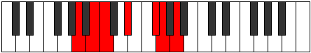 | [midi](https://github.com/edipermadi/music/blob/main/docs/ModeANaturalThylimic.mid?raw=true) |
| [A#](ModeASharpThylimic.md) | **A#**, B#, C#, **D##**, **E###**, **F###**, **A#** | C | 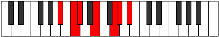 | [midi](https://github.com/edipermadi/music/blob/main/docs/ModeASharpThylimic.mid?raw=true) |
| [Bb](ModeBFlatThylimic.md) | **Bb**, C, Db, **E**, **F##**, **G#**, **Bb** | C |  | [midi](https://github.com/edipermadi/music/blob/main/docs/ModeBFlatThylimic.mid?raw=true) |
| [B](ModeBNaturalThylimic.md) | **B**, C#, D, **E#**, **F###**, **G##**, **B** | C | 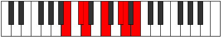 | [midi](https://github.com/edipermadi/music/blob/main/docs/ModeBNaturalThylimic.mid?raw=true) |
