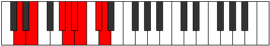
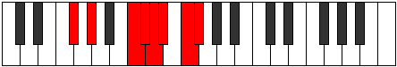

# Mode Thynian

## Links

- [Documentation](index.md)
- [Scales Index](Scales.md)
- [Modes Index](Modes.md)
- [Chords Index](Chords.md)

## Parent Scale

[Saptian](ScaleSaptian.md)

## Number

[3013](https://ianring.com/musictheory/scales/3013)

## Perfection

- 4 Perfect notes
- 3 Perfect notes

## Perfection Profile

[true true false true false false true]

## Permutations

| Tonic | Notes | Signature | Illustration | Audio |
|-------|-------|-----------|--------------|-------|
| [C](ModeCNaturalThynian.md) | C, D, **E##**, F##, **G#**, **A**, B, C | C |  | [midi](ModeCNaturalThynian.mid) [ogg](ModeCNaturalThynian.ogg) |
| [C#](ModeCSharpThynian.md) | C#, D#, **E###**, F###, **G##**, **A#**, B#, C# | C |  | [midi](ModeCSharpThynian.mid) [ogg](ModeCSharpThynian.ogg) |
| [Db](ModeDFlatThynian.md) | Db, Eb, **F##**, G#, **A**, **Bb**, C, Db | C |  | [midi](ModeDFlatThynian.mid) [ogg](ModeDFlatThynian.ogg) |
| [D](ModeDNaturalThynian.md) | D, E, **F###**, G##, **A#**, **B**, C#, D | C |  | [midi](ModeDNaturalThynian.mid) [ogg](ModeDNaturalThynian.ogg) |
| [D#](ModeDSharpThynian.md) | D#, E#, **Cbbb**, Cbb, **Dbbb**, **Dbb**, Ebb, D# | C |  | [midi](ModeDSharpThynian.mid) [ogg](ModeDSharpThynian.ogg) |
| [Eb](ModeEFlatThynian.md) | Eb, F, **G##**, A#, **B**, **C**, D, Eb | C |  | [midi](ModeEFlatThynian.mid) [ogg](ModeEFlatThynian.ogg) |
| [E](ModeENaturalThynian.md) | E, F#, **G###**, A##, **B#**, **C#**, D#, E | C |  | [midi](ModeENaturalThynian.mid) [ogg](ModeENaturalThynian.ogg) |
| [F](ModeFNaturalThynian.md) | F, G, **A##**, B#, **C#**, **D**, E, F | C |  | [midi](ModeFNaturalThynian.mid) [ogg](ModeFNaturalThynian.ogg) |
| [F#](ModeFSharpThynian.md) | F#, G#, **A###**, B##, **C##**, **D#**, E#, F# | C |  | [midi](ModeFSharpThynian.mid) [ogg](ModeFSharpThynian.ogg) |
| [Gb](ModeGFlatThynian.md) | Gb, Ab, **B#**, C#, **D**, **Eb**, F, Gb | C |  | [midi](ModeGFlatThynian.mid) [ogg](ModeGFlatThynian.ogg) |
| [G](ModeGNaturalThynian.md) | G, A, **B##**, C##, **D#**, **E**, F#, G | C |  | [midi](ModeGNaturalThynian.mid) [ogg](ModeGNaturalThynian.ogg) |
| [G#](ModeGSharpThynian.md) | G#, A#, **B###**, C###, **D##**, **E#**, F##, G# | C |  | [midi](ModeGSharpThynian.mid) [ogg](ModeGSharpThynian.ogg) |
| [Ab](ModeAFlatThynian.md) | Ab, Bb, **C##**, D#, **E**, **F**, G, Ab | C |  | [midi](ModeAFlatThynian.mid) [ogg](ModeAFlatThynian.ogg) |
| [A](ModeANaturalThynian.md) | A, B, **C###**, D##, **E#**, **F#**, G#, A | C |  | [midi](ModeANaturalThynian.mid) [ogg](ModeANaturalThynian.ogg) |
| [A#](ModeASharpThynian.md) | A#, B#, **D##**, E#, **F#**, **G**, A, A# | C |  | [midi](ModeASharpThynian.mid) [ogg](ModeASharpThynian.ogg) |
| [Bb](ModeBFlatThynian.md) | Bb, C, **D##**, E#, **F#**, **G**, A, Bb | C |  | [midi](ModeBFlatThynian.mid) [ogg](ModeBFlatThynian.ogg) |
| [B](ModeBNaturalThynian.md) | B, C#, **D###**, E##, **F##**, **G#**, A#, B | C |  | [midi](ModeBNaturalThynian.mid) [ogg](ModeBNaturalThynian.ogg) |
