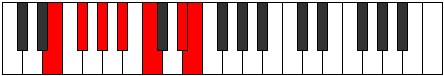

# Mode Thynimic

## Links

- [Documentation](README.md)
- [Scales Index](Scales.md)
- [Modes Index](Modes.md)
- [Chords Index](Chords.md)

## Parent Scale

[Boptimic](ScaleBoptimic.md)

## Number

[2389](https://ianring.com/musictheory/scales/2389)

## Transposition

2, 2, 2, 2, 3, 1

## Chord Pattern

I⁺, III⁺, V⁺, vi

## Perfection

- 2 Perfect notes
- 4 Perfect notes

## Perfection Profile

false, false, true, false, false, true

## Permutations

| Tonic | Notes | Signature | Illustration | Audio |
|-------|-------|-----------|--------------|-------|
| [C](ModeCNaturalThynimic.md) | **C**, **D**, E, **F#**, **G#**, A##, **C** | C |  | [midi](https://github.com/edipermadi/music/blob/main/docs/ModeCNaturalThynimic.mid?raw=true) |
| [C#](ModeCSharpThynimic.md) | **C#**, **D#**, E#, **F##**, **G##**, A###, **C#** | C |  | [midi](https://github.com/edipermadi/music/blob/main/docs/ModeCSharpThynimic.mid?raw=true) |
| [Db](ModeDFlatThynimic.md) | **Db**, **Eb**, F, **G**, **A**, B#, **Db** | C |  | [midi](https://github.com/edipermadi/music/blob/main/docs/ModeDFlatThynimic.mid?raw=true) |
| [D](ModeDNaturalThynimic.md) | **D**, **E**, F#, **G#**, **A#**, B##, **D** | C |  | [midi](https://github.com/edipermadi/music/blob/main/docs/ModeDNaturalThynimic.mid?raw=true) |
| [D#](ModeDSharpThynimic.md) | **D#**, **E#**, F##, **G##**, **A##**, B###, **D#** | C |  | [midi](https://github.com/edipermadi/music/blob/main/docs/ModeDSharpThynimic.mid?raw=true) |
| [Eb](ModeEFlatThynimic.md) | **Eb**, **F**, G, **A**, **B**, C##, **Eb** | C |  | [midi](https://github.com/edipermadi/music/blob/main/docs/ModeEFlatThynimic.mid?raw=true) |
| [E](ModeENaturalThynimic.md) | **E**, **F#**, G#, **A#**, **B#**, C###, **E** | C |  | [midi](https://github.com/edipermadi/music/blob/main/docs/ModeENaturalThynimic.mid?raw=true) |
| [F](ModeFNaturalThynimic.md) | **F**, **G**, A, **B**, **C#**, D##, **F** | C |  | [midi](https://github.com/edipermadi/music/blob/main/docs/ModeFNaturalThynimic.mid?raw=true) |
| [F#](ModeFSharpThynimic.md) | **F#**, **G#**, A#, **B#**, **C##**, D###, **F#** | C |  | [midi](https://github.com/edipermadi/music/blob/main/docs/ModeFSharpThynimic.mid?raw=true) |
| [Gb](ModeGFlatThynimic.md) | **Gb**, **Ab**, Bb, **C**, **D**, E#, **Gb** | C |  | [midi](https://github.com/edipermadi/music/blob/main/docs/ModeGFlatThynimic.mid?raw=true) |
| [G](ModeGNaturalThynimic.md) | **G**, **A**, B, **C#**, **D#**, E##, **G** | C |  | [midi](https://github.com/edipermadi/music/blob/main/docs/ModeGNaturalThynimic.mid?raw=true) |
| [G#](ModeGSharpThynimic.md) | **G#**, **A#**, B#, **C##**, **D##**, E###, **G#** | C |  | [midi](https://github.com/edipermadi/music/blob/main/docs/ModeGSharpThynimic.mid?raw=true) |
| [Ab](ModeAFlatThynimic.md) | **Ab**, **Bb**, C, **D**, **E**, F##, **Ab** | C |  | [midi](https://github.com/edipermadi/music/blob/main/docs/ModeAFlatThynimic.mid?raw=true) |
| [A](ModeANaturalThynimic.md) | **A**, **B**, C#, **D#**, **E#**, F###, **A** | C |  | [midi](https://github.com/edipermadi/music/blob/main/docs/ModeANaturalThynimic.mid?raw=true) |
| [A#](ModeASharpThynimic.md) | **A#**, **B#**, C##, **D##**, **E##**, Cbbb, **A#** | C |  | [midi](https://github.com/edipermadi/music/blob/main/docs/ModeASharpThynimic.mid?raw=true) |
| [Bb](ModeBFlatThynimic.md) | **Bb**, **C**, D, **E**, **F#**, G##, **Bb** | C |  | [midi](https://github.com/edipermadi/music/blob/main/docs/ModeBFlatThynimic.mid?raw=true) |
| [B](ModeBNaturalThynimic.md) | **B**, **C#**, D#, **E#**, **F##**, G###, **B** | C |  | [midi](https://github.com/edipermadi/music/blob/main/docs/ModeBNaturalThynimic.mid?raw=true) |
