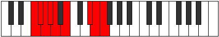

# Mode Thynyllic

## Links

- [Documentation](index.md)
- [Scales Index](Scales.md)
- [Modes Index](Modes.md)
- [Chords Index](Chords.md)

## Parent Scale

[Stolyllic](ScaleStolyllic.md)

## Number

[3167](https://ianring.com/musictheory/scales/3167)

## Perfection

- 4 Perfect notes
- 4 Perfect notes

## Perfection Profile

[false false false true true true false true]

## Permutations

| Tonic | Notes | Signature | Illustration | Audio |
|-------|-------|-----------|--------------|-------|
| [C](ModeCNaturalThynyllic.md) | **C**, **C#**, **D**, D#, E, F#, **A#**, B, **C** | C |  | [midi](ModeCNaturalThynyllic.mid) [ogg](ModeCNaturalThynyllic.ogg) |
| [C#](ModeCSharpThynyllic.md) | **C#**, **D**, **D#**, E, F, G, **B**, C, **C#** | C |  | [midi](ModeCSharpThynyllic.mid) [ogg](ModeCSharpThynyllic.ogg) |
| [Db](ModeDFlatThynyllic.md) | **Db**, **D**, **Eb**, E, F, G, **B**, C, **Db** | C |  | [midi](ModeDFlatThynyllic.mid) [ogg](ModeDFlatThynyllic.ogg) |
| [D](ModeDNaturalThynyllic.md) | **D**, **D#**, **E**, F, F#, G#, **C**, C#, **D** | C |  | [midi](ModeDNaturalThynyllic.mid) [ogg](ModeDNaturalThynyllic.ogg) |
| [D#](ModeDSharpThynyllic.md) | **D#**, **E**, **F**, F#, G, A, **C#**, D, **D#** | C |  | [midi](ModeDSharpThynyllic.mid) [ogg](ModeDSharpThynyllic.ogg) |
| [Eb](ModeEFlatThynyllic.md) | **Eb**, **E**, **F**, Gb, G, A, **Db**, D, **Eb** | C |  | [midi](ModeEFlatThynyllic.mid) [ogg](ModeEFlatThynyllic.ogg) |
| [E](ModeENaturalThynyllic.md) | **E**, **F**, **F#**, G, G#, A#, **D**, D#, **E** | C |  | [midi](ModeENaturalThynyllic.mid) [ogg](ModeENaturalThynyllic.ogg) |
| [F](ModeFNaturalThynyllic.md) | **F**, **F#**, **G**, G#, A, B, **D#**, E, **F** | C |  | [midi](ModeFNaturalThynyllic.mid) [ogg](ModeFNaturalThynyllic.ogg) |
| [F#](ModeFSharpThynyllic.md) | **F#**, **G**, **G#**, A, A#, C, **E**, F, **F#** | C |  | [midi](ModeFSharpThynyllic.mid) [ogg](ModeFSharpThynyllic.ogg) |
| [Gb](ModeGFlatThynyllic.md) | **Gb**, **G**, **Ab**, A, Bb, C, **E**, F, **Gb** | C |  | [midi](ModeGFlatThynyllic.mid) [ogg](ModeGFlatThynyllic.ogg) |
| [G](ModeGNaturalThynyllic.md) | **G**, **G#**, **A**, A#, B, C#, **F**, F#, **G** | C |  | [midi](ModeGNaturalThynyllic.mid) [ogg](ModeGNaturalThynyllic.ogg) |
| [G#](ModeGSharpThynyllic.md) | **G#**, **A**, **A#**, B, C, D, **F#**, G, **G#** | C |  | [midi](ModeGSharpThynyllic.mid) [ogg](ModeGSharpThynyllic.ogg) |
| [Ab](ModeAFlatThynyllic.md) | **Ab**, **A**, **Bb**, B, C, D, **Gb**, G, **Ab** | C |  | [midi](ModeAFlatThynyllic.mid) [ogg](ModeAFlatThynyllic.ogg) |
| [A](ModeANaturalThynyllic.md) | **A**, **A#**, **B**, C, C#, D#, **G**, G#, **A** | C |  | [midi](ModeANaturalThynyllic.mid) [ogg](ModeANaturalThynyllic.ogg) |
| [A#](ModeASharpThynyllic.md) | **A#**, **B**, **C**, C#, D, E, **G#**, A, **A#** | C |  | [midi](ModeASharpThynyllic.mid) [ogg](ModeASharpThynyllic.ogg) |
| [Bb](ModeBFlatThynyllic.md) | **Bb**, **B**, **C**, Db, D, E, **Ab**, A, **Bb** | C |  | [midi](ModeBFlatThynyllic.mid) [ogg](ModeBFlatThynyllic.ogg) |
| [B](ModeBNaturalThynyllic.md) | **B**, **C**, **C#**, D, D#, F, **A**, A#, **B** | C |  | [midi](ModeBNaturalThynyllic.mid) [ogg](ModeBNaturalThynyllic.ogg) |
