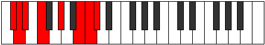

# Mode Thyphian

## Links

- [Documentation](index.md)
- [Scales Index](Scales.md)
- [Modes Index](Modes.md)
- [Chords Index](Chords.md)

## Parent Scale

[Katoptian](ScaleKatoptian.md)

## Number

[3223](https://ianring.com/musictheory/scales/3223)

## Perfection

- 3 Perfect notes
- 4 Perfect notes

## Perfection Profile

[true false false true true false false]

## Permutations

| Tonic | Notes | Signature | Illustration | Audio |
|-------|-------|-----------|--------------|-------|
| [C](ModeCNaturalThyphian.md) | C, **Db**, **Ebb**, Fb, G, **A#**, **B**, C | C |  | [midi](ModeCNaturalThyphian.mid) [ogg](ModeCNaturalThyphian.ogg) |
| [C#](ModeCSharpThyphian.md) | C#, **D**, **Eb**, F, G#, **A##**, **B#**, C# | C |  | [midi](ModeCSharpThyphian.mid) [ogg](ModeCSharpThyphian.ogg) |
| [Db](ModeDFlatThyphian.md) | Db, **Ebb**, **Fbb**, Gbb, Ab, **B**, **C**, Db | C |  | [midi](ModeDFlatThyphian.mid) [ogg](ModeDFlatThyphian.ogg) |
| [D](ModeDNaturalThyphian.md) | D, **Eb**, **Fb**, Gb, A, **B#**, **C#**, D | C |  | [midi](ModeDNaturalThyphian.mid) [ogg](ModeDNaturalThyphian.ogg) |
| [D#](ModeDSharpThyphian.md) | D#, **E**, **F**, G, A#, **B##**, **C##**, D# | C |  | [midi](ModeDSharpThyphian.mid) [ogg](ModeDSharpThyphian.ogg) |
| [Eb](ModeEFlatThyphian.md) | Eb, **Fb**, **Gbb**, Abb, Bb, **C#**, **D**, Eb | C |  | [midi](ModeEFlatThyphian.mid) [ogg](ModeEFlatThyphian.ogg) |
| [E](ModeENaturalThyphian.md) | E, **F**, **Gb**, Ab, B, **C##**, **D#**, E | C |  | [midi](ModeENaturalThyphian.mid) [ogg](ModeENaturalThyphian.ogg) |
| [F](ModeFNaturalThyphian.md) | F, **Gb**, **Abb**, Bbb, C, **D#**, **E**, F | C |  | [midi](ModeFNaturalThyphian.mid) [ogg](ModeFNaturalThyphian.ogg) |
| [F#](ModeFSharpThyphian.md) | F#, **G**, **Ab**, Bb, C#, **D##**, **E#**, F# | C |  | [midi](ModeFSharpThyphian.mid) [ogg](ModeFSharpThyphian.ogg) |
| [Gb](ModeGFlatThyphian.md) | Gb, **Abb**, **Bbbb**, Cbb, Db, **E**, **F**, Gb | C |  | [midi](ModeGFlatThyphian.mid) [ogg](ModeGFlatThyphian.ogg) |
| [G](ModeGNaturalThyphian.md) | G, **Ab**, **Bbb**, Cb, D, **E#**, **F#**, G | C |  | [midi](ModeGNaturalThyphian.mid) [ogg](ModeGNaturalThyphian.ogg) |
| [G#](ModeGSharpThyphian.md) | G#, **A**, **Bb**, C, D#, **E##**, **F##**, G# | C |  | [midi](ModeGSharpThyphian.mid) [ogg](ModeGSharpThyphian.ogg) |
| [Ab](ModeAFlatThyphian.md) | Ab, **Bbb**, **Cbb**, Dbb, Eb, **F#**, **G**, Ab | C |  | [midi](ModeAFlatThyphian.mid) [ogg](ModeAFlatThyphian.ogg) |
| [A](ModeANaturalThyphian.md) | A, **Bb**, **Cb**, Db, E, **F##**, **G#**, A | C |  | [midi](ModeANaturalThyphian.mid) [ogg](ModeANaturalThyphian.ogg) |
| [A#](ModeASharpThyphian.md) | A#, **B**, **C**, D, E#, **F###**, **G##**, A# | C |  | [midi](ModeASharpThyphian.mid) [ogg](ModeASharpThyphian.ogg) |
| [Bb](ModeBFlatThyphian.md) | Bb, **Cb**, **Dbb**, Ebb, F, **G#**, **A**, Bb | C |  | [midi](ModeBFlatThyphian.mid) [ogg](ModeBFlatThyphian.ogg) |
| [B](ModeBNaturalThyphian.md) | B, **C**, **Db**, Eb, F#, **G##**, **A#**, B | C |  | [midi](ModeBNaturalThyphian.mid) [ogg](ModeBNaturalThyphian.ogg) |
