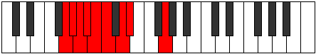
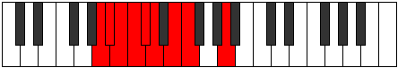

# Mode Thyphyllic

## Links

- [Documentation](index.md)
- [Scales Index](Scales.md)
- [Modes Index](Modes.md)
- [Chords Index](Chords.md)

## Parent Scale

[Phroryllic](ScalePhroryllic.md)

## Number

[447](https://ianring.com/musictheory/scales/447)

## Perfection

- 5 Perfect notes
- 3 Perfect notes

## Perfection Profile

[true true false false false true true true]

## Permutations

| Tonic | Notes | Signature | Illustration | Audio |
|-------|-------|-----------|--------------|-------|
| [C](ModeCNaturalThyphyllic.md) | C, C#, **D**, **D#**, **E**, F, G, G#, C | C |  | [midi](ModeCNaturalThyphyllic.mid) [ogg](ModeCNaturalThyphyllic.ogg) |
| [C#](ModeCSharpThyphyllic.md) | C#, D, **D#**, **E**, **F**, F#, G#, A, C# | C |  | [midi](ModeCSharpThyphyllic.mid) [ogg](ModeCSharpThyphyllic.ogg) |
| [Db](ModeDFlatThyphyllic.md) | Db, D, **Eb**, **E**, **F**, Gb, Ab, A, Db | C |  | [midi](ModeDFlatThyphyllic.mid) [ogg](ModeDFlatThyphyllic.ogg) |
| [D](ModeDNaturalThyphyllic.md) | D, D#, **E**, **F**, **F#**, G, A, A#, D | C |  | [midi](ModeDNaturalThyphyllic.mid) [ogg](ModeDNaturalThyphyllic.ogg) |
| [D#](ModeDSharpThyphyllic.md) | D#, E, **F**, **F#**, **G**, G#, A#, B, D# | C |  | [midi](ModeDSharpThyphyllic.mid) [ogg](ModeDSharpThyphyllic.ogg) |
| [Eb](ModeEFlatThyphyllic.md) | Eb, E, **F**, **Gb**, **G**, Ab, Bb, B, Eb | C |  | [midi](ModeEFlatThyphyllic.mid) [ogg](ModeEFlatThyphyllic.ogg) |
| [E](ModeENaturalThyphyllic.md) | E, F, **F#**, **G**, **G#**, A, B, C, E | C |  | [midi](ModeENaturalThyphyllic.mid) [ogg](ModeENaturalThyphyllic.ogg) |
| [F](ModeFNaturalThyphyllic.md) | F, F#, **G**, **G#**, **A**, A#, C, C#, F | C |  | [midi](ModeFNaturalThyphyllic.mid) [ogg](ModeFNaturalThyphyllic.ogg) |
| [F#](ModeFSharpThyphyllic.md) | F#, G, **G#**, **A**, **A#**, B, C#, D, F# | C |  | [midi](ModeFSharpThyphyllic.mid) [ogg](ModeFSharpThyphyllic.ogg) |
| [Gb](ModeGFlatThyphyllic.md) | Gb, G, **Ab**, **A**, **Bb**, B, Db, D, Gb | C |  | [midi](ModeGFlatThyphyllic.mid) [ogg](ModeGFlatThyphyllic.ogg) |
| [G](ModeGNaturalThyphyllic.md) | G, G#, **A**, **A#**, **B**, C, D, D#, G | C |  | [midi](ModeGNaturalThyphyllic.mid) [ogg](ModeGNaturalThyphyllic.ogg) |
| [G#](ModeGSharpThyphyllic.md) | G#, A, **A#**, **B**, **C**, C#, D#, E, G# | C |  | [midi](ModeGSharpThyphyllic.mid) [ogg](ModeGSharpThyphyllic.ogg) |
| [Ab](ModeAFlatThyphyllic.md) | Ab, A, **Bb**, **B**, **C**, Db, Eb, E, Ab | C |  | [midi](ModeAFlatThyphyllic.mid) [ogg](ModeAFlatThyphyllic.ogg) |
| [A](ModeANaturalThyphyllic.md) | A, A#, **B**, **C**, **C#**, D, E, F, A | C |  | [midi](ModeANaturalThyphyllic.mid) [ogg](ModeANaturalThyphyllic.ogg) |
| [A#](ModeASharpThyphyllic.md) | A#, B, **C**, **C#**, **D**, D#, F, F#, A# | C |  | [midi](ModeASharpThyphyllic.mid) [ogg](ModeASharpThyphyllic.ogg) |
| [Bb](ModeBFlatThyphyllic.md) | Bb, B, **C**, **Db**, **D**, Eb, F, Gb, Bb | C |  | [midi](ModeBFlatThyphyllic.mid) [ogg](ModeBFlatThyphyllic.ogg) |
| [B](ModeBNaturalThyphyllic.md) | B, C, **C#**, **D**, **D#**, E, F#, G, B | C |  | [midi](ModeBNaturalThyphyllic.mid) [ogg](ModeBNaturalThyphyllic.ogg) |
