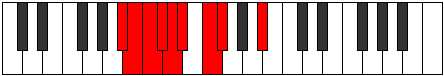

# Mode Thyphyllic

## Links

- [Documentation](index.md)
- [Scales Index](Scales.md)
- [Modes Index](Modes.md)
- [Chords Index](Chords.md)

## Parent Scale

[Phroryllic](ScalePhroryllic.md)

## Number

[447](https://ianring.com/musictheory/scales/447)

## Perfection

- 5 Perfect notes
- 3 Perfect notes

## Interval Pattern

1, 1, 1, 1, 1, 2, 1, 4

## Perfection Profile

[true true false false false true true true]

## Permutations

| Tonic | Notes | Signature | Illustration | Audio |
|-------|-------|-----------|--------------|-------|
| [C](ModeCNaturalThyphyllic.md) | C, C#, **D**, **D#**, **E**, F, G, G#, C | C |  | [midi](https://github.com/edipermadi/music/blob/main/docs/ModeCNaturalThyphyllic.mid?raw=true) |
| [C#](ModeCSharpThyphyllic.md) | C#, D, **D#**, **E**, **F**, F#, G#, A, C# | C |  | [midi](https://github.com/edipermadi/music/blob/main/docs/ModeCSharpThyphyllic.mid?raw=true) |
| [Db](ModeDFlatThyphyllic.md) | Db, D, **Eb**, **E**, **F**, Gb, Ab, A, Db | C |  | [midi](https://github.com/edipermadi/music/blob/main/docs/ModeDFlatThyphyllic.mid?raw=true) |
| [D](ModeDNaturalThyphyllic.md) | D, D#, **E**, **F**, **F#**, G, A, A#, D | C |  | [midi](https://github.com/edipermadi/music/blob/main/docs/ModeDNaturalThyphyllic.mid?raw=true) |
| [D#](ModeDSharpThyphyllic.md) | D#, E, **F**, **F#**, **G**, G#, A#, B, D# | C |  | [midi](https://github.com/edipermadi/music/blob/main/docs/ModeDSharpThyphyllic.mid?raw=true) |
| [Eb](ModeEFlatThyphyllic.md) | Eb, E, **F**, **Gb**, **G**, Ab, Bb, B, Eb | C |  | [midi](https://github.com/edipermadi/music/blob/main/docs/ModeEFlatThyphyllic.mid?raw=true) |
| [E](ModeENaturalThyphyllic.md) | E, F, **F#**, **G**, **G#**, A, B, C, E | C |  | [midi](https://github.com/edipermadi/music/blob/main/docs/ModeENaturalThyphyllic.mid?raw=true) |
| [F](ModeFNaturalThyphyllic.md) | F, F#, **G**, **G#**, **A**, A#, C, C#, F | C |  | [midi](https://github.com/edipermadi/music/blob/main/docs/ModeFNaturalThyphyllic.mid?raw=true) |
| [F#](ModeFSharpThyphyllic.md) | F#, G, **G#**, **A**, **A#**, B, C#, D, F# | C |  | [midi](https://github.com/edipermadi/music/blob/main/docs/ModeFSharpThyphyllic.mid?raw=true) |
| [Gb](ModeGFlatThyphyllic.md) | Gb, G, **Ab**, **A**, **Bb**, B, Db, D, Gb | C |  | [midi](https://github.com/edipermadi/music/blob/main/docs/ModeGFlatThyphyllic.mid?raw=true) |
| [G](ModeGNaturalThyphyllic.md) | G, G#, **A**, **A#**, **B**, C, D, D#, G | C |  | [midi](https://github.com/edipermadi/music/blob/main/docs/ModeGNaturalThyphyllic.mid?raw=true) |
| [G#](ModeGSharpThyphyllic.md) | G#, A, **A#**, **B**, **C**, C#, D#, E, G# | C |  | [midi](https://github.com/edipermadi/music/blob/main/docs/ModeGSharpThyphyllic.mid?raw=true) |
| [Ab](ModeAFlatThyphyllic.md) | Ab, A, **Bb**, **B**, **C**, Db, Eb, E, Ab | C |  | [midi](https://github.com/edipermadi/music/blob/main/docs/ModeAFlatThyphyllic.mid?raw=true) |
| [A](ModeANaturalThyphyllic.md) | A, A#, **B**, **C**, **C#**, D, E, F, A | C |  | [midi](https://github.com/edipermadi/music/blob/main/docs/ModeANaturalThyphyllic.mid?raw=true) |
| [A#](ModeASharpThyphyllic.md) | A#, B, **C**, **C#**, **D**, D#, F, F#, A# | C |  | [midi](https://github.com/edipermadi/music/blob/main/docs/ModeASharpThyphyllic.mid?raw=true) |
| [Bb](ModeBFlatThyphyllic.md) | Bb, B, **C**, **Db**, **D**, Eb, F, Gb, Bb | C |  | [midi](https://github.com/edipermadi/music/blob/main/docs/ModeBFlatThyphyllic.mid?raw=true) |
| [B](ModeBNaturalThyphyllic.md) | B, C, **C#**, **D**, **D#**, E, F#, G, B | C |  | [midi](https://github.com/edipermadi/music/blob/main/docs/ModeBNaturalThyphyllic.mid?raw=true) |
