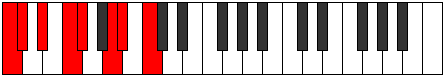

# Mode Thyptian

## Links

- [Documentation](index.md)
- [Scales Index](Scales.md)
- [Modes Index](Modes.md)
- [Chords Index](Chords.md)

## Parent Scale

[Bycrian](ScaleBycrian.md)

## Number

[1643](https://ianring.com/musictheory/scales/1643)

## Perfection

- 4 Perfect notes
- 3 Perfect notes

## Perfection Profile

[false false true true true false true]

## Permutations

| Tonic | Notes | Signature | Illustration | Audio |
|-------|-------|-----------|--------------|-------|
| [C](ModeCNaturalThyptian.md) | **C**, **Db**, Eb, F, Gb, **A**, Bb, **C** | C |  | [midi](ModeCNaturalThyptian.mid) [ogg](ModeCNaturalThyptian.ogg) |
| [C#](ModeCSharpThyptian.md) | **C#**, **D**, E, F#, G, **A#**, B, **C#** | C |  | [midi](ModeCSharpThyptian.mid) [ogg](ModeCSharpThyptian.ogg) |
| [Db](ModeDFlatThyptian.md) | **Db**, **Ebb**, Fb, Gb, Abb, **Bb**, Cb, **Db** | C |  | [midi](ModeDFlatThyptian.mid) [ogg](ModeDFlatThyptian.ogg) |
| [D](ModeDNaturalThyptian.md) | **D**, **Eb**, F, G, Ab, **B**, C, **D** | C |  | [midi](ModeDNaturalThyptian.mid) [ogg](ModeDNaturalThyptian.ogg) |
| [D#](ModeDSharpThyptian.md) | **D#**, **E**, F#, G#, A, **B#**, C#, **D#** | C |  | [midi](ModeDSharpThyptian.mid) [ogg](ModeDSharpThyptian.ogg) |
| [Eb](ModeEFlatThyptian.md) | **Eb**, **Fb**, Gb, Ab, Bbb, **C**, Db, **Eb** | C |  | [midi](ModeEFlatThyptian.mid) [ogg](ModeEFlatThyptian.ogg) |
| [E](ModeENaturalThyptian.md) | **E**, **F**, G, A, Bb, **C#**, D, **E** | C |  | [midi](ModeENaturalThyptian.mid) [ogg](ModeENaturalThyptian.ogg) |
| [F](ModeFNaturalThyptian.md) | **F**, **Gb**, Ab, Bb, Cb, **D**, Eb, **F** | C |  | [midi](ModeFNaturalThyptian.mid) [ogg](ModeFNaturalThyptian.ogg) |
| [F#](ModeFSharpThyptian.md) | **F#**, **G**, A, B, C, **D#**, E, **F#** | C |  | [midi](ModeFSharpThyptian.mid) [ogg](ModeFSharpThyptian.ogg) |
| [Gb](ModeGFlatThyptian.md) | **Gb**, **Abb**, Bbb, Cb, Dbb, **Eb**, Fb, **Gb** | C |  | [midi](ModeGFlatThyptian.mid) [ogg](ModeGFlatThyptian.ogg) |
| [G](ModeGNaturalThyptian.md) | **G**, **Ab**, Bb, C, Db, **E**, F, **G** | C |  | [midi](ModeGNaturalThyptian.mid) [ogg](ModeGNaturalThyptian.ogg) |
| [G#](ModeGSharpThyptian.md) | **G#**, **A**, B, C#, D, **E#**, F#, **G#** | C |  | [midi](ModeGSharpThyptian.mid) [ogg](ModeGSharpThyptian.ogg) |
| [Ab](ModeAFlatThyptian.md) | **Ab**, **Bbb**, Cb, Db, Ebb, **F**, Gb, **Ab** | C |  | [midi](ModeAFlatThyptian.mid) [ogg](ModeAFlatThyptian.ogg) |
| [A](ModeANaturalThyptian.md) | **A**, **Bb**, C, D, Eb, **F#**, G, **A** | C |  | [midi](ModeANaturalThyptian.mid) [ogg](ModeANaturalThyptian.ogg) |
| [A#](ModeASharpThyptian.md) | **A#**, **B**, C#, D#, E, **F##**, G#, **A#** | C |  | [midi](ModeASharpThyptian.mid) [ogg](ModeASharpThyptian.ogg) |
| [Bb](ModeBFlatThyptian.md) | **Bb**, **Cb**, Db, Eb, Fb, **G**, Ab, **Bb** | C |  | [midi](ModeBFlatThyptian.mid) [ogg](ModeBFlatThyptian.ogg) |
| [B](ModeBNaturalThyptian.md) | **B**, **C**, D, E, F, **G#**, A, **B** | C |  | [midi](ModeBNaturalThyptian.mid) [ogg](ModeBNaturalThyptian.ogg) |
