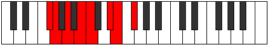

# Mode Thyptian

## Links

- [Documentation](README.md)
- [Scales Index](Scales.md)
- [Modes Index](Modes.md)
- [Chords Index](Chords.md)

## Parent Scale

[Bycrian](ScaleBycrian.md)

## Number

[1643](https://ianring.com/musictheory/scales/1643)

## Luminosity

-1

## Transposition

1, 2, 2, 1, 3, 1, 2

## Chord Pattern

i⁰, II⁺, iii, IV, V, vi⁰, vii

## Perfection

- 4 Perfect notes
- 3 Perfect notes

## Perfection Profile

false, false, true, true, true, false, true

## Permutations

| Tonic | Notes | Signature | Illustration | Audio |
|-------|-------|-----------|--------------|-------|
| [C](ModeCNaturalThyptian.md) | **C**, **Db**, Eb, F, Gb, **A**, Bb, **C** | C |  | [midi](https://github.com/edipermadi/music/blob/main/docs/ModeCNaturalThyptian.mid?raw=true) |
| [C#](ModeCSharpThyptian.md) | **C#**, **D**, E, F#, G, **A#**, B, **C#** | C |  | [midi](https://github.com/edipermadi/music/blob/main/docs/ModeCSharpThyptian.mid?raw=true) |
| [Db](ModeDFlatThyptian.md) | **Db**, **Ebb**, Fb, Gb, Abb, **Bb**, Cb, **Db** | C |  | [midi](https://github.com/edipermadi/music/blob/main/docs/ModeDFlatThyptian.mid?raw=true) |
| [D](ModeDNaturalThyptian.md) | **D**, **Eb**, F, G, Ab, **B**, C, **D** | C |  | [midi](https://github.com/edipermadi/music/blob/main/docs/ModeDNaturalThyptian.mid?raw=true) |
| [D#](ModeDSharpThyptian.md) | **D#**, **E**, F#, G#, A, **B#**, C#, **D#** | C |  | [midi](https://github.com/edipermadi/music/blob/main/docs/ModeDSharpThyptian.mid?raw=true) |
| [Eb](ModeEFlatThyptian.md) | **Eb**, **Fb**, Gb, Ab, Bbb, **C**, Db, **Eb** | C |  | [midi](https://github.com/edipermadi/music/blob/main/docs/ModeEFlatThyptian.mid?raw=true) |
| [E](ModeENaturalThyptian.md) | **E**, **F**, G, A, Bb, **C#**, D, **E** | C |  | [midi](https://github.com/edipermadi/music/blob/main/docs/ModeENaturalThyptian.mid?raw=true) |
| [F](ModeFNaturalThyptian.md) | **F**, **Gb**, Ab, Bb, Cb, **D**, Eb, **F** | C |  | [midi](https://github.com/edipermadi/music/blob/main/docs/ModeFNaturalThyptian.mid?raw=true) |
| [F#](ModeFSharpThyptian.md) | **F#**, **G**, A, B, C, **D#**, E, **F#** | C |  | [midi](https://github.com/edipermadi/music/blob/main/docs/ModeFSharpThyptian.mid?raw=true) |
| [Gb](ModeGFlatThyptian.md) | **Gb**, **Abb**, Bbb, Cb, Dbb, **Eb**, Fb, **Gb** | C |  | [midi](https://github.com/edipermadi/music/blob/main/docs/ModeGFlatThyptian.mid?raw=true) |
| [G](ModeGNaturalThyptian.md) | **G**, **Ab**, Bb, C, Db, **E**, F, **G** | C |  | [midi](https://github.com/edipermadi/music/blob/main/docs/ModeGNaturalThyptian.mid?raw=true) |
| [G#](ModeGSharpThyptian.md) | **G#**, **A**, B, C#, D, **E#**, F#, **G#** | C |  | [midi](https://github.com/edipermadi/music/blob/main/docs/ModeGSharpThyptian.mid?raw=true) |
| [Ab](ModeAFlatThyptian.md) | **Ab**, **Bbb**, Cb, Db, Ebb, **F**, Gb, **Ab** | C |  | [midi](https://github.com/edipermadi/music/blob/main/docs/ModeAFlatThyptian.mid?raw=true) |
| [A](ModeANaturalThyptian.md) | **A**, **Bb**, C, D, Eb, **F#**, G, **A** | C |  | [midi](https://github.com/edipermadi/music/blob/main/docs/ModeANaturalThyptian.mid?raw=true) |
| [A#](ModeASharpThyptian.md) | **A#**, **B**, C#, D#, E, **F##**, G#, **A#** | C |  | [midi](https://github.com/edipermadi/music/blob/main/docs/ModeASharpThyptian.mid?raw=true) |
| [Bb](ModeBFlatThyptian.md) | **Bb**, **Cb**, Db, Eb, Fb, **G**, Ab, **Bb** | C |  | [midi](https://github.com/edipermadi/music/blob/main/docs/ModeBFlatThyptian.mid?raw=true) |
| [B](ModeBNaturalThyptian.md) | **B**, **C**, D, E, F, **G#**, A, **B** | C |  | [midi](https://github.com/edipermadi/music/blob/main/docs/ModeBNaturalThyptian.mid?raw=true) |
