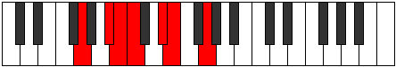

# Mode Thyptimic

## Links

- [Documentation](index.md)
- [Scales Index](Scales.md)
- [Modes Index](Modes.md)
- [Chords Index](Chords.md)

## Parent Scale

[Mydimic](ScaleMydimic.md)

## Number

[825](https://ianring.com/musictheory/scales/825)

## Perfection

- 3 Perfect notes
- 3 Perfect notes

## Perfection Profile

[false false false true true true]

## Permutations

| Tonic | Notes | Signature | Illustration | Audio |
|-------|-------|-----------|--------------|-------|
| [C](ModeCNaturalThyptimic.md) | **C**, **D#**, **E**, F, G#, A, **C** | C |  | [midi](ModeCNaturalThyptimic.mid) [ogg](ModeCNaturalThyptimic.ogg) |
| [C#](ModeCSharpThyptimic.md) | **C#**, **D##**, **E#**, F#, G##, A#, **C#** | C |  | [midi](ModeCSharpThyptimic.mid) [ogg](ModeCSharpThyptimic.ogg) |
| [Db](ModeDFlatThyptimic.md) | **Db**, **E**, **F**, Gb, A, Bb, **Db** | C |  | [midi](ModeDFlatThyptimic.mid) [ogg](ModeDFlatThyptimic.ogg) |
| [D](ModeDNaturalThyptimic.md) | **D**, **E#**, **F#**, G, A#, B, **D** | C |  | [midi](ModeDNaturalThyptimic.mid) [ogg](ModeDNaturalThyptimic.ogg) |
| [D#](ModeDSharpThyptimic.md) | **D#**, **E##**, **F##**, G#, A##, B#, **D#** | C |  | [midi](ModeDSharpThyptimic.mid) [ogg](ModeDSharpThyptimic.ogg) |
| [Eb](ModeEFlatThyptimic.md) | **Eb**, **F#**, **G**, Ab, B, C, **Eb** | C |  | [midi](ModeEFlatThyptimic.mid) [ogg](ModeEFlatThyptimic.ogg) |
| [E](ModeENaturalThyptimic.md) | **E**, **F##**, **G#**, A, B#, C#, **E** | C |  | [midi](ModeENaturalThyptimic.mid) [ogg](ModeENaturalThyptimic.ogg) |
| [F](ModeFNaturalThyptimic.md) | **F**, **G#**, **A**, Bb, C#, D, **F** | C |  | [midi](ModeFNaturalThyptimic.mid) [ogg](ModeFNaturalThyptimic.ogg) |
| [F#](ModeFSharpThyptimic.md) | **F#**, **G##**, **A#**, B, C##, D#, **F#** | C |  | [midi](ModeFSharpThyptimic.mid) [ogg](ModeFSharpThyptimic.ogg) |
| [Gb](ModeGFlatThyptimic.md) | **Gb**, **A**, **Bb**, Cb, D, Eb, **Gb** | C |  | [midi](ModeGFlatThyptimic.mid) [ogg](ModeGFlatThyptimic.ogg) |
| [G](ModeGNaturalThyptimic.md) | **G**, **A#**, **B**, C, D#, E, **G** | C |  | [midi](ModeGNaturalThyptimic.mid) [ogg](ModeGNaturalThyptimic.ogg) |
| [G#](ModeGSharpThyptimic.md) | **G#**, **A##**, **B#**, C#, D##, E#, **G#** | C |  | [midi](ModeGSharpThyptimic.mid) [ogg](ModeGSharpThyptimic.ogg) |
| [Ab](ModeAFlatThyptimic.md) | **Ab**, **B**, **C**, Db, E, F, **Ab** | C |  | [midi](ModeAFlatThyptimic.mid) [ogg](ModeAFlatThyptimic.ogg) |
| [A](ModeANaturalThyptimic.md) | **A**, **B#**, **C#**, D, E#, F#, **A** | C |  | [midi](ModeANaturalThyptimic.mid) [ogg](ModeANaturalThyptimic.ogg) |
| [A#](ModeASharpThyptimic.md) | **A#**, **B##**, **C##**, D#, E##, F##, **A#** | C |  | [midi](ModeASharpThyptimic.mid) [ogg](ModeASharpThyptimic.ogg) |
| [Bb](ModeBFlatThyptimic.md) | **Bb**, **C#**, **D**, Eb, F#, G, **Bb** | C |  | [midi](ModeBFlatThyptimic.mid) [ogg](ModeBFlatThyptimic.ogg) |
| [B](ModeBNaturalThyptimic.md) | **B**, **C##**, **D#**, E, F##, G#, **B** | C |  | [midi](ModeBNaturalThyptimic.mid) [ogg](ModeBNaturalThyptimic.ogg) |
