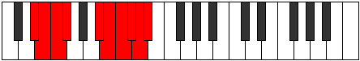

# Mode Thyptygic

## Links

- [Documentation](index.md)
- [Scales Index](Scales.md)
- [Modes Index](Modes.md)
- [Chords Index](Chords.md)

## Parent Scale

[Manygic](ScaleManygic.md)

## Number

[3983](https://ianring.com/musictheory/scales/3983)

## Perfection

- 6 Perfect notes
- 3 Perfect notes

## Interval Pattern

1, 1, 1, 4, 1, 1, 1, 1, 1

## Perfection Profile

[true true true true true true false false false]

## Permutations

| Tonic | Notes | Signature | Illustration | Audio |
|-------|-------|-----------|--------------|-------|
| [C](ModeCNaturalThyptygic.md) | C, C#, D, D#, G, G#, **A**, **A#**, **B**, C | C |  | [midi](https://github.com/edipermadi/music/blob/main/docs/ModeCNaturalThyptygic.mid?raw=true) |
| [C#](ModeCSharpThyptygic.md) | C#, D, D#, E, G#, A, **A#**, **B**, **C**, C# | C |  | [midi](https://github.com/edipermadi/music/blob/main/docs/ModeCSharpThyptygic.mid?raw=true) |
| [Db](ModeDFlatThyptygic.md) | Db, D, Eb, E, Ab, A, **Bb**, **B**, **C**, Db | C |  | [midi](https://github.com/edipermadi/music/blob/main/docs/ModeDFlatThyptygic.mid?raw=true) |
| [D](ModeDNaturalThyptygic.md) | D, D#, E, F, A, A#, **B**, **C**, **C#**, D | C |  | [midi](https://github.com/edipermadi/music/blob/main/docs/ModeDNaturalThyptygic.mid?raw=true) |
| [D#](ModeDSharpThyptygic.md) | D#, E, F, F#, A#, B, **C**, **C#**, **D**, D# | C |  | [midi](https://github.com/edipermadi/music/blob/main/docs/ModeDSharpThyptygic.mid?raw=true) |
| [Eb](ModeEFlatThyptygic.md) | Eb, E, F, Gb, Bb, B, **C**, **Db**, **D**, Eb | C |  | [midi](https://github.com/edipermadi/music/blob/main/docs/ModeEFlatThyptygic.mid?raw=true) |
| [E](ModeENaturalThyptygic.md) | E, F, F#, G, B, C, **C#**, **D**, **D#**, E | C |  | [midi](https://github.com/edipermadi/music/blob/main/docs/ModeENaturalThyptygic.mid?raw=true) |
| [F](ModeFNaturalThyptygic.md) | F, F#, G, G#, C, C#, **D**, **D#**, **E**, F | C |  | [midi](https://github.com/edipermadi/music/blob/main/docs/ModeFNaturalThyptygic.mid?raw=true) |
| [F#](ModeFSharpThyptygic.md) | F#, G, G#, A, C#, D, **D#**, **E**, **F**, F# | C |  | [midi](https://github.com/edipermadi/music/blob/main/docs/ModeFSharpThyptygic.mid?raw=true) |
| [Gb](ModeGFlatThyptygic.md) | Gb, G, Ab, A, Db, D, **Eb**, **E**, **F**, Gb | C |  | [midi](https://github.com/edipermadi/music/blob/main/docs/ModeGFlatThyptygic.mid?raw=true) |
| [G](ModeGNaturalThyptygic.md) | G, G#, A, A#, D, D#, **E**, **F**, **F#**, G | C |  | [midi](https://github.com/edipermadi/music/blob/main/docs/ModeGNaturalThyptygic.mid?raw=true) |
| [G#](ModeGSharpThyptygic.md) | G#, A, A#, B, D#, E, **F**, **F#**, **G**, G# | C |  | [midi](https://github.com/edipermadi/music/blob/main/docs/ModeGSharpThyptygic.mid?raw=true) |
| [Ab](ModeAFlatThyptygic.md) | Ab, A, Bb, B, Eb, E, **F**, **Gb**, **G**, Ab | C |  | [midi](https://github.com/edipermadi/music/blob/main/docs/ModeAFlatThyptygic.mid?raw=true) |
| [A](ModeANaturalThyptygic.md) | A, A#, B, C, E, F, **F#**, **G**, **G#**, A | C |  | [midi](https://github.com/edipermadi/music/blob/main/docs/ModeANaturalThyptygic.mid?raw=true) |
| [A#](ModeASharpThyptygic.md) | A#, B, C, C#, F, F#, **G**, **G#**, **A**, A# | C |  | [midi](https://github.com/edipermadi/music/blob/main/docs/ModeASharpThyptygic.mid?raw=true) |
| [Bb](ModeBFlatThyptygic.md) | Bb, B, C, Db, F, Gb, **G**, **Ab**, **A**, Bb | C |  | [midi](https://github.com/edipermadi/music/blob/main/docs/ModeBFlatThyptygic.mid?raw=true) |
| [B](ModeBNaturalThyptygic.md) | B, C, C#, D, F#, G, **G#**, **A**, **A#**, B | C |  | [midi](https://github.com/edipermadi/music/blob/main/docs/ModeBNaturalThyptygic.mid?raw=true) |
