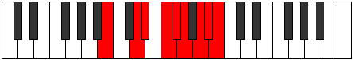

# Mode Thyptyllic

## Links

- [Documentation](index.md)
- [Scales Index](Scales.md)
- [Modes Index](Modes.md)
- [Chords Index](Chords.md)

## Parent Scale

[Thyptyllic](ScaleThyptyllic.md)

## Number

[3545](https://ianring.com/musictheory/scales/3545)

## Perfection

- 5 Perfect notes
- 3 Perfect notes

## Perfection Profile

[true true true false false true false true]

## Permutations

| Tonic | Notes | Signature | Illustration | Audio |
|-------|-------|-----------|--------------|-------|
| [C](ModeCNaturalThyptyllic.md) | C, D#, E, **F#**, **G**, G#, **A#**, B, C | C |  | [midi](ModeCNaturalThyptyllic.mid) [ogg](ModeCNaturalThyptyllic.ogg) |
| [C#](ModeCSharpThyptyllic.md) | C#, E, F, **G**, **G#**, A, **B**, C, C# | C |  | [midi](ModeCSharpThyptyllic.mid) [ogg](ModeCSharpThyptyllic.ogg) |
| [Db](ModeDFlatThyptyllic.md) | Db, E, F, **G**, **Ab**, A, **B**, C, Db | C |  | [midi](ModeDFlatThyptyllic.mid) [ogg](ModeDFlatThyptyllic.ogg) |
| [D](ModeDNaturalThyptyllic.md) | D, F, F#, **G#**, **A**, A#, **C**, C#, D | C |  | [midi](ModeDNaturalThyptyllic.mid) [ogg](ModeDNaturalThyptyllic.ogg) |
| [D#](ModeDSharpThyptyllic.md) | D#, F#, G, **A**, **A#**, B, **C#**, D, D# | C |  | [midi](ModeDSharpThyptyllic.mid) [ogg](ModeDSharpThyptyllic.ogg) |
| [Eb](ModeEFlatThyptyllic.md) | Eb, Gb, G, **A**, **Bb**, B, **Db**, D, Eb | C |  | [midi](ModeEFlatThyptyllic.mid) [ogg](ModeEFlatThyptyllic.ogg) |
| [E](ModeENaturalThyptyllic.md) | E, G, G#, **A#**, **B**, C, **D**, D#, E | C |  | [midi](ModeENaturalThyptyllic.mid) [ogg](ModeENaturalThyptyllic.ogg) |
| [F](ModeFNaturalThyptyllic.md) | F, G#, A, **B**, **C**, C#, **D#**, E, F | C |  | [midi](ModeFNaturalThyptyllic.mid) [ogg](ModeFNaturalThyptyllic.ogg) |
| [F#](ModeFSharpThyptyllic.md) | F#, A, A#, **C**, **C#**, D, **E**, F, F# | C |  | [midi](ModeFSharpThyptyllic.mid) [ogg](ModeFSharpThyptyllic.ogg) |
| [Gb](ModeGFlatThyptyllic.md) | Gb, A, Bb, **C**, **Db**, D, **E**, F, Gb | C |  | [midi](ModeGFlatThyptyllic.mid) [ogg](ModeGFlatThyptyllic.ogg) |
| [G](ModeGNaturalThyptyllic.md) | G, A#, B, **C#**, **D**, D#, **F**, F#, G | C |  | [midi](ModeGNaturalThyptyllic.mid) [ogg](ModeGNaturalThyptyllic.ogg) |
| [G#](ModeGSharpThyptyllic.md) | G#, B, C, **D**, **D#**, E, **F#**, G, G# | C |  | [midi](ModeGSharpThyptyllic.mid) [ogg](ModeGSharpThyptyllic.ogg) |
| [Ab](ModeAFlatThyptyllic.md) | Ab, B, C, **D**, **Eb**, E, **Gb**, G, Ab | C |  | [midi](ModeAFlatThyptyllic.mid) [ogg](ModeAFlatThyptyllic.ogg) |
| [A](ModeANaturalThyptyllic.md) | A, C, C#, **D#**, **E**, F, **G**, G#, A | C |  | [midi](ModeANaturalThyptyllic.mid) [ogg](ModeANaturalThyptyllic.ogg) |
| [A#](ModeASharpThyptyllic.md) | A#, C#, D, **E**, **F**, F#, **G#**, A, A# | C |  | [midi](ModeASharpThyptyllic.mid) [ogg](ModeASharpThyptyllic.ogg) |
| [Bb](ModeBFlatThyptyllic.md) | Bb, Db, D, **E**, **F**, Gb, **Ab**, A, Bb | C |  | [midi](ModeBFlatThyptyllic.mid) [ogg](ModeBFlatThyptyllic.ogg) |
| [B](ModeBNaturalThyptyllic.md) | B, D, D#, **F**, **F#**, G, **A**, A#, B | C |  | [midi](ModeBNaturalThyptyllic.mid) [ogg](ModeBNaturalThyptyllic.ogg) |
