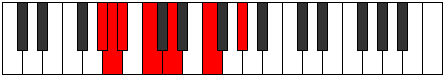

# Mode Thyrimic

## Links

- [Documentation](README.md)
- [Scales Index](Scales.md)
- [Modes Index](Modes.md)
- [Chords Index](Chords.md)

## Parent Scale

[Zagimic](ScaleZagimic.md)

## Number

[599](https://ianring.com/musictheory/scales/599)

## Interval Pattern

1, 1, 2, 2, 3, 3

## Chord Pattern

VI

## Perfection

- 3 Perfect notes
- 3 Perfect notes

## Perfection Profile

[false false true false true true]

## Permutations

| Tonic | Notes | Signature | Illustration | Audio |
|-------|-------|-----------|--------------|-------|
| [C](ModeCNaturalThyrimic.md) | **C**, **Db**, Ebb, **Fb**, Gb, A, **C** | C |  | [midi](https://github.com/edipermadi/music/blob/main/docs/ModeCNaturalThyrimic.mid?raw=true) |
| [C#](ModeCSharpThyrimic.md) | **C#**, **D**, Eb, **F**, G, A#, **C#** | C |  | [midi](https://github.com/edipermadi/music/blob/main/docs/ModeCSharpThyrimic.mid?raw=true) |
| [Db](ModeDFlatThyrimic.md) | **Db**, **Ebb**, Fbb, **Gbb**, Abb, Bb, **Db** | C |  | [midi](https://github.com/edipermadi/music/blob/main/docs/ModeDFlatThyrimic.mid?raw=true) |
| [D](ModeDNaturalThyrimic.md) | **D**, **Eb**, Fb, **Gb**, Ab, B, **D** | C |  | [midi](https://github.com/edipermadi/music/blob/main/docs/ModeDNaturalThyrimic.mid?raw=true) |
| [D#](ModeDSharpThyrimic.md) | **D#**, **E**, F, **G**, A, B#, **D#** | C |  | [midi](https://github.com/edipermadi/music/blob/main/docs/ModeDSharpThyrimic.mid?raw=true) |
| [Eb](ModeEFlatThyrimic.md) | **Eb**, **Fb**, Gbb, **Abb**, Bbb, C, **Eb** | C |  | [midi](https://github.com/edipermadi/music/blob/main/docs/ModeEFlatThyrimic.mid?raw=true) |
| [E](ModeENaturalThyrimic.md) | **E**, **F**, Gb, **Ab**, Bb, C#, **E** | C |  | [midi](https://github.com/edipermadi/music/blob/main/docs/ModeENaturalThyrimic.mid?raw=true) |
| [F](ModeFNaturalThyrimic.md) | **F**, **Gb**, Abb, **Bbb**, Cb, D, **F** | C |  | [midi](https://github.com/edipermadi/music/blob/main/docs/ModeFNaturalThyrimic.mid?raw=true) |
| [F#](ModeFSharpThyrimic.md) | **F#**, **G**, Ab, **Bb**, C, D#, **F#** | C |  | [midi](https://github.com/edipermadi/music/blob/main/docs/ModeFSharpThyrimic.mid?raw=true) |
| [Gb](ModeGFlatThyrimic.md) | **Gb**, **Abb**, Bbbb, **Cbb**, Dbb, Eb, **Gb** | C |  | [midi](https://github.com/edipermadi/music/blob/main/docs/ModeGFlatThyrimic.mid?raw=true) |
| [G](ModeGNaturalThyrimic.md) | **G**, **Ab**, Bbb, **Cb**, Db, E, **G** | C |  | [midi](https://github.com/edipermadi/music/blob/main/docs/ModeGNaturalThyrimic.mid?raw=true) |
| [G#](ModeGSharpThyrimic.md) | **G#**, **A**, Bb, **C**, D, E#, **G#** | C |  | [midi](https://github.com/edipermadi/music/blob/main/docs/ModeGSharpThyrimic.mid?raw=true) |
| [Ab](ModeAFlatThyrimic.md) | **Ab**, **Bbb**, Cbb, **Dbb**, Ebb, F, **Ab** | C |  | [midi](https://github.com/edipermadi/music/blob/main/docs/ModeAFlatThyrimic.mid?raw=true) |
| [A](ModeANaturalThyrimic.md) | **A**, **Bb**, Cb, **Db**, Eb, F#, **A** | C |  | [midi](https://github.com/edipermadi/music/blob/main/docs/ModeANaturalThyrimic.mid?raw=true) |
| [A#](ModeASharpThyrimic.md) | **A#**, **B**, C, **D**, E, F##, **A#** | C |  | [midi](https://github.com/edipermadi/music/blob/main/docs/ModeASharpThyrimic.mid?raw=true) |
| [Bb](ModeBFlatThyrimic.md) | **Bb**, **Cb**, Dbb, **Ebb**, Fb, G, **Bb** | C |  | [midi](https://github.com/edipermadi/music/blob/main/docs/ModeBFlatThyrimic.mid?raw=true) |
| [B](ModeBNaturalThyrimic.md) | **B**, **C**, Db, **Eb**, F, G#, **B** | C |  | [midi](https://github.com/edipermadi/music/blob/main/docs/ModeBNaturalThyrimic.mid?raw=true) |
