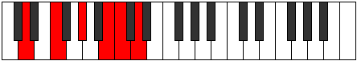
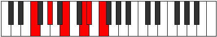

# Mode Thyritonic

## Links

- [Documentation](README.md)
- [Scales Index](Scales.md)
- [Modes Index](Modes.md)
- [Chords Index](Chords.md)

## Parent Scale

[Thyritonic](ScaleThyritonic.md)

## Number

[1609](https://ianring.com/musictheory/scales/1609)

## Transposition

3, 3, 3, 1, 2

## Chord Pattern

## Perfection

- 1 Perfect notes
- 4 Perfect notes

## Perfection Profile

false, true, false, false, false

## Permutations

| Tonic | Notes | Signature | Illustration | Audio |
|-------|-------|-----------|--------------|-------|
| [C](ModeCNaturalThyritonic.md) | **C**, D#, **F#**, **A**, **A#**, **C** | C |  | [midi](https://github.com/edipermadi/music/blob/main/docs/ModeCNaturalThyritonic.mid?raw=true) |
| [C#](ModeCSharpThyritonic.md) | **C#**, E, **G**, **A#**, **B**, **C#** | C |  | [midi](https://github.com/edipermadi/music/blob/main/docs/ModeCSharpThyritonic.mid?raw=true) |
| [Db](ModeDFlatThyritonic.md) | **Db**, E, **G**, **Bb**, **B**, **Db** | C |  | [midi](https://github.com/edipermadi/music/blob/main/docs/ModeDFlatThyritonic.mid?raw=true) |
| [D](ModeDNaturalThyritonic.md) | **D**, F, **G#**, **B**, **C**, **D** | C |  | [midi](https://github.com/edipermadi/music/blob/main/docs/ModeDNaturalThyritonic.mid?raw=true) |
| [D#](ModeDSharpThyritonic.md) | **D#**, F#, **A**, **C**, **C#**, **D#** | C |  | [midi](https://github.com/edipermadi/music/blob/main/docs/ModeDSharpThyritonic.mid?raw=true) |
| [Eb](ModeEFlatThyritonic.md) | **Eb**, Gb, **A**, **C**, **Db**, **Eb** | C |  | [midi](https://github.com/edipermadi/music/blob/main/docs/ModeEFlatThyritonic.mid?raw=true) |
| [E](ModeENaturalThyritonic.md) | **E**, G, **A#**, **C#**, **D**, **E** | C |  | [midi](https://github.com/edipermadi/music/blob/main/docs/ModeENaturalThyritonic.mid?raw=true) |
| [F](ModeFNaturalThyritonic.md) | **F**, G#, **B**, **D**, **D#**, **F** | C |  | [midi](https://github.com/edipermadi/music/blob/main/docs/ModeFNaturalThyritonic.mid?raw=true) |
| [F#](ModeFSharpThyritonic.md) | **F#**, A, **C**, **D#**, **E**, **F#** | C |  | [midi](https://github.com/edipermadi/music/blob/main/docs/ModeFSharpThyritonic.mid?raw=true) |
| [Gb](ModeGFlatThyritonic.md) | **Gb**, A, **C**, **Eb**, **E**, **Gb** | C |  | [midi](https://github.com/edipermadi/music/blob/main/docs/ModeGFlatThyritonic.mid?raw=true) |
| [G](ModeGNaturalThyritonic.md) | **G**, A#, **C#**, **E**, **F**, **G** | C |  | [midi](https://github.com/edipermadi/music/blob/main/docs/ModeGNaturalThyritonic.mid?raw=true) |
| [G#](ModeGSharpThyritonic.md) | **G#**, B, **D**, **F**, **F#**, **G#** | C |  | [midi](https://github.com/edipermadi/music/blob/main/docs/ModeGSharpThyritonic.mid?raw=true) |
| [Ab](ModeAFlatThyritonic.md) | **Ab**, B, **D**, **F**, **Gb**, **Ab** | C |  | [midi](https://github.com/edipermadi/music/blob/main/docs/ModeAFlatThyritonic.mid?raw=true) |
| [A](ModeANaturalThyritonic.md) | **A**, C, **D#**, **F#**, **G**, **A** | C |  | [midi](https://github.com/edipermadi/music/blob/main/docs/ModeANaturalThyritonic.mid?raw=true) |
| [A#](ModeASharpThyritonic.md) | **A#**, C#, **E**, **G**, **G#**, **A#** | C |  | [midi](https://github.com/edipermadi/music/blob/main/docs/ModeASharpThyritonic.mid?raw=true) |
| [Bb](ModeBFlatThyritonic.md) | **Bb**, Db, **E**, **G**, **Ab**, **Bb** | C |  | [midi](https://github.com/edipermadi/music/blob/main/docs/ModeBFlatThyritonic.mid?raw=true) |
| [B](ModeBNaturalThyritonic.md) | **B**, D, **F**, **G#**, **A**, **B** | C |  | [midi](https://github.com/edipermadi/music/blob/main/docs/ModeBNaturalThyritonic.mid?raw=true) |
