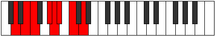

# Mode Tyrian

## Links

- [Documentation](index.md)
- [Scales Index](Scales.md)
- [Modes Index](Modes.md)
- [Chords Index](Chords.md)

## Parent Scale

[Dolian](ScaleDolian.md)

## Number

[1485](https://ianring.com/musictheory/scales/1485)

## Perfection

- 4 Perfect notes
- 3 Perfect notes

## Perfection Profile

[true false true false true true false]

## Permutations

| Tonic | Notes | Signature | Illustration | Audio |
|-------|-------|-----------|--------------|-------|
| [C](ModeCNaturalTyrian.md) | C, **D**, Eb, **F#**, G, Ab, **Bb**, C | C |  | [midi](ModeCNaturalTyrian.mid) [ogg](ModeCNaturalTyrian.ogg) |
| [C#](ModeCSharpTyrian.md) | C#, **D#**, E, **F##**, G#, A, **B**, C# | C |  | [midi](ModeCSharpTyrian.mid) [ogg](ModeCSharpTyrian.ogg) |
| [Db](ModeDFlatTyrian.md) | Db, **Eb**, Fb, **G**, Ab, Bbb, **Cb**, Db | C |  | [midi](ModeDFlatTyrian.mid) [ogg](ModeDFlatTyrian.ogg) |
| [D](ModeDNaturalTyrian.md) | D, **E**, F, **G#**, A, Bb, **C**, D | C |  | [midi](ModeDNaturalTyrian.mid) [ogg](ModeDNaturalTyrian.ogg) |
| [D#](ModeDSharpTyrian.md) | D#, **E#**, F#, **G##**, A#, B, **C#**, D# | C |  | [midi](ModeDSharpTyrian.mid) [ogg](ModeDSharpTyrian.ogg) |
| [Eb](ModeEFlatTyrian.md) | Eb, **F**, Gb, **A**, Bb, Cb, **Db**, Eb | C |  | [midi](ModeEFlatTyrian.mid) [ogg](ModeEFlatTyrian.ogg) |
| [E](ModeENaturalTyrian.md) | E, **F#**, G, **A#**, B, C, **D**, E | C |  | [midi](ModeENaturalTyrian.mid) [ogg](ModeENaturalTyrian.ogg) |
| [F](ModeFNaturalTyrian.md) | F, **G**, Ab, **B**, C, Db, **Eb**, F | C |  | [midi](ModeFNaturalTyrian.mid) [ogg](ModeFNaturalTyrian.ogg) |
| [F#](ModeFSharpTyrian.md) | F#, **G#**, A, **B#**, C#, D, **E**, F# | C |  | [midi](ModeFSharpTyrian.mid) [ogg](ModeFSharpTyrian.ogg) |
| [Gb](ModeGFlatTyrian.md) | Gb, **Ab**, Bbb, **C**, Db, Ebb, **Fb**, Gb | C |  | [midi](ModeGFlatTyrian.mid) [ogg](ModeGFlatTyrian.ogg) |
| [G](ModeGNaturalTyrian.md) | G, **A**, Bb, **C#**, D, Eb, **F**, G | C |  | [midi](ModeGNaturalTyrian.mid) [ogg](ModeGNaturalTyrian.ogg) |
| [G#](ModeGSharpTyrian.md) | G#, **A#**, B, **C##**, D#, E, **F#**, G# | C |  | [midi](ModeGSharpTyrian.mid) [ogg](ModeGSharpTyrian.ogg) |
| [Ab](ModeAFlatTyrian.md) | Ab, **Bb**, Cb, **D**, Eb, Fb, **Gb**, Ab | C |  | [midi](ModeAFlatTyrian.mid) [ogg](ModeAFlatTyrian.ogg) |
| [A](ModeANaturalTyrian.md) | A, **B**, C, **D#**, E, F, **G**, A | C |  | [midi](ModeANaturalTyrian.mid) [ogg](ModeANaturalTyrian.ogg) |
| [A#](ModeASharpTyrian.md) | A#, **B#**, C#, **D##**, E#, F#, **G#**, A# | C |  | [midi](ModeASharpTyrian.mid) [ogg](ModeASharpTyrian.ogg) |
| [Bb](ModeBFlatTyrian.md) | Bb, **C**, Db, **E**, F, Gb, **Ab**, Bb | C |  | [midi](ModeBFlatTyrian.mid) [ogg](ModeBFlatTyrian.ogg) |
| [B](ModeBNaturalTyrian.md) | B, **C#**, D, **E#**, F#, G, **A**, B | C |  | [midi](ModeBNaturalTyrian.mid) [ogg](ModeBNaturalTyrian.ogg) |
