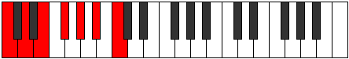
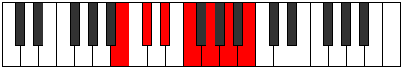

# Mode WholeTone

## Links

- [Documentation](index.md)
- [Scales Index](Scales.md)
- [Modes Index](Modes.md)
- [Chords Index](Chords.md)

## Parent Scale

[WholeTone](ScaleWholeTone.md)

## Number

[1365](https://ianring.com/musictheory/scales/1365)

## Perfection

- 0 Perfect notes
- 6 Perfect notes

## Perfection Profile

[false false false false false false]

## Permutations

| Tonic | Notes | Signature | Illustration | Audio |
|-------|-------|-----------|--------------|-------|
| [C](ModeCNaturalWholeTone.md) | **C**, **D**, **E**, **F#**, **G#**, **A#**, **C** | C |  | [midi](https://github.com/edipermadi/music/blob/main/docs/ModeCNaturalWholeTone.mid?raw=true) |
| [C#](ModeCSharpWholeTone.md) | **C#**, **D#**, **E#**, **F##**, **G##**, **A##**, **C#** | C |  | [midi](https://github.com/edipermadi/music/blob/main/docs/ModeCSharpWholeTone.mid?raw=true) |
| [Db](ModeDFlatWholeTone.md) | **Db**, **Eb**, **F**, **G**, **A**, **B**, **Db** | C |  | [midi](https://github.com/edipermadi/music/blob/main/docs/ModeDFlatWholeTone.mid?raw=true) |
| [D](ModeDNaturalWholeTone.md) | **D**, **E**, **F#**, **G#**, **A#**, **B#**, **D** | C |  | [midi](https://github.com/edipermadi/music/blob/main/docs/ModeDNaturalWholeTone.mid?raw=true) |
| [D#](ModeDSharpWholeTone.md) | **D#**, **E#**, **F##**, **G##**, **A##**, **B##**, **D#** | C |  | [midi](https://github.com/edipermadi/music/blob/main/docs/ModeDSharpWholeTone.mid?raw=true) |
| [Eb](ModeEFlatWholeTone.md) | **Eb**, **F**, **G**, **A**, **B**, **C#**, **Eb** | C |  | [midi](https://github.com/edipermadi/music/blob/main/docs/ModeEFlatWholeTone.mid?raw=true) |
| [E](ModeENaturalWholeTone.md) | **E**, **F#**, **G#**, **A#**, **B#**, **C##**, **E** | C |  | [midi](https://github.com/edipermadi/music/blob/main/docs/ModeENaturalWholeTone.mid?raw=true) |
| [F](ModeFNaturalWholeTone.md) | **F**, **G**, **A**, **B**, **C#**, **D#**, **F** | C |  | [midi](https://github.com/edipermadi/music/blob/main/docs/ModeFNaturalWholeTone.mid?raw=true) |
| [F#](ModeFSharpWholeTone.md) | **F#**, **G#**, **A#**, **B#**, **C##**, **D##**, **F#** | C |  | [midi](https://github.com/edipermadi/music/blob/main/docs/ModeFSharpWholeTone.mid?raw=true) |
| [Gb](ModeGFlatWholeTone.md) | **Gb**, **Ab**, **Bb**, **C**, **D**, **E**, **Gb** | C |  | [midi](https://github.com/edipermadi/music/blob/main/docs/ModeGFlatWholeTone.mid?raw=true) |
| [G](ModeGNaturalWholeTone.md) | **G**, **A**, **B**, **C#**, **D#**, **E#**, **G** | C |  | [midi](https://github.com/edipermadi/music/blob/main/docs/ModeGNaturalWholeTone.mid?raw=true) |
| [G#](ModeGSharpWholeTone.md) | **G#**, **A#**, **B#**, **C##**, **D##**, **E##**, **G#** | C |  | [midi](https://github.com/edipermadi/music/blob/main/docs/ModeGSharpWholeTone.mid?raw=true) |
| [Ab](ModeAFlatWholeTone.md) | **Ab**, **Bb**, **C**, **D**, **E**, **F#**, **Ab** | C |  | [midi](https://github.com/edipermadi/music/blob/main/docs/ModeAFlatWholeTone.mid?raw=true) |
| [A](ModeANaturalWholeTone.md) | **A**, **B**, **C#**, **D#**, **E#**, **F##**, **A** | C |  | [midi](https://github.com/edipermadi/music/blob/main/docs/ModeANaturalWholeTone.mid?raw=true) |
| [A#](ModeASharpWholeTone.md) | **A#**, **B#**, **C##**, **D##**, **E##**, **F###**, **A#** | C |  | [midi](https://github.com/edipermadi/music/blob/main/docs/ModeASharpWholeTone.mid?raw=true) |
| [Bb](ModeBFlatWholeTone.md) | **Bb**, **C**, **D**, **E**, **F#**, **G#**, **Bb** | C |  | [midi](https://github.com/edipermadi/music/blob/main/docs/ModeBFlatWholeTone.mid?raw=true) |
| [B](ModeBNaturalWholeTone.md) | **B**, **C#**, **D#**, **E#**, **F##**, **G##**, **B** | C |  | [midi](https://github.com/edipermadi/music/blob/main/docs/ModeBNaturalWholeTone.mid?raw=true) |
