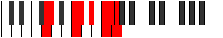

# Mode Zacrian

## Links

- [Documentation](README.md)
- [Scales Index](Scales.md)
- [Modes Index](Modes.md)
- [Chords Index](Chords.md)

## Parent Scale

[Ionythian](ScaleIonythian.md)

## Number

[3427](https://ianring.com/musictheory/scales/3427)

## Interval Pattern

1, 4, 1, 2, 2, 1, 1

## Chord Pattern

iii⁰, IVb5

## Perfection

- 5 Perfect notes
- 2 Perfect notes

## Perfection Profile

[false true true true false true true]

## Permutations

| Tonic | Notes | Signature | Illustration | Audio |
|-------|-------|-----------|--------------|-------|
| [C](ModeCNaturalZacrian.md) | **C**, Db, E#, F#, **G#**, A#, B, **C** | C |  | [midi](https://github.com/edipermadi/music/blob/main/docs/ModeCNaturalZacrian.mid?raw=true) |
| [C#](ModeCSharpZacrian.md) | **C#**, D, E##, F##, **G##**, A##, B#, **C#** | C |  | [midi](https://github.com/edipermadi/music/blob/main/docs/ModeCSharpZacrian.mid?raw=true) |
| [Db](ModeDFlatZacrian.md) | **Db**, Ebb, F#, G, **A**, B, C, **Db** | C |  | [midi](https://github.com/edipermadi/music/blob/main/docs/ModeDFlatZacrian.mid?raw=true) |
| [D](ModeDNaturalZacrian.md) | **D**, Eb, F##, G#, **A#**, B#, C#, **D** | C |  | [midi](https://github.com/edipermadi/music/blob/main/docs/ModeDNaturalZacrian.mid?raw=true) |
| [D#](ModeDSharpZacrian.md) | **D#**, E, F###, G##, **A##**, B##, C##, **D#** | C |  | [midi](https://github.com/edipermadi/music/blob/main/docs/ModeDSharpZacrian.mid?raw=true) |
| [Eb](ModeEFlatZacrian.md) | **Eb**, Fb, G#, A, **B**, C#, D, **Eb** | C |  | [midi](https://github.com/edipermadi/music/blob/main/docs/ModeEFlatZacrian.mid?raw=true) |
| [E](ModeENaturalZacrian.md) | **E**, F, G##, A#, **B#**, C##, D#, **E** | C |  | [midi](https://github.com/edipermadi/music/blob/main/docs/ModeENaturalZacrian.mid?raw=true) |
| [F](ModeFNaturalZacrian.md) | **F**, Gb, A#, B, **C#**, D#, E, **F** | C |  | [midi](https://github.com/edipermadi/music/blob/main/docs/ModeFNaturalZacrian.mid?raw=true) |
| [F#](ModeFSharpZacrian.md) | **F#**, G, A##, B#, **C##**, D##, E#, **F#** | C |  | [midi](https://github.com/edipermadi/music/blob/main/docs/ModeFSharpZacrian.mid?raw=true) |
| [Gb](ModeGFlatZacrian.md) | **Gb**, Abb, B, C, **D**, E, F, **Gb** | C |  | [midi](https://github.com/edipermadi/music/blob/main/docs/ModeGFlatZacrian.mid?raw=true) |
| [G](ModeGNaturalZacrian.md) | **G**, Ab, B#, C#, **D#**, E#, F#, **G** | C |  | [midi](https://github.com/edipermadi/music/blob/main/docs/ModeGNaturalZacrian.mid?raw=true) |
| [G#](ModeGSharpZacrian.md) | **G#**, A, B##, C##, **D##**, E##, F##, **G#** | C |  | [midi](https://github.com/edipermadi/music/blob/main/docs/ModeGSharpZacrian.mid?raw=true) |
| [Ab](ModeAFlatZacrian.md) | **Ab**, Bbb, C#, D, **E**, F#, G, **Ab** | C |  | [midi](https://github.com/edipermadi/music/blob/main/docs/ModeAFlatZacrian.mid?raw=true) |
| [A](ModeANaturalZacrian.md) | **A**, Bb, C##, D#, **E#**, F##, G#, **A** | C |  | [midi](https://github.com/edipermadi/music/blob/main/docs/ModeANaturalZacrian.mid?raw=true) |
| [A#](ModeASharpZacrian.md) | **A#**, B, C###, D##, **E##**, F###, G##, **A#** | C |  | [midi](https://github.com/edipermadi/music/blob/main/docs/ModeASharpZacrian.mid?raw=true) |
| [Bb](ModeBFlatZacrian.md) | **Bb**, Cb, D#, E, **F#**, G#, A, **Bb** | C |  | [midi](https://github.com/edipermadi/music/blob/main/docs/ModeBFlatZacrian.mid?raw=true) |
| [B](ModeBNaturalZacrian.md) | **B**, C, D##, E#, **F##**, G##, A#, **B** | C |  | [midi](https://github.com/edipermadi/music/blob/main/docs/ModeBNaturalZacrian.mid?raw=true) |
