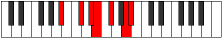

# Mode Zacrimic

## Links

- [Documentation](index.md)
- [Scales Index](Scales.md)
- [Modes Index](Modes.md)
- [Chords Index](Chords.md)

## Parent Scale

[Zacrimic](ScaleZacrimic.md)

## Number

[2409](https://ianring.com/musictheory/scales/2409)

## Perfection

- 3 Perfect notes
- 3 Perfect notes

## Perfection Profile

[false false true false true true]

## Permutations

| Tonic | Notes | Signature | Illustration | Audio |
|-------|-------|-----------|--------------|-------|
| [C](ModeCNaturalZacrimic.md) | **C**, **D#**, E#, **F#**, G#, A##, **C** | C |  | [midi](ModeCNaturalZacrimic.mid) [ogg](ModeCNaturalZacrimic.ogg) |
| [C#](ModeCSharpZacrimic.md) | **C#**, **D##**, E##, **F##**, G##, A###, **C#** | C |  | [midi](ModeCSharpZacrimic.mid) [ogg](ModeCSharpZacrimic.ogg) |
| [Db](ModeDFlatZacrimic.md) | **Db**, **E**, F#, **G**, A, B#, **Db** | C |  | [midi](ModeDFlatZacrimic.mid) [ogg](ModeDFlatZacrimic.ogg) |
| [D](ModeDNaturalZacrimic.md) | **D**, **E#**, F##, **G#**, A#, B##, **D** | C |  | [midi](ModeDNaturalZacrimic.mid) [ogg](ModeDNaturalZacrimic.ogg) |
| [D#](ModeDSharpZacrimic.md) | **D#**, **E##**, F###, **G##**, A##, B###, **D#** | C |  | [midi](ModeDSharpZacrimic.mid) [ogg](ModeDSharpZacrimic.ogg) |
| [Eb](ModeEFlatZacrimic.md) | **Eb**, **F#**, G#, **A**, B, C##, **Eb** | C |  | [midi](ModeEFlatZacrimic.mid) [ogg](ModeEFlatZacrimic.ogg) |
| [E](ModeENaturalZacrimic.md) | **E**, **F##**, G##, **A#**, B#, C###, **E** | C |  | [midi](ModeENaturalZacrimic.mid) [ogg](ModeENaturalZacrimic.ogg) |
| [F](ModeFNaturalZacrimic.md) | **F**, **G#**, A#, **B**, C#, D##, **F** | C |  | [midi](ModeFNaturalZacrimic.mid) [ogg](ModeFNaturalZacrimic.ogg) |
| [F#](ModeFSharpZacrimic.md) | **F#**, **G##**, A##, **B#**, C##, D###, **F#** | C |  | [midi](ModeFSharpZacrimic.mid) [ogg](ModeFSharpZacrimic.ogg) |
| [Gb](ModeGFlatZacrimic.md) | **Gb**, **A**, B, **C**, D, E#, **Gb** | C |  | [midi](ModeGFlatZacrimic.mid) [ogg](ModeGFlatZacrimic.ogg) |
| [G](ModeGNaturalZacrimic.md) | **G**, **A#**, B#, **C#**, D#, E##, **G** | C |  | [midi](ModeGNaturalZacrimic.mid) [ogg](ModeGNaturalZacrimic.ogg) |
| [G#](ModeGSharpZacrimic.md) | **G#**, **A##**, B##, **C##**, D##, E###, **G#** | C |  | [midi](ModeGSharpZacrimic.mid) [ogg](ModeGSharpZacrimic.ogg) |
| [Ab](ModeAFlatZacrimic.md) | **Ab**, **B**, C#, **D**, E, F##, **Ab** | C |  | [midi](ModeAFlatZacrimic.mid) [ogg](ModeAFlatZacrimic.ogg) |
| [A](ModeANaturalZacrimic.md) | **A**, **B#**, C##, **D#**, E#, F###, **A** | C |  | [midi](ModeANaturalZacrimic.mid) [ogg](ModeANaturalZacrimic.ogg) |
| [A#](ModeASharpZacrimic.md) | **A#**, **B##**, C###, **D##**, E##, Cbbb, **A#** | C |  | [midi](ModeASharpZacrimic.mid) [ogg](ModeASharpZacrimic.ogg) |
| [Bb](ModeBFlatZacrimic.md) | **Bb**, **C#**, D#, **E**, F#, G##, **Bb** | C |  | [midi](ModeBFlatZacrimic.mid) [ogg](ModeBFlatZacrimic.ogg) |
| [B](ModeBNaturalZacrimic.md) | **B**, **C##**, D##, **E#**, F##, G###, **B** | C |  | [midi](ModeBNaturalZacrimic.mid) [ogg](ModeBNaturalZacrimic.ogg) |
