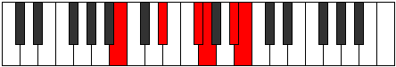

# Mode Zacritonic

## Links

- [Documentation](index.md)
- [Scales Index](Scales.md)
- [Modes Index](Modes.md)
- [Chords Index](Chords.md)

## Parent Scale

[Zacritonic](ScaleZacritonic.md)

## Number

[2449](https://ianring.com/musictheory/scales/2449)

## Perfection

- 2 Perfect notes
- 3 Perfect notes

## Perfection Profile

[true true false false false]

## Permutations

| Tonic | Notes | Signature | Illustration | Audio |
|-------|-------|-----------|--------------|-------|
| [C](ModeCNaturalZacritonic.md) | C, E, **G**, **G#**, **B**, C | C |  | [midi](ModeCNaturalZacritonic.mid) [ogg](ModeCNaturalZacritonic.ogg) |
| [C#](ModeCSharpZacritonic.md) | C#, F, **G#**, **A**, **C**, C# | C |  | [midi](ModeCSharpZacritonic.mid) [ogg](ModeCSharpZacritonic.ogg) |
| [Db](ModeDFlatZacritonic.md) | Db, F, **Ab**, **A**, **C**, Db | C |  | [midi](ModeDFlatZacritonic.mid) [ogg](ModeDFlatZacritonic.ogg) |
| [D](ModeDNaturalZacritonic.md) | D, F#, **A**, **A#**, **C#**, D | C |  | [midi](ModeDNaturalZacritonic.mid) [ogg](ModeDNaturalZacritonic.ogg) |
| [D#](ModeDSharpZacritonic.md) | D#, G, **A#**, **B**, **D**, D# | C |  | [midi](ModeDSharpZacritonic.mid) [ogg](ModeDSharpZacritonic.ogg) |
| [Eb](ModeEFlatZacritonic.md) | Eb, G, **Bb**, **B**, **D**, Eb | C |  | [midi](ModeEFlatZacritonic.mid) [ogg](ModeEFlatZacritonic.ogg) |
| [E](ModeENaturalZacritonic.md) | E, G#, **B**, **C**, **D#**, E | C |  | [midi](ModeENaturalZacritonic.mid) [ogg](ModeENaturalZacritonic.ogg) |
| [F](ModeFNaturalZacritonic.md) | F, A, **C**, **C#**, **E**, F | C |  | [midi](ModeFNaturalZacritonic.mid) [ogg](ModeFNaturalZacritonic.ogg) |
| [F#](ModeFSharpZacritonic.md) | F#, A#, **C#**, **D**, **F**, F# | C |  | [midi](ModeFSharpZacritonic.mid) [ogg](ModeFSharpZacritonic.ogg) |
| [Gb](ModeGFlatZacritonic.md) | Gb, Bb, **Db**, **D**, **F**, Gb | C |  | [midi](ModeGFlatZacritonic.mid) [ogg](ModeGFlatZacritonic.ogg) |
| [G](ModeGNaturalZacritonic.md) | G, B, **D**, **D#**, **F#**, G | C |  | [midi](ModeGNaturalZacritonic.mid) [ogg](ModeGNaturalZacritonic.ogg) |
| [G#](ModeGSharpZacritonic.md) | G#, C, **D#**, **E**, **G**, G# | C |  | [midi](ModeGSharpZacritonic.mid) [ogg](ModeGSharpZacritonic.ogg) |
| [Ab](ModeAFlatZacritonic.md) | Ab, C, **Eb**, **E**, **G**, Ab | C |  | [midi](ModeAFlatZacritonic.mid) [ogg](ModeAFlatZacritonic.ogg) |
| [A](ModeANaturalZacritonic.md) | A, C#, **E**, **F**, **G#**, A | C |  | [midi](ModeANaturalZacritonic.mid) [ogg](ModeANaturalZacritonic.ogg) |
| [A#](ModeASharpZacritonic.md) | A#, D, **F**, **F#**, **A**, A# | C |  | [midi](ModeASharpZacritonic.mid) [ogg](ModeASharpZacritonic.ogg) |
| [Bb](ModeBFlatZacritonic.md) | Bb, D, **F**, **Gb**, **A**, Bb | C |  | [midi](ModeBFlatZacritonic.mid) [ogg](ModeBFlatZacritonic.ogg) |
| [B](ModeBNaturalZacritonic.md) | B, D#, **F#**, **G**, **A#**, B | C |  | [midi](ModeBNaturalZacritonic.mid) [ogg](ModeBNaturalZacritonic.ogg) |
