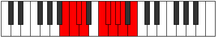

# Mode Zacrygic

## Links

- [Documentation](index.md)
- [Scales Index](Scales.md)
- [Modes Index](Modes.md)
- [Chords Index](Chords.md)

## Parent Scale

[Dycrygic](ScaleDycrygic.md)

## Number

[1999](https://ianring.com/musictheory/scales/1999)

## Perfection

- 7 Perfect notes
- 2 Perfect notes

## Perfection Profile

[true true true true true true true false false]

## Permutations

| Tonic | Notes | Signature | Illustration | Audio |
|-------|-------|-----------|--------------|-------|
| [C](ModeCNaturalZacrygic.md) | C, C#, D, D#, F#, G, G#, **A**, **A#**, C | C |  | [midi](ModeCNaturalZacrygic.mid) [ogg](ModeCNaturalZacrygic.ogg) |
| [C#](ModeCSharpZacrygic.md) | C#, D, D#, E, G, G#, A, **A#**, **B**, C# | C |  | [midi](ModeCSharpZacrygic.mid) [ogg](ModeCSharpZacrygic.ogg) |
| [Db](ModeDFlatZacrygic.md) | Db, D, Eb, E, G, Ab, A, **Bb**, **B**, Db | C |  | [midi](ModeDFlatZacrygic.mid) [ogg](ModeDFlatZacrygic.ogg) |
| [D](ModeDNaturalZacrygic.md) | D, D#, E, F, G#, A, A#, **B**, **C**, D | C |  | [midi](ModeDNaturalZacrygic.mid) [ogg](ModeDNaturalZacrygic.ogg) |
| [D#](ModeDSharpZacrygic.md) | D#, E, F, F#, A, A#, B, **C**, **C#**, D# | C |  | [midi](ModeDSharpZacrygic.mid) [ogg](ModeDSharpZacrygic.ogg) |
| [Eb](ModeEFlatZacrygic.md) | Eb, E, F, Gb, A, Bb, B, **C**, **Db**, Eb | C |  | [midi](ModeEFlatZacrygic.mid) [ogg](ModeEFlatZacrygic.ogg) |
| [E](ModeENaturalZacrygic.md) | E, F, F#, G, A#, B, C, **C#**, **D**, E | C |  | [midi](ModeENaturalZacrygic.mid) [ogg](ModeENaturalZacrygic.ogg) |
| [F](ModeFNaturalZacrygic.md) | F, F#, G, G#, B, C, C#, **D**, **D#**, F | C |  | [midi](ModeFNaturalZacrygic.mid) [ogg](ModeFNaturalZacrygic.ogg) |
| [F#](ModeFSharpZacrygic.md) | F#, G, G#, A, C, C#, D, **D#**, **E**, F# | C |  | [midi](ModeFSharpZacrygic.mid) [ogg](ModeFSharpZacrygic.ogg) |
| [Gb](ModeGFlatZacrygic.md) | Gb, G, Ab, A, C, Db, D, **Eb**, **E**, Gb | C |  | [midi](ModeGFlatZacrygic.mid) [ogg](ModeGFlatZacrygic.ogg) |
| [G](ModeGNaturalZacrygic.md) | G, G#, A, A#, C#, D, D#, **E**, **F**, G | C |  | [midi](ModeGNaturalZacrygic.mid) [ogg](ModeGNaturalZacrygic.ogg) |
| [G#](ModeGSharpZacrygic.md) | G#, A, A#, B, D, D#, E, **F**, **F#**, G# | C |  | [midi](ModeGSharpZacrygic.mid) [ogg](ModeGSharpZacrygic.ogg) |
| [Ab](ModeAFlatZacrygic.md) | Ab, A, Bb, B, D, Eb, E, **F**, **Gb**, Ab | C |  | [midi](ModeAFlatZacrygic.mid) [ogg](ModeAFlatZacrygic.ogg) |
| [A](ModeANaturalZacrygic.md) | A, A#, B, C, D#, E, F, **F#**, **G**, A | C |  | [midi](ModeANaturalZacrygic.mid) [ogg](ModeANaturalZacrygic.ogg) |
| [A#](ModeASharpZacrygic.md) | A#, B, C, C#, E, F, F#, **G**, **G#**, A# | C |  | [midi](ModeASharpZacrygic.mid) [ogg](ModeASharpZacrygic.ogg) |
| [Bb](ModeBFlatZacrygic.md) | Bb, B, C, Db, E, F, Gb, **G**, **Ab**, Bb | C |  | [midi](ModeBFlatZacrygic.mid) [ogg](ModeBFlatZacrygic.ogg) |
| [B](ModeBNaturalZacrygic.md) | B, C, C#, D, F, F#, G, **G#**, **A**, B | C |  | [midi](ModeBNaturalZacrygic.mid) [ogg](ModeBNaturalZacrygic.ogg) |
