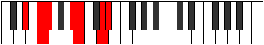

# Mode Zadimic

## Links

- [Documentation](README.md)
- [Scales Index](Scales.md)
- [Modes Index](Modes.md)
- [Chords Index](Chords.md)

## Parent Scale

[Solimic](ScaleSolimic.md)

## Number

[2445](https://ianring.com/musictheory/scales/2445)

## Transposition

2, 1, 4, 1, 3, 1

## Chord Pattern

IV, V

## Perfection

- 3 Perfect notes
- 3 Perfect notes

## Perfection Profile

[true false false true true false]

## Permutations

| Tonic | Notes | Signature | Illustration | Audio |
|-------|-------|-----------|--------------|-------|
| [C](ModeCNaturalZadimic.md) | C, **D**, **Eb**, F##, G#, **A##**, C | C |  | [midi](https://github.com/edipermadi/music/blob/main/docs/ModeCNaturalZadimic.mid?raw=true) |
| [C#](ModeCSharpZadimic.md) | C#, **D#**, **E**, F###, G##, **A###**, C# | C |  | [midi](https://github.com/edipermadi/music/blob/main/docs/ModeCSharpZadimic.mid?raw=true) |
| [Db](ModeDFlatZadimic.md) | Db, **Eb**, **Fb**, G#, A, **B#**, Db | C |  | [midi](https://github.com/edipermadi/music/blob/main/docs/ModeDFlatZadimic.mid?raw=true) |
| [D](ModeDNaturalZadimic.md) | D, **E**, **F**, G##, A#, **B##**, D | C |  | [midi](https://github.com/edipermadi/music/blob/main/docs/ModeDNaturalZadimic.mid?raw=true) |
| [D#](ModeDSharpZadimic.md) | D#, **E#**, **F#**, G###, A##, **B###**, D# | C |  | [midi](https://github.com/edipermadi/music/blob/main/docs/ModeDSharpZadimic.mid?raw=true) |
| [Eb](ModeEFlatZadimic.md) | Eb, **F**, **Gb**, A#, B, **C##**, Eb | C |  | [midi](https://github.com/edipermadi/music/blob/main/docs/ModeEFlatZadimic.mid?raw=true) |
| [E](ModeENaturalZadimic.md) | E, **F#**, **G**, A##, B#, **C###**, E | C |  | [midi](https://github.com/edipermadi/music/blob/main/docs/ModeENaturalZadimic.mid?raw=true) |
| [F](ModeFNaturalZadimic.md) | F, **G**, **Ab**, B#, C#, **D##**, F | C |  | [midi](https://github.com/edipermadi/music/blob/main/docs/ModeFNaturalZadimic.mid?raw=true) |
| [F#](ModeFSharpZadimic.md) | F#, **G#**, **A**, B##, C##, **D###**, F# | C |  | [midi](https://github.com/edipermadi/music/blob/main/docs/ModeFSharpZadimic.mid?raw=true) |
| [Gb](ModeGFlatZadimic.md) | Gb, **Ab**, **Bbb**, C#, D, **E#**, Gb | C |  | [midi](https://github.com/edipermadi/music/blob/main/docs/ModeGFlatZadimic.mid?raw=true) |
| [G](ModeGNaturalZadimic.md) | G, **A**, **Bb**, C##, D#, **E##**, G | C |  | [midi](https://github.com/edipermadi/music/blob/main/docs/ModeGNaturalZadimic.mid?raw=true) |
| [G#](ModeGSharpZadimic.md) | G#, **A#**, **B**, C###, D##, **E###**, G# | C |  | [midi](https://github.com/edipermadi/music/blob/main/docs/ModeGSharpZadimic.mid?raw=true) |
| [Ab](ModeAFlatZadimic.md) | Ab, **Bb**, **Cb**, D#, E, **F##**, Ab | C |  | [midi](https://github.com/edipermadi/music/blob/main/docs/ModeAFlatZadimic.mid?raw=true) |
| [A](ModeANaturalZadimic.md) | A, **B**, **C**, D##, E#, **F###**, A | C |  | [midi](https://github.com/edipermadi/music/blob/main/docs/ModeANaturalZadimic.mid?raw=true) |
| [A#](ModeASharpZadimic.md) | A#, **B#**, **C#**, D###, E##, **Cbbb**, A# | C |  | [midi](https://github.com/edipermadi/music/blob/main/docs/ModeASharpZadimic.mid?raw=true) |
| [Bb](ModeBFlatZadimic.md) | Bb, **C**, **Db**, E#, F#, **G##**, Bb | C |  | [midi](https://github.com/edipermadi/music/blob/main/docs/ModeBFlatZadimic.mid?raw=true) |
| [B](ModeBNaturalZadimic.md) | B, **C#**, **D**, E##, F##, **G###**, B | C |  | [midi](https://github.com/edipermadi/music/blob/main/docs/ModeBNaturalZadimic.mid?raw=true) |
