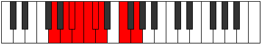

# Mode Zadyllic

## Links

- [Documentation](index.md)
- [Scales Index](Scales.md)
- [Modes Index](Modes.md)
- [Chords Index](Chords.md)

## Parent Scale

[Phranyllic](ScalePhranyllic.md)

## Number

[1277](https://ianring.com/musictheory/scales/1277)

## Perfection

- 5 Perfect notes
- 3 Perfect notes

## Perfection Profile

[true false true false true false true true]

## Permutations

| Tonic | Notes | Signature | Illustration | Audio |
|-------|-------|-----------|--------------|-------|
| [C](ModeCNaturalZadyllic.md) | C, **D**, D#, **E**, F, **F#**, G, A#, C | C |  | [midi](ModeCNaturalZadyllic.mid) [ogg](ModeCNaturalZadyllic.ogg) |
| [C#](ModeCSharpZadyllic.md) | C#, **D#**, E, **F**, F#, **G**, G#, B, C# | C |  | [midi](ModeCSharpZadyllic.mid) [ogg](ModeCSharpZadyllic.ogg) |
| [Db](ModeDFlatZadyllic.md) | Db, **Eb**, E, **F**, Gb, **G**, Ab, B, Db | C |  | [midi](ModeDFlatZadyllic.mid) [ogg](ModeDFlatZadyllic.ogg) |
| [D](ModeDNaturalZadyllic.md) | D, **E**, F, **F#**, G, **G#**, A, C, D | C |  | [midi](ModeDNaturalZadyllic.mid) [ogg](ModeDNaturalZadyllic.ogg) |
| [D#](ModeDSharpZadyllic.md) | D#, **F**, F#, **G**, G#, **A**, A#, C#, D# | C |  | [midi](ModeDSharpZadyllic.mid) [ogg](ModeDSharpZadyllic.ogg) |
| [Eb](ModeEFlatZadyllic.md) | Eb, **F**, Gb, **G**, Ab, **A**, Bb, Db, Eb | C |  | [midi](ModeEFlatZadyllic.mid) [ogg](ModeEFlatZadyllic.ogg) |
| [E](ModeENaturalZadyllic.md) | E, **F#**, G, **G#**, A, **A#**, B, D, E | C |  | [midi](ModeENaturalZadyllic.mid) [ogg](ModeENaturalZadyllic.ogg) |
| [F](ModeFNaturalZadyllic.md) | F, **G**, G#, **A**, A#, **B**, C, D#, F | C |  | [midi](ModeFNaturalZadyllic.mid) [ogg](ModeFNaturalZadyllic.ogg) |
| [F#](ModeFSharpZadyllic.md) | F#, **G#**, A, **A#**, B, **C**, C#, E, F# | C |  | [midi](ModeFSharpZadyllic.mid) [ogg](ModeFSharpZadyllic.ogg) |
| [Gb](ModeGFlatZadyllic.md) | Gb, **Ab**, A, **Bb**, B, **C**, Db, E, Gb | C |  | [midi](ModeGFlatZadyllic.mid) [ogg](ModeGFlatZadyllic.ogg) |
| [G](ModeGNaturalZadyllic.md) | G, **A**, A#, **B**, C, **C#**, D, F, G | C |  | [midi](ModeGNaturalZadyllic.mid) [ogg](ModeGNaturalZadyllic.ogg) |
| [G#](ModeGSharpZadyllic.md) | G#, **A#**, B, **C**, C#, **D**, D#, F#, G# | C |  | [midi](ModeGSharpZadyllic.mid) [ogg](ModeGSharpZadyllic.ogg) |
| [Ab](ModeAFlatZadyllic.md) | Ab, **Bb**, B, **C**, Db, **D**, Eb, Gb, Ab | C |  | [midi](ModeAFlatZadyllic.mid) [ogg](ModeAFlatZadyllic.ogg) |
| [A](ModeANaturalZadyllic.md) | A, **B**, C, **C#**, D, **D#**, E, G, A | C |  | [midi](ModeANaturalZadyllic.mid) [ogg](ModeANaturalZadyllic.ogg) |
| [A#](ModeASharpZadyllic.md) | A#, **C**, C#, **D**, D#, **E**, F, G#, A# | C |  | [midi](ModeASharpZadyllic.mid) [ogg](ModeASharpZadyllic.ogg) |
| [Bb](ModeBFlatZadyllic.md) | Bb, **C**, Db, **D**, Eb, **E**, F, Ab, Bb | C |  | [midi](ModeBFlatZadyllic.mid) [ogg](ModeBFlatZadyllic.ogg) |
| [B](ModeBNaturalZadyllic.md) | B, **C#**, D, **D#**, E, **F**, F#, A, B | C |  | [midi](ModeBNaturalZadyllic.mid) [ogg](ModeBNaturalZadyllic.ogg) |
