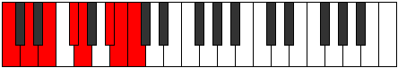

# Mode Zagian

## Links

- [Documentation](README.md)
- [Scales Index](Scales.md)
- [Modes Index](Modes.md)
- [Chords Index](Chords.md)

## Parent Scale

[Dolian](ScaleDolian.md)

## Number

[3285](https://ianring.com/musictheory/scales/3285)

## Transposition

2, 2, 2, 1, 3, 1, 1

## Chord Pattern

I, II⁺, iii, IVb5, V, vi⁰b3, vii

## Perfection

- 4 Perfect notes
- 3 Perfect notes

## Perfection Profile

[true false true false true false true]

## Permutations

| Tonic | Notes | Signature | Illustration | Audio |
|-------|-------|-----------|--------------|-------|
| [C](ModeCNaturalZagian.md) | C, **D**, E, **F#**, G, **A#**, B, C | C |  | [midi](https://github.com/edipermadi/music/blob/main/docs/ModeCNaturalZagian.mid?raw=true) |
| [C#](ModeCSharpZagian.md) | C#, **D#**, E#, **F##**, G#, **A##**, B#, C# | C |  | [midi](https://github.com/edipermadi/music/blob/main/docs/ModeCSharpZagian.mid?raw=true) |
| [Db](ModeDFlatZagian.md) | Db, **Eb**, F, **G**, Ab, **B**, C, Db | C |  | [midi](https://github.com/edipermadi/music/blob/main/docs/ModeDFlatZagian.mid?raw=true) |
| [D](ModeDNaturalZagian.md) | D, **E**, F#, **G#**, A, **B#**, C#, D | C |  | [midi](https://github.com/edipermadi/music/blob/main/docs/ModeDNaturalZagian.mid?raw=true) |
| [D#](ModeDSharpZagian.md) | D#, **E#**, F##, **G##**, A#, **B##**, C##, D# | C |  | [midi](https://github.com/edipermadi/music/blob/main/docs/ModeDSharpZagian.mid?raw=true) |
| [Eb](ModeEFlatZagian.md) | Eb, **F**, G, **A**, Bb, **C#**, D, Eb | C |  | [midi](https://github.com/edipermadi/music/blob/main/docs/ModeEFlatZagian.mid?raw=true) |
| [E](ModeENaturalZagian.md) | E, **F#**, G#, **A#**, B, **C##**, D#, E | C |  | [midi](https://github.com/edipermadi/music/blob/main/docs/ModeENaturalZagian.mid?raw=true) |
| [F](ModeFNaturalZagian.md) | F, **G**, A, **B**, C, **D#**, E, F | C |  | [midi](https://github.com/edipermadi/music/blob/main/docs/ModeFNaturalZagian.mid?raw=true) |
| [F#](ModeFSharpZagian.md) | F#, **G#**, A#, **B#**, C#, **D##**, E#, F# | C |  | [midi](https://github.com/edipermadi/music/blob/main/docs/ModeFSharpZagian.mid?raw=true) |
| [Gb](ModeGFlatZagian.md) | Gb, **Ab**, Bb, **C**, Db, **E**, F, Gb | C |  | [midi](https://github.com/edipermadi/music/blob/main/docs/ModeGFlatZagian.mid?raw=true) |
| [G](ModeGNaturalZagian.md) | G, **A**, B, **C#**, D, **E#**, F#, G | C |  | [midi](https://github.com/edipermadi/music/blob/main/docs/ModeGNaturalZagian.mid?raw=true) |
| [G#](ModeGSharpZagian.md) | G#, **A#**, B#, **C##**, D#, **E##**, F##, G# | C |  | [midi](https://github.com/edipermadi/music/blob/main/docs/ModeGSharpZagian.mid?raw=true) |
| [Ab](ModeAFlatZagian.md) | Ab, **Bb**, C, **D**, Eb, **F#**, G, Ab | C |  | [midi](https://github.com/edipermadi/music/blob/main/docs/ModeAFlatZagian.mid?raw=true) |
| [A](ModeANaturalZagian.md) | A, **B**, C#, **D#**, E, **F##**, G#, A | C |  | [midi](https://github.com/edipermadi/music/blob/main/docs/ModeANaturalZagian.mid?raw=true) |
| [A#](ModeASharpZagian.md) | A#, **B#**, C##, **D##**, E#, **F###**, G##, A# | C |  | [midi](https://github.com/edipermadi/music/blob/main/docs/ModeASharpZagian.mid?raw=true) |
| [Bb](ModeBFlatZagian.md) | Bb, **C**, D, **E**, F, **G#**, A, Bb | C |  | [midi](https://github.com/edipermadi/music/blob/main/docs/ModeBFlatZagian.mid?raw=true) |
| [B](ModeBNaturalZagian.md) | B, **C#**, D#, **E#**, F#, **G##**, A#, B | C |  | [midi](https://github.com/edipermadi/music/blob/main/docs/ModeBNaturalZagian.mid?raw=true) |
