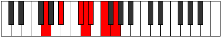
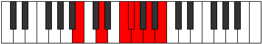

# Mode Zagimic

## Links

- [Documentation](README.md)
- [Scales Index](Scales.md)
- [Modes Index](Modes.md)
- [Chords Index](Chords.md)

## Parent Scale

[Zagimic](ScaleZagimic.md)

## Number

[1481](https://ianring.com/musictheory/scales/1481)

## Transposition

3, 3, 1, 1, 2, 2

## Chord Pattern

II, II, iii⁰b3, iii⁰b3

## Perfection

- 3 Perfect notes
- 3 Perfect notes

## Perfection Profile

[true true false false true false]

## Permutations

| Tonic | Notes | Signature | Illustration | Audio |
|-------|-------|-----------|--------------|-------|
| [C](ModeCNaturalZagimic.md) | C, D#, **E##**, **F##**, G#, **A#**, C | C |  | [midi](https://github.com/edipermadi/music/blob/main/docs/ModeCNaturalZagimic.mid?raw=true) |
| [C#](ModeCSharpZagimic.md) | C#, D##, **E###**, **F###**, G##, **A##**, C# | C |  | [midi](https://github.com/edipermadi/music/blob/main/docs/ModeCSharpZagimic.mid?raw=true) |
| [Db](ModeDFlatZagimic.md) | Db, E, **F##**, **G#**, A, **B**, Db | C |  | [midi](https://github.com/edipermadi/music/blob/main/docs/ModeDFlatZagimic.mid?raw=true) |
| [D](ModeDNaturalZagimic.md) | D, E#, **F###**, **G##**, A#, **B#**, D | C |  | [midi](https://github.com/edipermadi/music/blob/main/docs/ModeDNaturalZagimic.mid?raw=true) |
| [D#](ModeDSharpZagimic.md) | D#, E##, **Cbbb**, **Cbb**, Dbbb, **Ebbb**, D# | C |  | [midi](https://github.com/edipermadi/music/blob/main/docs/ModeDSharpZagimic.mid?raw=true) |
| [Eb](ModeEFlatZagimic.md) | Eb, F#, **G##**, **A#**, B, **C#**, Eb | C |  | [midi](https://github.com/edipermadi/music/blob/main/docs/ModeEFlatZagimic.mid?raw=true) |
| [E](ModeENaturalZagimic.md) | E, F##, **G###**, **A##**, B#, **C##**, E | C |  | [midi](https://github.com/edipermadi/music/blob/main/docs/ModeENaturalZagimic.mid?raw=true) |
| [F](ModeFNaturalZagimic.md) | F, G#, **A##**, **B#**, C#, **D#**, F | C |  | [midi](https://github.com/edipermadi/music/blob/main/docs/ModeFNaturalZagimic.mid?raw=true) |
| [F#](ModeFSharpZagimic.md) | F#, G##, **A###**, **B##**, C##, **D##**, F# | C |  | [midi](https://github.com/edipermadi/music/blob/main/docs/ModeFSharpZagimic.mid?raw=true) |
| [Gb](ModeGFlatZagimic.md) | Gb, A, **B#**, **C#**, D, **E**, Gb | C |  | [midi](https://github.com/edipermadi/music/blob/main/docs/ModeGFlatZagimic.mid?raw=true) |
| [G](ModeGNaturalZagimic.md) | G, A#, **B##**, **C##**, D#, **E#**, G | C |  | [midi](https://github.com/edipermadi/music/blob/main/docs/ModeGNaturalZagimic.mid?raw=true) |
| [G#](ModeGSharpZagimic.md) | G#, A##, **B###**, **C###**, D##, **E##**, G# | C |  | [midi](https://github.com/edipermadi/music/blob/main/docs/ModeGSharpZagimic.mid?raw=true) |
| [Ab](ModeAFlatZagimic.md) | Ab, B, **C##**, **D#**, E, **F#**, Ab | C |  | [midi](https://github.com/edipermadi/music/blob/main/docs/ModeAFlatZagimic.mid?raw=true) |
| [A](ModeANaturalZagimic.md) | A, B#, **C###**, **D##**, E#, **F##**, A | C |  | [midi](https://github.com/edipermadi/music/blob/main/docs/ModeANaturalZagimic.mid?raw=true) |
| [A#](ModeASharpZagimic.md) | A#, B##, **D##**, **E#**, F#, **G#**, A# | C |  | [midi](https://github.com/edipermadi/music/blob/main/docs/ModeASharpZagimic.mid?raw=true) |
| [Bb](ModeBFlatZagimic.md) | Bb, C#, **D##**, **E#**, F#, **G#**, Bb | C |  | [midi](https://github.com/edipermadi/music/blob/main/docs/ModeBFlatZagimic.mid?raw=true) |
| [B](ModeBNaturalZagimic.md) | B, C##, **D###**, **E##**, F##, **G##**, B | C |  | [midi](https://github.com/edipermadi/music/blob/main/docs/ModeBNaturalZagimic.mid?raw=true) |
