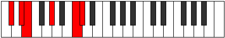
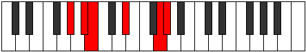
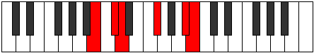

# Mode Zagitonic

## Links

- [Documentation](index.md)
- [Scales Index](Scales.md)
- [Modes Index](Modes.md)
- [Chords Index](Chords.md)

## Parent Scale

[Dolitonic](ScaleDolitonic.md)

## Number

[2189](https://ianring.com/musictheory/scales/2189)

## Perfection

- 2 Perfect notes
- 3 Perfect notes

## Perfection Profile

[true false false true false]

## Permutations

| Tonic | Notes | Signature | Illustration | Audio |
|-------|-------|-----------|--------------|-------|
| [C](ModeCNaturalZagitonic.md) | C, **D**, **D#**, G, **B**, C | C |  | [midi](ModeCNaturalZagitonic.mid) [ogg](ModeCNaturalZagitonic.ogg) |
| [C#](ModeCSharpZagitonic.md) | C#, **D#**, **E**, G#, **C**, C# | C |  | [midi](ModeCSharpZagitonic.mid) [ogg](ModeCSharpZagitonic.ogg) |
| [Db](ModeDFlatZagitonic.md) | Db, **Eb**, **E**, Ab, **C**, Db | C |  | [midi](ModeDFlatZagitonic.mid) [ogg](ModeDFlatZagitonic.ogg) |
| [D](ModeDNaturalZagitonic.md) | D, **E**, **F**, A, **C#**, D | C |  | [midi](ModeDNaturalZagitonic.mid) [ogg](ModeDNaturalZagitonic.ogg) |
| [D#](ModeDSharpZagitonic.md) | D#, **F**, **F#**, A#, **D**, D# | C |  | [midi](ModeDSharpZagitonic.mid) [ogg](ModeDSharpZagitonic.ogg) |
| [Eb](ModeEFlatZagitonic.md) | Eb, **F**, **Gb**, Bb, **D**, Eb | C |  | [midi](ModeEFlatZagitonic.mid) [ogg](ModeEFlatZagitonic.ogg) |
| [E](ModeENaturalZagitonic.md) | E, **F#**, **G**, B, **D#**, E | C |  | [midi](ModeENaturalZagitonic.mid) [ogg](ModeENaturalZagitonic.ogg) |
| [F](ModeFNaturalZagitonic.md) | F, **G**, **G#**, C, **E**, F | C |  | [midi](ModeFNaturalZagitonic.mid) [ogg](ModeFNaturalZagitonic.ogg) |
| [F#](ModeFSharpZagitonic.md) | F#, **G#**, **A**, C#, **F**, F# | C |  | [midi](ModeFSharpZagitonic.mid) [ogg](ModeFSharpZagitonic.ogg) |
| [Gb](ModeGFlatZagitonic.md) | Gb, **Ab**, **A**, Db, **F**, Gb | C |  | [midi](ModeGFlatZagitonic.mid) [ogg](ModeGFlatZagitonic.ogg) |
| [G](ModeGNaturalZagitonic.md) | G, **A**, **A#**, D, **F#**, G | C |  | [midi](ModeGNaturalZagitonic.mid) [ogg](ModeGNaturalZagitonic.ogg) |
| [G#](ModeGSharpZagitonic.md) | G#, **A#**, **B**, D#, **G**, G# | C |  | [midi](ModeGSharpZagitonic.mid) [ogg](ModeGSharpZagitonic.ogg) |
| [Ab](ModeAFlatZagitonic.md) | Ab, **Bb**, **B**, Eb, **G**, Ab | C |  | [midi](ModeAFlatZagitonic.mid) [ogg](ModeAFlatZagitonic.ogg) |
| [A](ModeANaturalZagitonic.md) | A, **B**, **C**, E, **G#**, A | C |  | [midi](ModeANaturalZagitonic.mid) [ogg](ModeANaturalZagitonic.ogg) |
| [A#](ModeASharpZagitonic.md) | A#, **C**, **C#**, F, **A**, A# | C |  | [midi](ModeASharpZagitonic.mid) [ogg](ModeASharpZagitonic.ogg) |
| [Bb](ModeBFlatZagitonic.md) | Bb, **C**, **Db**, F, **A**, Bb | C |  | [midi](ModeBFlatZagitonic.mid) [ogg](ModeBFlatZagitonic.ogg) |
| [B](ModeBNaturalZagitonic.md) | B, **C#**, **D**, F#, **A#**, B | C |  | [midi](ModeBNaturalZagitonic.mid) [ogg](ModeBNaturalZagitonic.ogg) |
