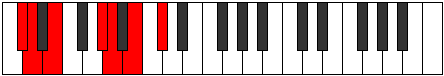

# Mode Zalimic

## Links

- [Documentation](README.md)
- [Scales Index](Scales.md)
- [Modes Index](Modes.md)
- [Chords Index](Chords.md)

## Parent Scale

[Garimic](ScaleGarimic.md)

## Number

[1419](https://ianring.com/musictheory/scales/1419)

## Transposition

1, 2, 4, 1, 2, 2

## Chord Pattern

iv⁰, V

## Perfection

- 4 Perfect notes
- 2 Perfect notes

## Perfection Profile

true, true, true, false, true, false

## Permutations

| Tonic | Notes | Signature | Illustration | Audio |
|-------|-------|-----------|--------------|-------|
| [C](ModeCNaturalZalimic.md) | C, Db, Eb, **F##**, G#, **A#**, C | C |  | [midi](https://github.com/edipermadi/music/blob/main/docs/ModeCNaturalZalimic.mid?raw=true) |
| [C#](ModeCSharpZalimic.md) | C#, D, E, **F###**, G##, **A##**, C# | C |  | [midi](https://github.com/edipermadi/music/blob/main/docs/ModeCSharpZalimic.mid?raw=true) |
| [Db](ModeDFlatZalimic.md) | Db, Ebb, Fb, **G#**, A, **B**, Db | C |  | [midi](https://github.com/edipermadi/music/blob/main/docs/ModeDFlatZalimic.mid?raw=true) |
| [D](ModeDNaturalZalimic.md) | D, Eb, F, **G##**, A#, **B#**, D | C |  | [midi](https://github.com/edipermadi/music/blob/main/docs/ModeDNaturalZalimic.mid?raw=true) |
| [D#](ModeDSharpZalimic.md) | D#, E, F#, **G###**, A##, **B##**, D# | C |  | [midi](https://github.com/edipermadi/music/blob/main/docs/ModeDSharpZalimic.mid?raw=true) |
| [Eb](ModeEFlatZalimic.md) | Eb, Fb, Gb, **A#**, B, **C#**, Eb | C |  | [midi](https://github.com/edipermadi/music/blob/main/docs/ModeEFlatZalimic.mid?raw=true) |
| [E](ModeENaturalZalimic.md) | E, F, G, **A##**, B#, **C##**, E | C |  | [midi](https://github.com/edipermadi/music/blob/main/docs/ModeENaturalZalimic.mid?raw=true) |
| [F](ModeFNaturalZalimic.md) | F, Gb, Ab, **B#**, C#, **D#**, F | C |  | [midi](https://github.com/edipermadi/music/blob/main/docs/ModeFNaturalZalimic.mid?raw=true) |
| [F#](ModeFSharpZalimic.md) | F#, G, A, **B##**, C##, **D##**, F# | C |  | [midi](https://github.com/edipermadi/music/blob/main/docs/ModeFSharpZalimic.mid?raw=true) |
| [Gb](ModeGFlatZalimic.md) | Gb, Abb, Bbb, **C#**, D, **E**, Gb | C |  | [midi](https://github.com/edipermadi/music/blob/main/docs/ModeGFlatZalimic.mid?raw=true) |
| [G](ModeGNaturalZalimic.md) | G, Ab, Bb, **C##**, D#, **E#**, G | C |  | [midi](https://github.com/edipermadi/music/blob/main/docs/ModeGNaturalZalimic.mid?raw=true) |
| [G#](ModeGSharpZalimic.md) | G#, A, B, **C###**, D##, **E##**, G# | C |  | [midi](https://github.com/edipermadi/music/blob/main/docs/ModeGSharpZalimic.mid?raw=true) |
| [Ab](ModeAFlatZalimic.md) | Ab, Bbb, Cb, **D#**, E, **F#**, Ab | C |  | [midi](https://github.com/edipermadi/music/blob/main/docs/ModeAFlatZalimic.mid?raw=true) |
| [A](ModeANaturalZalimic.md) | A, Bb, C, **D##**, E#, **F##**, A | C |  | [midi](https://github.com/edipermadi/music/blob/main/docs/ModeANaturalZalimic.mid?raw=true) |
| [A#](ModeASharpZalimic.md) | A#, B, C#, **D###**, E##, **F###**, A# | C |  | [midi](https://github.com/edipermadi/music/blob/main/docs/ModeASharpZalimic.mid?raw=true) |
| [Bb](ModeBFlatZalimic.md) | Bb, Cb, Db, **E#**, F#, **G#**, Bb | C |  | [midi](https://github.com/edipermadi/music/blob/main/docs/ModeBFlatZalimic.mid?raw=true) |
| [B](ModeBNaturalZalimic.md) | B, C, D, **E##**, F##, **G##**, B | C |  | [midi](https://github.com/edipermadi/music/blob/main/docs/ModeBNaturalZalimic.mid?raw=true) |
