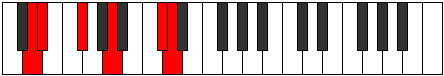
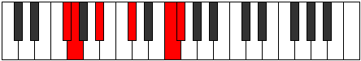
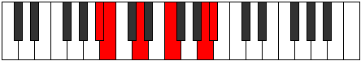

# Mode Zalitonic

## Links

- [Documentation](index.md)
- [Scales Index](Scales.md)
- [Modes Index](Modes.md)
- [Chords Index](Chords.md)

## Parent Scale

[Ionyptitonic](ScaleIonyptitonic.md)

## Number

[2195](https://ianring.com/musictheory/scales/2195)

## Perfection

- 2 Perfect notes
- 3 Perfect notes

## Perfection Profile

[true false true false false]

## Permutations

| Tonic | Notes | Signature | Illustration | Audio |
|-------|-------|-----------|--------------|-------|
| [C](ModeCNaturalZalitonic.md) | C, **C#**, E, **G**, **B**, C | C |  | [midi](ModeCNaturalZalitonic.mid) [ogg](ModeCNaturalZalitonic.ogg) |
| [C#](ModeCSharpZalitonic.md) | C#, **D**, F, **G#**, **C**, C# | C |  | [midi](ModeCSharpZalitonic.mid) [ogg](ModeCSharpZalitonic.ogg) |
| [Db](ModeDFlatZalitonic.md) | Db, **D**, F, **Ab**, **C**, Db | C |  | [midi](ModeDFlatZalitonic.mid) [ogg](ModeDFlatZalitonic.ogg) |
| [D](ModeDNaturalZalitonic.md) | D, **D#**, F#, **A**, **C#**, D | C |  | [midi](ModeDNaturalZalitonic.mid) [ogg](ModeDNaturalZalitonic.ogg) |
| [D#](ModeDSharpZalitonic.md) | D#, **E**, G, **A#**, **D**, D# | C |  | [midi](ModeDSharpZalitonic.mid) [ogg](ModeDSharpZalitonic.ogg) |
| [Eb](ModeEFlatZalitonic.md) | Eb, **E**, G, **Bb**, **D**, Eb | C |  | [midi](ModeEFlatZalitonic.mid) [ogg](ModeEFlatZalitonic.ogg) |
| [E](ModeENaturalZalitonic.md) | E, **F**, G#, **B**, **D#**, E | C |  | [midi](ModeENaturalZalitonic.mid) [ogg](ModeENaturalZalitonic.ogg) |
| [F](ModeFNaturalZalitonic.md) | F, **F#**, A, **C**, **E**, F | C |  | [midi](ModeFNaturalZalitonic.mid) [ogg](ModeFNaturalZalitonic.ogg) |
| [F#](ModeFSharpZalitonic.md) | F#, **G**, A#, **C#**, **F**, F# | C |  | [midi](ModeFSharpZalitonic.mid) [ogg](ModeFSharpZalitonic.ogg) |
| [Gb](ModeGFlatZalitonic.md) | Gb, **G**, Bb, **Db**, **F**, Gb | C |  | [midi](ModeGFlatZalitonic.mid) [ogg](ModeGFlatZalitonic.ogg) |
| [G](ModeGNaturalZalitonic.md) | G, **G#**, B, **D**, **F#**, G | C |  | [midi](ModeGNaturalZalitonic.mid) [ogg](ModeGNaturalZalitonic.ogg) |
| [G#](ModeGSharpZalitonic.md) | G#, **A**, C, **D#**, **G**, G# | C |  | [midi](ModeGSharpZalitonic.mid) [ogg](ModeGSharpZalitonic.ogg) |
| [Ab](ModeAFlatZalitonic.md) | Ab, **A**, C, **Eb**, **G**, Ab | C |  | [midi](ModeAFlatZalitonic.mid) [ogg](ModeAFlatZalitonic.ogg) |
| [A](ModeANaturalZalitonic.md) | A, **A#**, C#, **E**, **G#**, A | C |  | [midi](ModeANaturalZalitonic.mid) [ogg](ModeANaturalZalitonic.ogg) |
| [A#](ModeASharpZalitonic.md) | A#, **B**, D, **F**, **A**, A# | C |  | [midi](ModeASharpZalitonic.mid) [ogg](ModeASharpZalitonic.ogg) |
| [Bb](ModeBFlatZalitonic.md) | Bb, **B**, D, **F**, **A**, Bb | C |  | [midi](ModeBFlatZalitonic.mid) [ogg](ModeBFlatZalitonic.ogg) |
| [B](ModeBNaturalZalitonic.md) | B, **C**, D#, **F#**, **A#**, B | C |  | [midi](ModeBNaturalZalitonic.mid) [ogg](ModeBNaturalZalitonic.ogg) |
