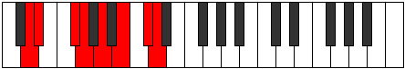

# Mode Zanian

## Links

- [Documentation](README.md)
- [Scales Index](Scales.md)
- [Modes Index](Modes.md)
- [Chords Index](Chords.md)

## Parent Scale

[Golian](ScaleGolian.md)

## Number

[2739](https://ianring.com/musictheory/scales/2739)

## Interval Pattern

1, 3, 1, 2, 2, 2, 1

## Chord Pattern

I, II⁺, iii, IV, vi

## Perfection

- 4 Perfect notes
- 3 Perfect notes

## Perfection Profile

[true false true true false true false]

## Permutations

| Tonic | Notes | Signature | Illustration | Audio |
|-------|-------|-----------|--------------|-------|
| [C](ModeCNaturalZanian.md) | C, **Db**, E, F, **G**, A, **B**, C | C |  | [midi](https://github.com/edipermadi/music/blob/main/docs/ModeCNaturalZanian.mid?raw=true) |
| [C#](ModeCSharpZanian.md) | C#, **D**, E#, F#, **G#**, A#, **B#**, C# | C |  | [midi](https://github.com/edipermadi/music/blob/main/docs/ModeCSharpZanian.mid?raw=true) |
| [Db](ModeDFlatZanian.md) | Db, **Ebb**, F, Gb, **Ab**, Bb, **C**, Db | C |  | [midi](https://github.com/edipermadi/music/blob/main/docs/ModeDFlatZanian.mid?raw=true) |
| [D](ModeDNaturalZanian.md) | D, **Eb**, F#, G, **A**, B, **C#**, D | C |  | [midi](https://github.com/edipermadi/music/blob/main/docs/ModeDNaturalZanian.mid?raw=true) |
| [D#](ModeDSharpZanian.md) | D#, **E**, F##, G#, **A#**, B#, **C##**, D# | C |  | [midi](https://github.com/edipermadi/music/blob/main/docs/ModeDSharpZanian.mid?raw=true) |
| [Eb](ModeEFlatZanian.md) | Eb, **Fb**, G, Ab, **Bb**, C, **D**, Eb | C |  | [midi](https://github.com/edipermadi/music/blob/main/docs/ModeEFlatZanian.mid?raw=true) |
| [E](ModeENaturalZanian.md) | E, **F**, G#, A, **B**, C#, **D#**, E | C |  | [midi](https://github.com/edipermadi/music/blob/main/docs/ModeENaturalZanian.mid?raw=true) |
| [F](ModeFNaturalZanian.md) | F, **Gb**, A, Bb, **C**, D, **E**, F | C |  | [midi](https://github.com/edipermadi/music/blob/main/docs/ModeFNaturalZanian.mid?raw=true) |
| [F#](ModeFSharpZanian.md) | F#, **G**, A#, B, **C#**, D#, **E#**, F# | C |  | [midi](https://github.com/edipermadi/music/blob/main/docs/ModeFSharpZanian.mid?raw=true) |
| [Gb](ModeGFlatZanian.md) | Gb, **Abb**, Bb, Cb, **Db**, Eb, **F**, Gb | C |  | [midi](https://github.com/edipermadi/music/blob/main/docs/ModeGFlatZanian.mid?raw=true) |
| [G](ModeGNaturalZanian.md) | G, **Ab**, B, C, **D**, E, **F#**, G | C |  | [midi](https://github.com/edipermadi/music/blob/main/docs/ModeGNaturalZanian.mid?raw=true) |
| [G#](ModeGSharpZanian.md) | G#, **A**, B#, C#, **D#**, E#, **F##**, G# | C |  | [midi](https://github.com/edipermadi/music/blob/main/docs/ModeGSharpZanian.mid?raw=true) |
| [Ab](ModeAFlatZanian.md) | Ab, **Bbb**, C, Db, **Eb**, F, **G**, Ab | C |  | [midi](https://github.com/edipermadi/music/blob/main/docs/ModeAFlatZanian.mid?raw=true) |
| [A](ModeANaturalZanian.md) | A, **Bb**, C#, D, **E**, F#, **G#**, A | C |  | [midi](https://github.com/edipermadi/music/blob/main/docs/ModeANaturalZanian.mid?raw=true) |
| [A#](ModeASharpZanian.md) | A#, **B**, C##, D#, **E#**, F##, **G##**, A# | C |  | [midi](https://github.com/edipermadi/music/blob/main/docs/ModeASharpZanian.mid?raw=true) |
| [Bb](ModeBFlatZanian.md) | Bb, **Cb**, D, Eb, **F**, G, **A**, Bb | C |  | [midi](https://github.com/edipermadi/music/blob/main/docs/ModeBFlatZanian.mid?raw=true) |
| [B](ModeBNaturalZanian.md) | B, **C**, D#, E, **F#**, G#, **A#**, B | C |  | [midi](https://github.com/edipermadi/music/blob/main/docs/ModeBNaturalZanian.mid?raw=true) |
