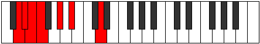

# Mode Zanimic

## Links

- [Documentation](README.md)
- [Scales Index](Scales.md)
- [Modes Index](Modes.md)
- [Chords Index](Chords.md)

## Parent Scale

[Pynimic](ScalePynimic.md)

## Number

[335](https://ianring.com/musictheory/scales/335)

## Interval Pattern

1, 1, 1, 3, 2, 4

## Chord Pattern

i⁰b3

## Perfection

- 3 Perfect notes
- 3 Perfect notes

## Perfection Profile

[false true false false true true]

## Permutations

| Tonic | Notes | Signature | Illustration | Audio |
|-------|-------|-----------|--------------|-------|
| [C](ModeCNaturalZanimic.md) | **C**, Db, **Ebb**, **Fbb**, Gb, Ab, **C** | C |  | [midi](https://github.com/edipermadi/music/blob/main/docs/ModeCNaturalZanimic.mid?raw=true) |
| [C#](ModeCSharpZanimic.md) | **C#**, D, **Eb**, **Fb**, G, A, **C#** | C |  | [midi](https://github.com/edipermadi/music/blob/main/docs/ModeCSharpZanimic.mid?raw=true) |
| [Db](ModeDFlatZanimic.md) | **Db**, Ebb, **Fbb**, **Gbbb**, Abb, Bbb, **Db** | C |  | [midi](https://github.com/edipermadi/music/blob/main/docs/ModeDFlatZanimic.mid?raw=true) |
| [D](ModeDNaturalZanimic.md) | **D**, Eb, **Fb**, **Gbb**, Ab, Bb, **D** | C |  | [midi](https://github.com/edipermadi/music/blob/main/docs/ModeDNaturalZanimic.mid?raw=true) |
| [D#](ModeDSharpZanimic.md) | **D#**, E, **F**, **Gb**, A, B, **D#** | C |  | [midi](https://github.com/edipermadi/music/blob/main/docs/ModeDSharpZanimic.mid?raw=true) |
| [Eb](ModeEFlatZanimic.md) | **Eb**, Fb, **Gbb**, **Abbb**, Bbb, Cb, **Eb** | C |  | [midi](https://github.com/edipermadi/music/blob/main/docs/ModeEFlatZanimic.mid?raw=true) |
| [E](ModeENaturalZanimic.md) | **E**, F, **Gb**, **Abb**, Bb, C, **E** | C |  | [midi](https://github.com/edipermadi/music/blob/main/docs/ModeENaturalZanimic.mid?raw=true) |
| [F](ModeFNaturalZanimic.md) | **F**, Gb, **Abb**, **Bbbb**, Cb, Db, **F** | C |  | [midi](https://github.com/edipermadi/music/blob/main/docs/ModeFNaturalZanimic.mid?raw=true) |
| [F#](ModeFSharpZanimic.md) | **F#**, G, **Ab**, **Bbb**, C, D, **F#** | C |  | [midi](https://github.com/edipermadi/music/blob/main/docs/ModeFSharpZanimic.mid?raw=true) |
| [Gb](ModeGFlatZanimic.md) | **Gb**, Abb, **Bbbb**, **Cbbb**, Dbb, Ebb, **Gb** | C |  | [midi](https://github.com/edipermadi/music/blob/main/docs/ModeGFlatZanimic.mid?raw=true) |
| [G](ModeGNaturalZanimic.md) | **G**, Ab, **Bbb**, **Cbb**, Db, Eb, **G** | C |  | [midi](https://github.com/edipermadi/music/blob/main/docs/ModeGNaturalZanimic.mid?raw=true) |
| [G#](ModeGSharpZanimic.md) | **G#**, A, **Bb**, **Cb**, D, E, **G#** | C |  | [midi](https://github.com/edipermadi/music/blob/main/docs/ModeGSharpZanimic.mid?raw=true) |
| [Ab](ModeAFlatZanimic.md) | **Ab**, Bbb, **Cbb**, **Dbbb**, Ebb, Fb, **Ab** | C |  | [midi](https://github.com/edipermadi/music/blob/main/docs/ModeAFlatZanimic.mid?raw=true) |
| [A](ModeANaturalZanimic.md) | **A**, Bb, **Cb**, **Dbb**, Eb, F, **A** | C |  | [midi](https://github.com/edipermadi/music/blob/main/docs/ModeANaturalZanimic.mid?raw=true) |
| [A#](ModeASharpZanimic.md) | **A#**, B, **C**, **Db**, E, F#, **A#** | C |  | [midi](https://github.com/edipermadi/music/blob/main/docs/ModeASharpZanimic.mid?raw=true) |
| [Bb](ModeBFlatZanimic.md) | **Bb**, Cb, **Dbb**, **Ebbb**, Fb, Gb, **Bb** | C |  | [midi](https://github.com/edipermadi/music/blob/main/docs/ModeBFlatZanimic.mid?raw=true) |
| [B](ModeBNaturalZanimic.md) | **B**, C, **Db**, **Ebb**, F, G, **B** | C |  | [midi](https://github.com/edipermadi/music/blob/main/docs/ModeBNaturalZanimic.mid?raw=true) |
