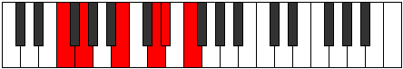
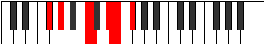
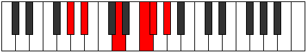
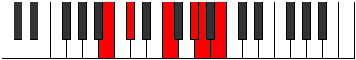

# Mode Zanitonic

## Links

- [Documentation](README.md)
- [Scales Index](Scales.md)
- [Modes Index](Modes.md)
- [Chords Index](Chords.md)

## Parent Scale

[Ryphitonic](ScaleRyphitonic.md)

## Number

[1605](https://ianring.com/musictheory/scales/1605)

## Interval Pattern

2, 4, 3, 1, 2

## Chord Pattern

III⁺

## Perfection

- 1 Perfect notes
- 4 Perfect notes

## Perfection Profile

[false true false false false]

## Permutations

| Tonic | Notes | Signature | Illustration | Audio |
|-------|-------|-----------|--------------|-------|
| [C](ModeCNaturalZanitonic.md) | **C**, D, **F#**, **A**, **A#**, **C** | C |  | [midi](https://github.com/edipermadi/music/blob/main/docs/ModeCNaturalZanitonic.mid?raw=true) |
| [C#](ModeCSharpZanitonic.md) | **C#**, D#, **G**, **A#**, **B**, **C#** | C |  | [midi](https://github.com/edipermadi/music/blob/main/docs/ModeCSharpZanitonic.mid?raw=true) |
| [Db](ModeDFlatZanitonic.md) | **Db**, Eb, **G**, **Bb**, **B**, **Db** | C |  | [midi](https://github.com/edipermadi/music/blob/main/docs/ModeDFlatZanitonic.mid?raw=true) |
| [D](ModeDNaturalZanitonic.md) | **D**, E, **G#**, **B**, **C**, **D** | C |  | [midi](https://github.com/edipermadi/music/blob/main/docs/ModeDNaturalZanitonic.mid?raw=true) |
| [D#](ModeDSharpZanitonic.md) | **D#**, F, **A**, **C**, **C#**, **D#** | C |  | [midi](https://github.com/edipermadi/music/blob/main/docs/ModeDSharpZanitonic.mid?raw=true) |
| [Eb](ModeEFlatZanitonic.md) | **Eb**, F, **A**, **C**, **Db**, **Eb** | C |  | [midi](https://github.com/edipermadi/music/blob/main/docs/ModeEFlatZanitonic.mid?raw=true) |
| [E](ModeENaturalZanitonic.md) | **E**, F#, **A#**, **C#**, **D**, **E** | C |  | [midi](https://github.com/edipermadi/music/blob/main/docs/ModeENaturalZanitonic.mid?raw=true) |
| [F](ModeFNaturalZanitonic.md) | **F**, G, **B**, **D**, **D#**, **F** | C |  | [midi](https://github.com/edipermadi/music/blob/main/docs/ModeFNaturalZanitonic.mid?raw=true) |
| [F#](ModeFSharpZanitonic.md) | **F#**, G#, **C**, **D#**, **E**, **F#** | C |  | [midi](https://github.com/edipermadi/music/blob/main/docs/ModeFSharpZanitonic.mid?raw=true) |
| [Gb](ModeGFlatZanitonic.md) | **Gb**, Ab, **C**, **Eb**, **E**, **Gb** | C |  | [midi](https://github.com/edipermadi/music/blob/main/docs/ModeGFlatZanitonic.mid?raw=true) |
| [G](ModeGNaturalZanitonic.md) | **G**, A, **C#**, **E**, **F**, **G** | C |  | [midi](https://github.com/edipermadi/music/blob/main/docs/ModeGNaturalZanitonic.mid?raw=true) |
| [G#](ModeGSharpZanitonic.md) | **G#**, A#, **D**, **F**, **F#**, **G#** | C |  | [midi](https://github.com/edipermadi/music/blob/main/docs/ModeGSharpZanitonic.mid?raw=true) |
| [Ab](ModeAFlatZanitonic.md) | **Ab**, Bb, **D**, **F**, **Gb**, **Ab** | C |  | [midi](https://github.com/edipermadi/music/blob/main/docs/ModeAFlatZanitonic.mid?raw=true) |
| [A](ModeANaturalZanitonic.md) | **A**, B, **D#**, **F#**, **G**, **A** | C |  | [midi](https://github.com/edipermadi/music/blob/main/docs/ModeANaturalZanitonic.mid?raw=true) |
| [A#](ModeASharpZanitonic.md) | **A#**, C, **E**, **G**, **G#**, **A#** | C |  | [midi](https://github.com/edipermadi/music/blob/main/docs/ModeASharpZanitonic.mid?raw=true) |
| [Bb](ModeBFlatZanitonic.md) | **Bb**, C, **E**, **G**, **Ab**, **Bb** | C |  | [midi](https://github.com/edipermadi/music/blob/main/docs/ModeBFlatZanitonic.mid?raw=true) |
| [B](ModeBNaturalZanitonic.md) | **B**, C#, **F**, **G#**, **A**, **B** | C |  | [midi](https://github.com/edipermadi/music/blob/main/docs/ModeBNaturalZanitonic.mid?raw=true) |
