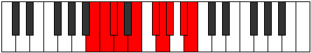

# Mode Zanygic

## Links

- [Documentation](README.md)
- [Scales Index](Scales.md)
- [Modes Index](Modes.md)
- [Chords Index](Chords.md)

## Parent Scale

[Porygic](ScalePorygic.md)

## Number

[2991](https://ianring.com/musictheory/scales/2991)

## Transposition

1, 1, 1, 2, 2, 1, 1, 2, 1

## Chord Pattern

ii⁰b3, iii⁰, IVb5, v⁰

## Perfection

- 6 Perfect notes
- 3 Perfect notes

## Perfection Profile

[true true true false true true true false false]

## Permutations

| Tonic | Notes | Signature | Illustration | Audio |
|-------|-------|-----------|--------------|-------|
| [C](ModeCNaturalZanygic.md) | C, C#, D, **D#**, F, G, G#, **A**, **B**, C | C |  | [midi](https://github.com/edipermadi/music/blob/main/docs/ModeCNaturalZanygic.mid?raw=true) |
| [C#](ModeCSharpZanygic.md) | C#, D, D#, **E**, F#, G#, A, **A#**, **C**, C# | C |  | [midi](https://github.com/edipermadi/music/blob/main/docs/ModeCSharpZanygic.mid?raw=true) |
| [Db](ModeDFlatZanygic.md) | Db, D, Eb, **E**, Gb, Ab, A, **Bb**, **C**, Db | C |  | [midi](https://github.com/edipermadi/music/blob/main/docs/ModeDFlatZanygic.mid?raw=true) |
| [D](ModeDNaturalZanygic.md) | D, D#, E, **F**, G, A, A#, **B**, **C#**, D | C |  | [midi](https://github.com/edipermadi/music/blob/main/docs/ModeDNaturalZanygic.mid?raw=true) |
| [D#](ModeDSharpZanygic.md) | D#, E, F, **F#**, G#, A#, B, **C**, **D**, D# | C |  | [midi](https://github.com/edipermadi/music/blob/main/docs/ModeDSharpZanygic.mid?raw=true) |
| [Eb](ModeEFlatZanygic.md) | Eb, E, F, **Gb**, Ab, Bb, B, **C**, **D**, Eb | C |  | [midi](https://github.com/edipermadi/music/blob/main/docs/ModeEFlatZanygic.mid?raw=true) |
| [E](ModeENaturalZanygic.md) | E, F, F#, **G**, A, B, C, **C#**, **D#**, E | C |  | [midi](https://github.com/edipermadi/music/blob/main/docs/ModeENaturalZanygic.mid?raw=true) |
| [F](ModeFNaturalZanygic.md) | F, F#, G, **G#**, A#, C, C#, **D**, **E**, F | C |  | [midi](https://github.com/edipermadi/music/blob/main/docs/ModeFNaturalZanygic.mid?raw=true) |
| [F#](ModeFSharpZanygic.md) | F#, G, G#, **A**, B, C#, D, **D#**, **F**, F# | C |  | [midi](https://github.com/edipermadi/music/blob/main/docs/ModeFSharpZanygic.mid?raw=true) |
| [Gb](ModeGFlatZanygic.md) | Gb, G, Ab, **A**, B, Db, D, **Eb**, **F**, Gb | C |  | [midi](https://github.com/edipermadi/music/blob/main/docs/ModeGFlatZanygic.mid?raw=true) |
| [G](ModeGNaturalZanygic.md) | G, G#, A, **A#**, C, D, D#, **E**, **F#**, G | C |  | [midi](https://github.com/edipermadi/music/blob/main/docs/ModeGNaturalZanygic.mid?raw=true) |
| [G#](ModeGSharpZanygic.md) | G#, A, A#, **B**, C#, D#, E, **F**, **G**, G# | C |  | [midi](https://github.com/edipermadi/music/blob/main/docs/ModeGSharpZanygic.mid?raw=true) |
| [Ab](ModeAFlatZanygic.md) | Ab, A, Bb, **B**, Db, Eb, E, **F**, **G**, Ab | C |  | [midi](https://github.com/edipermadi/music/blob/main/docs/ModeAFlatZanygic.mid?raw=true) |
| [A](ModeANaturalZanygic.md) | A, A#, B, **C**, D, E, F, **F#**, **G#**, A | C |  | [midi](https://github.com/edipermadi/music/blob/main/docs/ModeANaturalZanygic.mid?raw=true) |
| [A#](ModeASharpZanygic.md) | A#, B, C, **C#**, D#, F, F#, **G**, **A**, A# | C |  | [midi](https://github.com/edipermadi/music/blob/main/docs/ModeASharpZanygic.mid?raw=true) |
| [Bb](ModeBFlatZanygic.md) | Bb, B, C, **Db**, Eb, F, Gb, **G**, **A**, Bb | C |  | [midi](https://github.com/edipermadi/music/blob/main/docs/ModeBFlatZanygic.mid?raw=true) |
| [B](ModeBNaturalZanygic.md) | B, C, C#, **D**, E, F#, G, **G#**, **A#**, B | C |  | [midi](https://github.com/edipermadi/music/blob/main/docs/ModeBNaturalZanygic.mid?raw=true) |
