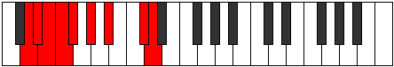

# Mode Zanyllic

## Links

- [Documentation](index.md)
- [Scales Index](Scales.md)
- [Modes Index](Modes.md)
- [Chords Index](Chords.md)

## Parent Scale

[Kataryllic](ScaleKataryllic.md)

## Number

[2399](https://ianring.com/musictheory/scales/2399)

## Perfection

- 5 Perfect notes
- 3 Perfect notes

## Perfection Profile

[false true false false true true true true]

## Permutations

| Tonic | Notes | Signature | Illustration | Audio |
|-------|-------|-----------|--------------|-------|
| [C](ModeCNaturalZanyllic.md) | **C**, C#, **D**, **D#**, E, F#, G#, B, **C** | C |  | [midi](ModeCNaturalZanyllic.mid) [ogg](ModeCNaturalZanyllic.ogg) |
| [C#](ModeCSharpZanyllic.md) | **C#**, D, **D#**, **E**, F, G, A, C, **C#** | C |  | [midi](ModeCSharpZanyllic.mid) [ogg](ModeCSharpZanyllic.ogg) |
| [Db](ModeDFlatZanyllic.md) | **Db**, D, **Eb**, **E**, F, G, A, C, **Db** | C |  | [midi](ModeDFlatZanyllic.mid) [ogg](ModeDFlatZanyllic.ogg) |
| [D](ModeDNaturalZanyllic.md) | **D**, D#, **E**, **F**, F#, G#, A#, C#, **D** | C |  | [midi](ModeDNaturalZanyllic.mid) [ogg](ModeDNaturalZanyllic.ogg) |
| [D#](ModeDSharpZanyllic.md) | **D#**, E, **F**, **F#**, G, A, B, D, **D#** | C |  | [midi](ModeDSharpZanyllic.mid) [ogg](ModeDSharpZanyllic.ogg) |
| [Eb](ModeEFlatZanyllic.md) | **Eb**, E, **F**, **Gb**, G, A, B, D, **Eb** | C |  | [midi](ModeEFlatZanyllic.mid) [ogg](ModeEFlatZanyllic.ogg) |
| [E](ModeENaturalZanyllic.md) | **E**, F, **F#**, **G**, G#, A#, C, D#, **E** | C |  | [midi](ModeENaturalZanyllic.mid) [ogg](ModeENaturalZanyllic.ogg) |
| [F](ModeFNaturalZanyllic.md) | **F**, F#, **G**, **G#**, A, B, C#, E, **F** | C |  | [midi](ModeFNaturalZanyllic.mid) [ogg](ModeFNaturalZanyllic.ogg) |
| [F#](ModeFSharpZanyllic.md) | **F#**, G, **G#**, **A**, A#, C, D, F, **F#** | C |  | [midi](ModeFSharpZanyllic.mid) [ogg](ModeFSharpZanyllic.ogg) |
| [Gb](ModeGFlatZanyllic.md) | **Gb**, G, **Ab**, **A**, Bb, C, D, F, **Gb** | C |  | [midi](ModeGFlatZanyllic.mid) [ogg](ModeGFlatZanyllic.ogg) |
| [G](ModeGNaturalZanyllic.md) | **G**, G#, **A**, **A#**, B, C#, D#, F#, **G** | C |  | [midi](ModeGNaturalZanyllic.mid) [ogg](ModeGNaturalZanyllic.ogg) |
| [G#](ModeGSharpZanyllic.md) | **G#**, A, **A#**, **B**, C, D, E, G, **G#** | C |  | [midi](ModeGSharpZanyllic.mid) [ogg](ModeGSharpZanyllic.ogg) |
| [Ab](ModeAFlatZanyllic.md) | **Ab**, A, **Bb**, **B**, C, D, E, G, **Ab** | C |  | [midi](ModeAFlatZanyllic.mid) [ogg](ModeAFlatZanyllic.ogg) |
| [A](ModeANaturalZanyllic.md) | **A**, A#, **B**, **C**, C#, D#, F, G#, **A** | C |  | [midi](ModeANaturalZanyllic.mid) [ogg](ModeANaturalZanyllic.ogg) |
| [A#](ModeASharpZanyllic.md) | **A#**, B, **C**, **C#**, D, E, F#, A, **A#** | C |  | [midi](ModeASharpZanyllic.mid) [ogg](ModeASharpZanyllic.ogg) |
| [Bb](ModeBFlatZanyllic.md) | **Bb**, B, **C**, **Db**, D, E, Gb, A, **Bb** | C |  | [midi](ModeBFlatZanyllic.mid) [ogg](ModeBFlatZanyllic.ogg) |
| [B](ModeBNaturalZanyllic.md) | **B**, C, **C#**, **D**, D#, F, G, A#, **B** | C |  | [midi](ModeBNaturalZanyllic.mid) [ogg](ModeBNaturalZanyllic.ogg) |
