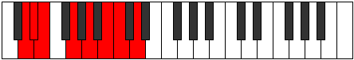
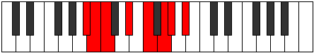

# Mode Zaptian

## Links

- [Documentation](index.md)
- [Scales Index](Scales.md)
- [Modes Index](Modes.md)
- [Chords Index](Chords.md)

## Parent Scale

[Phrolian](ScalePhrolian.md)

## Number

[1703](https://ianring.com/musictheory/scales/1703)

## Perfection

- 5 Perfect notes
- 2 Perfect notes

## Perfection Profile

[true false true true true false true]

## Permutations

| Tonic | Notes | Signature | Illustration | Audio |
|-------|-------|-----------|--------------|-------|
| [C](ModeCNaturalZaptian.md) | C, **Db**, Ebb, F, G, **A**, Bb, C | C |  | [midi](ModeCNaturalZaptian.mid) [ogg](ModeCNaturalZaptian.ogg) |
| [C#](ModeCSharpZaptian.md) | C#, **D**, Eb, F#, G#, **A#**, B, C# | C |  | [midi](ModeCSharpZaptian.mid) [ogg](ModeCSharpZaptian.ogg) |
| [Db](ModeDFlatZaptian.md) | Db, **Ebb**, Fbb, Gb, Ab, **Bb**, Cb, Db | C |  | [midi](ModeDFlatZaptian.mid) [ogg](ModeDFlatZaptian.ogg) |
| [D](ModeDNaturalZaptian.md) | D, **Eb**, Fb, G, A, **B**, C, D | C |  | [midi](ModeDNaturalZaptian.mid) [ogg](ModeDNaturalZaptian.ogg) |
| [D#](ModeDSharpZaptian.md) | D#, **E**, F, G#, A#, **B#**, C#, D# | C |  | [midi](ModeDSharpZaptian.mid) [ogg](ModeDSharpZaptian.ogg) |
| [Eb](ModeEFlatZaptian.md) | Eb, **Fb**, Gbb, Ab, Bb, **C**, Db, Eb | C |  | [midi](ModeEFlatZaptian.mid) [ogg](ModeEFlatZaptian.ogg) |
| [E](ModeENaturalZaptian.md) | E, **F**, Gb, A, B, **C#**, D, E | C |  | [midi](ModeENaturalZaptian.mid) [ogg](ModeENaturalZaptian.ogg) |
| [F](ModeFNaturalZaptian.md) | F, **Gb**, Abb, Bb, C, **D**, Eb, F | C |  | [midi](ModeFNaturalZaptian.mid) [ogg](ModeFNaturalZaptian.ogg) |
| [F#](ModeFSharpZaptian.md) | F#, **G**, Ab, B, C#, **D#**, E, F# | C |  | [midi](ModeFSharpZaptian.mid) [ogg](ModeFSharpZaptian.ogg) |
| [Gb](ModeGFlatZaptian.md) | Gb, **Abb**, Bbbb, Cb, Db, **Eb**, Fb, Gb | C |  | [midi](ModeGFlatZaptian.mid) [ogg](ModeGFlatZaptian.ogg) |
| [G](ModeGNaturalZaptian.md) | G, **Ab**, Bbb, C, D, **E**, F, G | C |  | [midi](ModeGNaturalZaptian.mid) [ogg](ModeGNaturalZaptian.ogg) |
| [G#](ModeGSharpZaptian.md) | G#, **A**, Bb, C#, D#, **E#**, F#, G# | C |  | [midi](ModeGSharpZaptian.mid) [ogg](ModeGSharpZaptian.ogg) |
| [Ab](ModeAFlatZaptian.md) | Ab, **Bbb**, Cbb, Db, Eb, **F**, Gb, Ab | C |  | [midi](ModeAFlatZaptian.mid) [ogg](ModeAFlatZaptian.ogg) |
| [A](ModeANaturalZaptian.md) | A, **Bb**, Cb, D, E, **F#**, G, A | C |  | [midi](ModeANaturalZaptian.mid) [ogg](ModeANaturalZaptian.ogg) |
| [A#](ModeASharpZaptian.md) | A#, **B**, C, D#, E#, **F##**, G#, A# | C |  | [midi](ModeASharpZaptian.mid) [ogg](ModeASharpZaptian.ogg) |
| [Bb](ModeBFlatZaptian.md) | Bb, **Cb**, Dbb, Eb, F, **G**, Ab, Bb | C |  | [midi](ModeBFlatZaptian.mid) [ogg](ModeBFlatZaptian.ogg) |
| [B](ModeBNaturalZaptian.md) | B, **C**, Db, E, F#, **G#**, A, B | C |  | [midi](ModeBNaturalZaptian.mid) [ogg](ModeBNaturalZaptian.ogg) |
