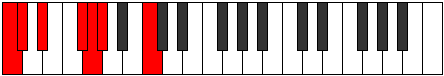
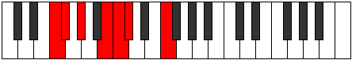

# Mode Zaptimic

## Links

- [Documentation](index.md)
- [Scales Index](Scales.md)
- [Modes Index](Modes.md)
- [Chords Index](Chords.md)

## Parent Scale

[Epygimic](ScaleEpygimic.md)

## Number

[459](https://ianring.com/musictheory/scales/459)

## Interval Pattern

1, 2, 3, 1, 1, 4

## Chord Pattern

i⁰, i, VI

## Perfection

- 4 Perfect notes
- 2 Perfect notes

## Perfection Profile

[true true false true false true]

## Permutations

| Tonic | Notes | Signature | Illustration | Audio |
|-------|-------|-----------|--------------|-------|
| [C](ModeCNaturalZaptimic.md) | C, Db, **Eb**, F#, **G**, Ab, C | C |  | [midi](https://github.com/edipermadi/music/blob/main/docs/ModeCNaturalZaptimic.mid?raw=true) |
| [C#](ModeCSharpZaptimic.md) | C#, D, **E**, F##, **G#**, A, C# | C |  | [midi](https://github.com/edipermadi/music/blob/main/docs/ModeCSharpZaptimic.mid?raw=true) |
| [Db](ModeDFlatZaptimic.md) | Db, Ebb, **Fb**, G, **Ab**, Bbb, Db | C |  | [midi](https://github.com/edipermadi/music/blob/main/docs/ModeDFlatZaptimic.mid?raw=true) |
| [D](ModeDNaturalZaptimic.md) | D, Eb, **F**, G#, **A**, Bb, D | C |  | [midi](https://github.com/edipermadi/music/blob/main/docs/ModeDNaturalZaptimic.mid?raw=true) |
| [D#](ModeDSharpZaptimic.md) | D#, E, **F#**, G##, **A#**, B, D# | C |  | [midi](https://github.com/edipermadi/music/blob/main/docs/ModeDSharpZaptimic.mid?raw=true) |
| [Eb](ModeEFlatZaptimic.md) | Eb, Fb, **Gb**, A, **Bb**, Cb, Eb | C |  | [midi](https://github.com/edipermadi/music/blob/main/docs/ModeEFlatZaptimic.mid?raw=true) |
| [E](ModeENaturalZaptimic.md) | E, F, **G**, A#, **B**, C, E | C |  | [midi](https://github.com/edipermadi/music/blob/main/docs/ModeENaturalZaptimic.mid?raw=true) |
| [F](ModeFNaturalZaptimic.md) | F, Gb, **Ab**, B, **C**, Db, F | C |  | [midi](https://github.com/edipermadi/music/blob/main/docs/ModeFNaturalZaptimic.mid?raw=true) |
| [F#](ModeFSharpZaptimic.md) | F#, G, **A**, B#, **C#**, D, F# | C |  | [midi](https://github.com/edipermadi/music/blob/main/docs/ModeFSharpZaptimic.mid?raw=true) |
| [Gb](ModeGFlatZaptimic.md) | Gb, Abb, **Bbb**, C, **Db**, Ebb, Gb | C |  | [midi](https://github.com/edipermadi/music/blob/main/docs/ModeGFlatZaptimic.mid?raw=true) |
| [G](ModeGNaturalZaptimic.md) | G, Ab, **Bb**, C#, **D**, Eb, G | C |  | [midi](https://github.com/edipermadi/music/blob/main/docs/ModeGNaturalZaptimic.mid?raw=true) |
| [G#](ModeGSharpZaptimic.md) | G#, A, **B**, C##, **D#**, E, G# | C |  | [midi](https://github.com/edipermadi/music/blob/main/docs/ModeGSharpZaptimic.mid?raw=true) |
| [Ab](ModeAFlatZaptimic.md) | Ab, Bbb, **Cb**, D, **Eb**, Fb, Ab | C |  | [midi](https://github.com/edipermadi/music/blob/main/docs/ModeAFlatZaptimic.mid?raw=true) |
| [A](ModeANaturalZaptimic.md) | A, Bb, **C**, D#, **E**, F, A | C |  | [midi](https://github.com/edipermadi/music/blob/main/docs/ModeANaturalZaptimic.mid?raw=true) |
| [A#](ModeASharpZaptimic.md) | A#, B, **C#**, D##, **E#**, F#, A# | C |  | [midi](https://github.com/edipermadi/music/blob/main/docs/ModeASharpZaptimic.mid?raw=true) |
| [Bb](ModeBFlatZaptimic.md) | Bb, Cb, **Db**, E, **F**, Gb, Bb | C |  | [midi](https://github.com/edipermadi/music/blob/main/docs/ModeBFlatZaptimic.mid?raw=true) |
| [B](ModeBNaturalZaptimic.md) | B, C, **D**, E#, **F#**, G, B | C |  | [midi](https://github.com/edipermadi/music/blob/main/docs/ModeBNaturalZaptimic.mid?raw=true) |
