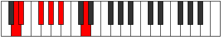

# Mode Zaptitonic

## Links

- [Documentation](index.md)
- [Scales Index](Scales.md)
- [Modes Index](Modes.md)
- [Chords Index](Chords.md)

## Parent Scale

[Epygitonic](ScaleEpygitonic.md)

## Number

[339](https://ianring.com/musictheory/scales/339)

## Perfection

- 2 Perfect notes
- 3 Perfect notes

## Perfection Profile

[false true false true false]

## Permutations

| Tonic | Notes | Signature | Illustration | Audio |
|-------|-------|-----------|--------------|-------|
| [C](ModeCNaturalZaptitonic.md) | **C**, C#, **E**, F#, **G#**, **C** | C |  | [midi](ModeCNaturalZaptitonic.mid) [ogg](ModeCNaturalZaptitonic.ogg) |
| [C#](ModeCSharpZaptitonic.md) | **C#**, D, **F**, G, **A**, **C#** | C |  | [midi](ModeCSharpZaptitonic.mid) [ogg](ModeCSharpZaptitonic.ogg) |
| [Db](ModeDFlatZaptitonic.md) | **Db**, D, **F**, G, **A**, **Db** | C |  | [midi](ModeDFlatZaptitonic.mid) [ogg](ModeDFlatZaptitonic.ogg) |
| [D](ModeDNaturalZaptitonic.md) | **D**, D#, **F#**, G#, **A#**, **D** | C |  | [midi](ModeDNaturalZaptitonic.mid) [ogg](ModeDNaturalZaptitonic.ogg) |
| [D#](ModeDSharpZaptitonic.md) | **D#**, E, **G**, A, **B**, **D#** | C |  | [midi](ModeDSharpZaptitonic.mid) [ogg](ModeDSharpZaptitonic.ogg) |
| [Eb](ModeEFlatZaptitonic.md) | **Eb**, E, **G**, A, **B**, **Eb** | C |  | [midi](ModeEFlatZaptitonic.mid) [ogg](ModeEFlatZaptitonic.ogg) |
| [E](ModeENaturalZaptitonic.md) | **E**, F, **G#**, A#, **C**, **E** | C |  | [midi](ModeENaturalZaptitonic.mid) [ogg](ModeENaturalZaptitonic.ogg) |
| [F](ModeFNaturalZaptitonic.md) | **F**, F#, **A**, B, **C#**, **F** | C |  | [midi](ModeFNaturalZaptitonic.mid) [ogg](ModeFNaturalZaptitonic.ogg) |
| [F#](ModeFSharpZaptitonic.md) | **F#**, G, **A#**, C, **D**, **F#** | C |  | [midi](ModeFSharpZaptitonic.mid) [ogg](ModeFSharpZaptitonic.ogg) |
| [Gb](ModeGFlatZaptitonic.md) | **Gb**, G, **Bb**, C, **D**, **Gb** | C |  | [midi](ModeGFlatZaptitonic.mid) [ogg](ModeGFlatZaptitonic.ogg) |
| [G](ModeGNaturalZaptitonic.md) | **G**, G#, **B**, C#, **D#**, **G** | C |  | [midi](ModeGNaturalZaptitonic.mid) [ogg](ModeGNaturalZaptitonic.ogg) |
| [G#](ModeGSharpZaptitonic.md) | **G#**, A, **C**, D, **E**, **G#** | C |  | [midi](ModeGSharpZaptitonic.mid) [ogg](ModeGSharpZaptitonic.ogg) |
| [Ab](ModeAFlatZaptitonic.md) | **Ab**, A, **C**, D, **E**, **Ab** | C |  | [midi](ModeAFlatZaptitonic.mid) [ogg](ModeAFlatZaptitonic.ogg) |
| [A](ModeANaturalZaptitonic.md) | **A**, A#, **C#**, D#, **F**, **A** | C |  | [midi](ModeANaturalZaptitonic.mid) [ogg](ModeANaturalZaptitonic.ogg) |
| [A#](ModeASharpZaptitonic.md) | **A#**, B, **D**, E, **F#**, **A#** | C |  | [midi](ModeASharpZaptitonic.mid) [ogg](ModeASharpZaptitonic.ogg) |
| [Bb](ModeBFlatZaptitonic.md) | **Bb**, B, **D**, E, **Gb**, **Bb** | C |  | [midi](ModeBFlatZaptitonic.mid) [ogg](ModeBFlatZaptitonic.ogg) |
| [B](ModeBNaturalZaptitonic.md) | **B**, C, **D#**, F, **G**, **B** | C |  | [midi](ModeBNaturalZaptitonic.mid) [ogg](ModeBNaturalZaptitonic.ogg) |
