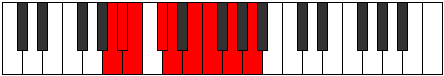
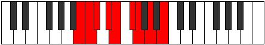

# Mode Zaptyllic

## Links

- [Documentation](index.md)
- [Scales Index](Scales.md)
- [Modes Index](Modes.md)
- [Chords Index](Chords.md)

## Parent Scale

[Dalyllic](ScaleDalyllic.md)

## Number

[1463](https://ianring.com/musictheory/scales/1463)

## Perfection

- 5 Perfect notes
- 3 Perfect notes

## Interval Pattern

1, 1, 2, 1, 2, 1, 2, 2

## Perfection Profile

[true true false false true true false true]

## Permutations

| Tonic | Notes | Signature | Illustration | Audio |
|-------|-------|-----------|--------------|-------|
| [C](ModeCNaturalZaptyllic.md) | C, C#, **D**, **E**, F, G, **G#**, A#, C | C |  | [midi](https://github.com/edipermadi/music/blob/main/docs/ModeCNaturalZaptyllic.mid?raw=true) |
| [C#](ModeCSharpZaptyllic.md) | C#, D, **D#**, **F**, F#, G#, **A**, B, C# | C |  | [midi](https://github.com/edipermadi/music/blob/main/docs/ModeCSharpZaptyllic.mid?raw=true) |
| [Db](ModeDFlatZaptyllic.md) | Db, D, **Eb**, **F**, Gb, Ab, **A**, B, Db | C |  | [midi](https://github.com/edipermadi/music/blob/main/docs/ModeDFlatZaptyllic.mid?raw=true) |
| [D](ModeDNaturalZaptyllic.md) | D, D#, **E**, **F#**, G, A, **A#**, C, D | C |  | [midi](https://github.com/edipermadi/music/blob/main/docs/ModeDNaturalZaptyllic.mid?raw=true) |
| [D#](ModeDSharpZaptyllic.md) | D#, E, **F**, **G**, G#, A#, **B**, C#, D# | C |  | [midi](https://github.com/edipermadi/music/blob/main/docs/ModeDSharpZaptyllic.mid?raw=true) |
| [Eb](ModeEFlatZaptyllic.md) | Eb, E, **F**, **G**, Ab, Bb, **B**, Db, Eb | C |  | [midi](https://github.com/edipermadi/music/blob/main/docs/ModeEFlatZaptyllic.mid?raw=true) |
| [E](ModeENaturalZaptyllic.md) | E, F, **F#**, **G#**, A, B, **C**, D, E | C |  | [midi](https://github.com/edipermadi/music/blob/main/docs/ModeENaturalZaptyllic.mid?raw=true) |
| [F](ModeFNaturalZaptyllic.md) | F, F#, **G**, **A**, A#, C, **C#**, D#, F | C |  | [midi](https://github.com/edipermadi/music/blob/main/docs/ModeFNaturalZaptyllic.mid?raw=true) |
| [F#](ModeFSharpZaptyllic.md) | F#, G, **G#**, **A#**, B, C#, **D**, E, F# | C |  | [midi](https://github.com/edipermadi/music/blob/main/docs/ModeFSharpZaptyllic.mid?raw=true) |
| [Gb](ModeGFlatZaptyllic.md) | Gb, G, **Ab**, **Bb**, B, Db, **D**, E, Gb | C |  | [midi](https://github.com/edipermadi/music/blob/main/docs/ModeGFlatZaptyllic.mid?raw=true) |
| [G](ModeGNaturalZaptyllic.md) | G, G#, **A**, **B**, C, D, **D#**, F, G | C |  | [midi](https://github.com/edipermadi/music/blob/main/docs/ModeGNaturalZaptyllic.mid?raw=true) |
| [G#](ModeGSharpZaptyllic.md) | G#, A, **A#**, **C**, C#, D#, **E**, F#, G# | C |  | [midi](https://github.com/edipermadi/music/blob/main/docs/ModeGSharpZaptyllic.mid?raw=true) |
| [Ab](ModeAFlatZaptyllic.md) | Ab, A, **Bb**, **C**, Db, Eb, **E**, Gb, Ab | C |  | [midi](https://github.com/edipermadi/music/blob/main/docs/ModeAFlatZaptyllic.mid?raw=true) |
| [A](ModeANaturalZaptyllic.md) | A, A#, **B**, **C#**, D, E, **F**, G, A | C |  | [midi](https://github.com/edipermadi/music/blob/main/docs/ModeANaturalZaptyllic.mid?raw=true) |
| [A#](ModeASharpZaptyllic.md) | A#, B, **C**, **D**, D#, F, **F#**, G#, A# | C |  | [midi](https://github.com/edipermadi/music/blob/main/docs/ModeASharpZaptyllic.mid?raw=true) |
| [Bb](ModeBFlatZaptyllic.md) | Bb, B, **C**, **D**, Eb, F, **Gb**, Ab, Bb | C |  | [midi](https://github.com/edipermadi/music/blob/main/docs/ModeBFlatZaptyllic.mid?raw=true) |
| [B](ModeBNaturalZaptyllic.md) | B, C, **C#**, **D#**, E, F#, **G**, A, B | C |  | [midi](https://github.com/edipermadi/music/blob/main/docs/ModeBNaturalZaptyllic.mid?raw=true) |
