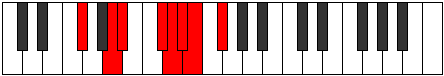
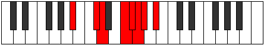

# Mode Zarian

## Links

- [Documentation](index.md)
- [Scales Index](Scales.md)
- [Modes Index](Modes.md)
- [Chords Index](Chords.md)

## Parent Scale

[Zarian](ScaleZarian.md)

## Number

[1945](https://ianring.com/musictheory/scales/1945)

## Perfection

- 4 Perfect notes
- 3 Perfect notes

## Perfection Profile

[true true false false true true false]

## Permutations

| Tonic | Notes | Signature | Illustration | Audio |
|-------|-------|-----------|--------------|-------|
| [C](ModeCNaturalZarian.md) | C, D#, **E**, **F##**, G#, A, **Bb**, C | C |  | [midi](ModeCNaturalZarian.mid) [ogg](ModeCNaturalZarian.ogg) |
| [C#](ModeCSharpZarian.md) | C#, D##, **E#**, **F###**, G##, A#, **B**, C# | C |  | [midi](ModeCSharpZarian.mid) [ogg](ModeCSharpZarian.ogg) |
| [Db](ModeDFlatZarian.md) | Db, E, **F**, **G#**, A, Bb, **Cb**, Db | C |  | [midi](ModeDFlatZarian.mid) [ogg](ModeDFlatZarian.ogg) |
| [D](ModeDNaturalZarian.md) | D, E#, **F#**, **G##**, A#, B, **C**, D | C |  | [midi](ModeDNaturalZarian.mid) [ogg](ModeDNaturalZarian.ogg) |
| [D#](ModeDSharpZarian.md) | D#, E##, **F##**, **G###**, A##, B#, **C#**, D# | C |  | [midi](ModeDSharpZarian.mid) [ogg](ModeDSharpZarian.ogg) |
| [Eb](ModeEFlatZarian.md) | Eb, F#, **G**, **A#**, B, C, **Db**, Eb | C |  | [midi](ModeEFlatZarian.mid) [ogg](ModeEFlatZarian.ogg) |
| [E](ModeENaturalZarian.md) | E, F##, **G#**, **A##**, B#, C#, **D**, E | C |  | [midi](ModeENaturalZarian.mid) [ogg](ModeENaturalZarian.ogg) |
| [F](ModeFNaturalZarian.md) | F, G#, **A**, **B#**, C#, D, **Eb**, F | C |  | [midi](ModeFNaturalZarian.mid) [ogg](ModeFNaturalZarian.ogg) |
| [F#](ModeFSharpZarian.md) | F#, G##, **A#**, **B##**, C##, D#, **E**, F# | C |  | [midi](ModeFSharpZarian.mid) [ogg](ModeFSharpZarian.ogg) |
| [Gb](ModeGFlatZarian.md) | Gb, A, **Bb**, **C#**, D, Eb, **Fb**, Gb | C |  | [midi](ModeGFlatZarian.mid) [ogg](ModeGFlatZarian.ogg) |
| [G](ModeGNaturalZarian.md) | G, A#, **B**, **C##**, D#, E, **F**, G | C |  | [midi](ModeGNaturalZarian.mid) [ogg](ModeGNaturalZarian.ogg) |
| [G#](ModeGSharpZarian.md) | G#, A##, **B#**, **C###**, D##, E#, **F#**, G# | C |  | [midi](ModeGSharpZarian.mid) [ogg](ModeGSharpZarian.ogg) |
| [Ab](ModeAFlatZarian.md) | Ab, B, **C**, **D#**, E, F, **Gb**, Ab | C |  | [midi](ModeAFlatZarian.mid) [ogg](ModeAFlatZarian.ogg) |
| [A](ModeANaturalZarian.md) | A, B#, **C#**, **D##**, E#, F#, **G**, A | C |  | [midi](ModeANaturalZarian.mid) [ogg](ModeANaturalZarian.ogg) |
| [A#](ModeASharpZarian.md) | A#, B##, **C##**, **D###**, E##, F##, **G#**, A# | C |  | [midi](ModeASharpZarian.mid) [ogg](ModeASharpZarian.ogg) |
| [Bb](ModeBFlatZarian.md) | Bb, C#, **D**, **E#**, F#, G, **Ab**, Bb | C |  | [midi](ModeBFlatZarian.mid) [ogg](ModeBFlatZarian.ogg) |
| [B](ModeBNaturalZarian.md) | B, C##, **D#**, **E##**, F##, G#, **A**, B | C |  | [midi](ModeBNaturalZarian.mid) [ogg](ModeBNaturalZarian.ogg) |
