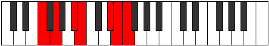

# Mode Zarimic

## Links

- [Documentation](index.md)
- [Scales Index](Scales.md)
- [Modes Index](Modes.md)
- [Chords Index](Chords.md)

## Parent Scale

[Kanimic](ScaleKanimic.md)

## Number

[3173](https://ianring.com/musictheory/scales/3173)

## Perfection

- 3 Perfect notes
- 3 Perfect notes

## Perfection Profile

[false false true false true true]

## Permutations

| Tonic | Notes | Signature | Illustration | Audio |
|-------|-------|-----------|--------------|-------|
| [C](ModeCNaturalZarimic.md) | **C**, **D**, E#, **F#**, G###, A##, **C** | C |  | [midi](ModeCNaturalZarimic.mid) [ogg](ModeCNaturalZarimic.ogg) |
| [C#](ModeCSharpZarimic.md) | **C#**, **D#**, E##, **F##**, Cb, Dbb, **C#** | C |  | [midi](ModeCSharpZarimic.mid) [ogg](ModeCSharpZarimic.ogg) |
| [Db](ModeDFlatZarimic.md) | **Db**, **Eb**, F#, **G**, A##, B#, **Db** | C |  | [midi](ModeDFlatZarimic.mid) [ogg](ModeDFlatZarimic.ogg) |
| [D](ModeDNaturalZarimic.md) | **D**, **E**, F##, **G#**, A###, B##, **D** | C |  | [midi](ModeDNaturalZarimic.mid) [ogg](ModeDNaturalZarimic.ogg) |
| [D#](ModeDSharpZarimic.md) | **D#**, **E#**, F###, **G##**, Db, Ebb, **D#** | C |  | [midi](ModeDSharpZarimic.mid) [ogg](ModeDSharpZarimic.ogg) |
| [Eb](ModeEFlatZarimic.md) | **Eb**, **F**, G#, **A**, B##, C##, **Eb** | C |  | [midi](ModeEFlatZarimic.mid) [ogg](ModeEFlatZarimic.ogg) |
| [E](ModeENaturalZarimic.md) | **E**, **F#**, G##, **A#**, B###, C###, **E** | C |  | [midi](ModeENaturalZarimic.mid) [ogg](ModeENaturalZarimic.ogg) |
| [F](ModeFNaturalZarimic.md) | **F**, **G**, A#, **B**, C###, D##, **F** | C |  | [midi](ModeFNaturalZarimic.mid) [ogg](ModeFNaturalZarimic.ogg) |
| [F#](ModeFSharpZarimic.md) | **F#**, **G#**, A##, **B#**, D##, E#, **F#** | C |  | [midi](ModeFSharpZarimic.mid) [ogg](ModeFSharpZarimic.ogg) |
| [Gb](ModeGFlatZarimic.md) | **Gb**, **Ab**, B, **C**, D##, E#, **Gb** | C |  | [midi](ModeGFlatZarimic.mid) [ogg](ModeGFlatZarimic.ogg) |
| [G](ModeGNaturalZarimic.md) | **G**, **A**, B#, **C#**, D###, E##, **G** | C |  | [midi](ModeGNaturalZarimic.mid) [ogg](ModeGNaturalZarimic.ogg) |
| [G#](ModeGSharpZarimic.md) | **G#**, **A#**, B##, **C##**, E##, F##, **G#** | C |  | [midi](ModeGSharpZarimic.mid) [ogg](ModeGSharpZarimic.ogg) |
| [Ab](ModeAFlatZarimic.md) | **Ab**, **Bb**, C#, **D**, E##, F##, **Ab** | C |  | [midi](ModeAFlatZarimic.mid) [ogg](ModeAFlatZarimic.ogg) |
| [A](ModeANaturalZarimic.md) | **A**, **B**, C##, **D#**, E###, F###, **A** | C |  | [midi](ModeANaturalZarimic.mid) [ogg](ModeANaturalZarimic.ogg) |
| [A#](ModeASharpZarimic.md) | **A#**, **B#**, C###, **D##**, F###, G##, **A#** | C |  | [midi](ModeASharpZarimic.mid) [ogg](ModeASharpZarimic.ogg) |
| [Bb](ModeBFlatZarimic.md) | **Bb**, **C**, D#, **E**, F###, G##, **Bb** | C |  | [midi](ModeBFlatZarimic.mid) [ogg](ModeBFlatZarimic.ogg) |
| [B](ModeBNaturalZarimic.md) | **B**, **C#**, D##, **E#**, Cbbb, Cbb, **B** | C |  | [midi](ModeBNaturalZarimic.mid) [ogg](ModeBNaturalZarimic.ogg) |
