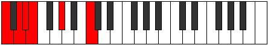
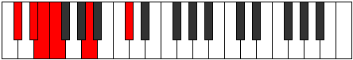

# Mode Zaritonic

## Links

- [Documentation](index.md)
- [Scales Index](Scales.md)
- [Modes Index](Modes.md)
- [Chords Index](Chords.md)

## Parent Scale

[Zylitonic](ScaleZylitonic.md)

## Number

[285](https://ianring.com/musictheory/scales/285)

## Perfection

- 1 Perfect notes
- 4 Perfect notes

## Perfection Profile

[false false false false true]

## Permutations

| Tonic | Notes | Signature | Illustration | Audio |
|-------|-------|-----------|--------------|-------|
| [C](ModeCNaturalZaritonic.md) | **C**, **D**, **D#**, **E**, G#, **C** | C |  | [midi](ModeCNaturalZaritonic.mid) [ogg](ModeCNaturalZaritonic.ogg) |
| [C#](ModeCSharpZaritonic.md) | **C#**, **D#**, **E**, **F**, A, **C#** | C |  | [midi](ModeCSharpZaritonic.mid) [ogg](ModeCSharpZaritonic.ogg) |
| [Db](ModeDFlatZaritonic.md) | **Db**, **Eb**, **E**, **F**, A, **Db** | C |  | [midi](ModeDFlatZaritonic.mid) [ogg](ModeDFlatZaritonic.ogg) |
| [D](ModeDNaturalZaritonic.md) | **D**, **E**, **F**, **F#**, A#, **D** | C |  | [midi](ModeDNaturalZaritonic.mid) [ogg](ModeDNaturalZaritonic.ogg) |
| [D#](ModeDSharpZaritonic.md) | **D#**, **F**, **F#**, **G**, B, **D#** | C |  | [midi](ModeDSharpZaritonic.mid) [ogg](ModeDSharpZaritonic.ogg) |
| [Eb](ModeEFlatZaritonic.md) | **Eb**, **F**, **Gb**, **G**, B, **Eb** | C |  | [midi](ModeEFlatZaritonic.mid) [ogg](ModeEFlatZaritonic.ogg) |
| [E](ModeENaturalZaritonic.md) | **E**, **F#**, **G**, **G#**, C, **E** | C |  | [midi](ModeENaturalZaritonic.mid) [ogg](ModeENaturalZaritonic.ogg) |
| [F](ModeFNaturalZaritonic.md) | **F**, **G**, **G#**, **A**, C#, **F** | C |  | [midi](ModeFNaturalZaritonic.mid) [ogg](ModeFNaturalZaritonic.ogg) |
| [F#](ModeFSharpZaritonic.md) | **F#**, **G#**, **A**, **A#**, D, **F#** | C |  | [midi](ModeFSharpZaritonic.mid) [ogg](ModeFSharpZaritonic.ogg) |
| [Gb](ModeGFlatZaritonic.md) | **Gb**, **Ab**, **A**, **Bb**, D, **Gb** | C |  | [midi](ModeGFlatZaritonic.mid) [ogg](ModeGFlatZaritonic.ogg) |
| [G](ModeGNaturalZaritonic.md) | **G**, **A**, **A#**, **B**, D#, **G** | C |  | [midi](ModeGNaturalZaritonic.mid) [ogg](ModeGNaturalZaritonic.ogg) |
| [G#](ModeGSharpZaritonic.md) | **G#**, **A#**, **B**, **C**, E, **G#** | C |  | [midi](ModeGSharpZaritonic.mid) [ogg](ModeGSharpZaritonic.ogg) |
| [Ab](ModeAFlatZaritonic.md) | **Ab**, **Bb**, **B**, **C**, E, **Ab** | C |  | [midi](ModeAFlatZaritonic.mid) [ogg](ModeAFlatZaritonic.ogg) |
| [A](ModeANaturalZaritonic.md) | **A**, **B**, **C**, **C#**, F, **A** | C |  | [midi](ModeANaturalZaritonic.mid) [ogg](ModeANaturalZaritonic.ogg) |
| [A#](ModeASharpZaritonic.md) | **A#**, **C**, **C#**, **D**, F#, **A#** | C |  | [midi](ModeASharpZaritonic.mid) [ogg](ModeASharpZaritonic.ogg) |
| [Bb](ModeBFlatZaritonic.md) | **Bb**, **C**, **Db**, **D**, Gb, **Bb** | C |  | [midi](ModeBFlatZaritonic.mid) [ogg](ModeBFlatZaritonic.ogg) |
| [B](ModeBNaturalZaritonic.md) | **B**, **C#**, **D**, **D#**, G, **B** | C |  | [midi](ModeBNaturalZaritonic.mid) [ogg](ModeBNaturalZaritonic.ogg) |
