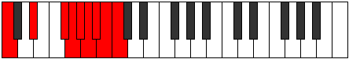
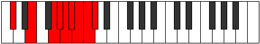
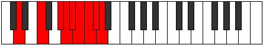
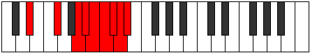
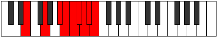
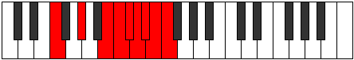
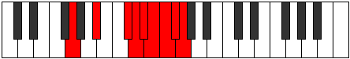
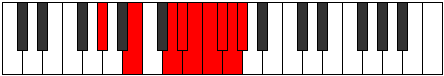
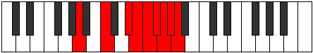
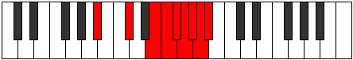

# Mode Zaryllic

## Links

- [Documentation](index.md)
- [Scales Index](Scales.md)
- [Modes Index](Modes.md)
- [Chords Index](Chords.md)

## Parent Scale

[Zaryllic](ScaleZaryllic.md)

## Number

[4041](https://ianring.com/musictheory/scales/4041)

## Perfection

- 4 Perfect notes
- 4 Perfect notes

## Interval Pattern

3, 3, 1, 1, 1, 1, 1, 1

## Perfection Profile

[true true false false true false false true]

## Permutations

| Tonic | Notes | Signature | Illustration | Audio |
|-------|-------|-----------|--------------|-------|
| [C](ModeCNaturalZaryllic.md) | C, D#, **F#**, **G**, G#, **A**, **A#**, B, C | C |  | [midi](https://github.com/edipermadi/music/blob/main/docs/ModeCNaturalZaryllic.mid?raw=true) |
| [C#](ModeCSharpZaryllic.md) | C#, E, **G**, **G#**, A, **A#**, **B**, C, C# | C |  | [midi](https://github.com/edipermadi/music/blob/main/docs/ModeCSharpZaryllic.mid?raw=true) |
| [Db](ModeDFlatZaryllic.md) | Db, E, **G**, **Ab**, A, **Bb**, **B**, C, Db | C |  | [midi](https://github.com/edipermadi/music/blob/main/docs/ModeDFlatZaryllic.mid?raw=true) |
| [D](ModeDNaturalZaryllic.md) | D, F, **G#**, **A**, A#, **B**, **C**, C#, D | C |  | [midi](https://github.com/edipermadi/music/blob/main/docs/ModeDNaturalZaryllic.mid?raw=true) |
| [D#](ModeDSharpZaryllic.md) | D#, F#, **A**, **A#**, B, **C**, **C#**, D, D# | C |  | [midi](https://github.com/edipermadi/music/blob/main/docs/ModeDSharpZaryllic.mid?raw=true) |
| [Eb](ModeEFlatZaryllic.md) | Eb, Gb, **A**, **Bb**, B, **C**, **Db**, D, Eb | C |  | [midi](https://github.com/edipermadi/music/blob/main/docs/ModeEFlatZaryllic.mid?raw=true) |
| [E](ModeENaturalZaryllic.md) | E, G, **A#**, **B**, C, **C#**, **D**, D#, E | C |  | [midi](https://github.com/edipermadi/music/blob/main/docs/ModeENaturalZaryllic.mid?raw=true) |
| [F](ModeFNaturalZaryllic.md) | F, G#, **B**, **C**, C#, **D**, **D#**, E, F | C |  | [midi](https://github.com/edipermadi/music/blob/main/docs/ModeFNaturalZaryllic.mid?raw=true) |
| [F#](ModeFSharpZaryllic.md) | F#, A, **C**, **C#**, D, **D#**, **E**, F, F# | C |  | [midi](https://github.com/edipermadi/music/blob/main/docs/ModeFSharpZaryllic.mid?raw=true) |
| [Gb](ModeGFlatZaryllic.md) | Gb, A, **C**, **Db**, D, **Eb**, **E**, F, Gb | C |  | [midi](https://github.com/edipermadi/music/blob/main/docs/ModeGFlatZaryllic.mid?raw=true) |
| [G](ModeGNaturalZaryllic.md) | G, A#, **C#**, **D**, D#, **E**, **F**, F#, G | C |  | [midi](https://github.com/edipermadi/music/blob/main/docs/ModeGNaturalZaryllic.mid?raw=true) |
| [G#](ModeGSharpZaryllic.md) | G#, B, **D**, **D#**, E, **F**, **F#**, G, G# | C |  | [midi](https://github.com/edipermadi/music/blob/main/docs/ModeGSharpZaryllic.mid?raw=true) |
| [Ab](ModeAFlatZaryllic.md) | Ab, B, **D**, **Eb**, E, **F**, **Gb**, G, Ab | C |  | [midi](https://github.com/edipermadi/music/blob/main/docs/ModeAFlatZaryllic.mid?raw=true) |
| [A](ModeANaturalZaryllic.md) | A, C, **D#**, **E**, F, **F#**, **G**, G#, A | C |  | [midi](https://github.com/edipermadi/music/blob/main/docs/ModeANaturalZaryllic.mid?raw=true) |
| [A#](ModeASharpZaryllic.md) | A#, C#, **E**, **F**, F#, **G**, **G#**, A, A# | C |  | [midi](https://github.com/edipermadi/music/blob/main/docs/ModeASharpZaryllic.mid?raw=true) |
| [Bb](ModeBFlatZaryllic.md) | Bb, Db, **E**, **F**, Gb, **G**, **Ab**, A, Bb | C |  | [midi](https://github.com/edipermadi/music/blob/main/docs/ModeBFlatZaryllic.mid?raw=true) |
| [B](ModeBNaturalZaryllic.md) | B, D, **F**, **F#**, G, **G#**, **A**, A#, B | C |  | [midi](https://github.com/edipermadi/music/blob/main/docs/ModeBNaturalZaryllic.mid?raw=true) |
