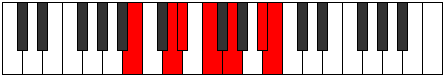

# Mode Zathimic

## Links

- [Documentation](index.md)
- [Scales Index](Scales.md)
- [Modes Index](Modes.md)
- [Chords Index](Chords.md)

## Parent Scale

[Dynimic](ScaleDynimic.md)

## Number

[2393](https://ianring.com/musictheory/scales/2393)

## Perfection

- 3 Perfect notes
- 3 Perfect notes

## Interval Pattern

3, 1, 2, 2, 3, 1

## Perfection Profile

[false false true false true true]

## Permutations

| Tonic | Notes | Signature | Illustration | Audio |
|-------|-------|-----------|--------------|-------|
| [C](ModeCNaturalZathimic.md) | **C**, **D#**, E, **F#**, G#, A##, **C** | C |  | [midi](https://github.com/edipermadi/music/blob/main/docs/ModeCNaturalZathimic.mid?raw=true) |
| [C#](ModeCSharpZathimic.md) | **C#**, **D##**, E#, **F##**, G##, A###, **C#** | C |  | [midi](https://github.com/edipermadi/music/blob/main/docs/ModeCSharpZathimic.mid?raw=true) |
| [Db](ModeDFlatZathimic.md) | **Db**, **E**, F, **G**, A, B#, **Db** | C |  | [midi](https://github.com/edipermadi/music/blob/main/docs/ModeDFlatZathimic.mid?raw=true) |
| [D](ModeDNaturalZathimic.md) | **D**, **E#**, F#, **G#**, A#, B##, **D** | C |  | [midi](https://github.com/edipermadi/music/blob/main/docs/ModeDNaturalZathimic.mid?raw=true) |
| [D#](ModeDSharpZathimic.md) | **D#**, **E##**, F##, **G##**, A##, B###, **D#** | C |  | [midi](https://github.com/edipermadi/music/blob/main/docs/ModeDSharpZathimic.mid?raw=true) |
| [Eb](ModeEFlatZathimic.md) | **Eb**, **F#**, G, **A**, B, C##, **Eb** | C |  | [midi](https://github.com/edipermadi/music/blob/main/docs/ModeEFlatZathimic.mid?raw=true) |
| [E](ModeENaturalZathimic.md) | **E**, **F##**, G#, **A#**, B#, C###, **E** | C |  | [midi](https://github.com/edipermadi/music/blob/main/docs/ModeENaturalZathimic.mid?raw=true) |
| [F](ModeFNaturalZathimic.md) | **F**, **G#**, A, **B**, C#, D##, **F** | C |  | [midi](https://github.com/edipermadi/music/blob/main/docs/ModeFNaturalZathimic.mid?raw=true) |
| [F#](ModeFSharpZathimic.md) | **F#**, **G##**, A#, **B#**, C##, D###, **F#** | C |  | [midi](https://github.com/edipermadi/music/blob/main/docs/ModeFSharpZathimic.mid?raw=true) |
| [Gb](ModeGFlatZathimic.md) | **Gb**, **A**, Bb, **C**, D, E#, **Gb** | C |  | [midi](https://github.com/edipermadi/music/blob/main/docs/ModeGFlatZathimic.mid?raw=true) |
| [G](ModeGNaturalZathimic.md) | **G**, **A#**, B, **C#**, D#, E##, **G** | C |  | [midi](https://github.com/edipermadi/music/blob/main/docs/ModeGNaturalZathimic.mid?raw=true) |
| [G#](ModeGSharpZathimic.md) | **G#**, **A##**, B#, **C##**, D##, E###, **G#** | C |  | [midi](https://github.com/edipermadi/music/blob/main/docs/ModeGSharpZathimic.mid?raw=true) |
| [Ab](ModeAFlatZathimic.md) | **Ab**, **B**, C, **D**, E, F##, **Ab** | C |  | [midi](https://github.com/edipermadi/music/blob/main/docs/ModeAFlatZathimic.mid?raw=true) |
| [A](ModeANaturalZathimic.md) | **A**, **B#**, C#, **D#**, E#, F###, **A** | C |  | [midi](https://github.com/edipermadi/music/blob/main/docs/ModeANaturalZathimic.mid?raw=true) |
| [A#](ModeASharpZathimic.md) | **A#**, **B##**, C##, **D##**, E##, Cbbb, **A#** | C |  | [midi](https://github.com/edipermadi/music/blob/main/docs/ModeASharpZathimic.mid?raw=true) |
| [Bb](ModeBFlatZathimic.md) | **Bb**, **C#**, D, **E**, F#, G##, **Bb** | C |  | [midi](https://github.com/edipermadi/music/blob/main/docs/ModeBFlatZathimic.mid?raw=true) |
| [B](ModeBNaturalZathimic.md) | **B**, **C##**, D#, **E#**, F##, G###, **B** | C |  | [midi](https://github.com/edipermadi/music/blob/main/docs/ModeBNaturalZathimic.mid?raw=true) |
