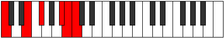
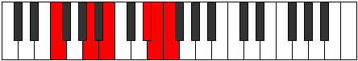
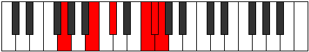
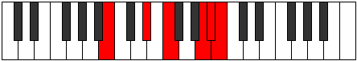

# Mode Zathitonic

## Links

- [Documentation](index.md)
- [Scales Index](Scales.md)
- [Modes Index](Modes.md)
- [Chords Index](Chords.md)

## Parent Scale

[Zathitonic](ScaleZathitonic.md)

## Number

[3153](https://ianring.com/musictheory/scales/3153)

## Perfection

- 2 Perfect notes
- 3 Perfect notes

## Perfection Profile

[false true false false true]

## Permutations

| Tonic | Notes | Signature | Illustration | Audio |
|-------|-------|-----------|--------------|-------|
| [C](ModeCNaturalZathitonic.md) | **C**, E, **F#**, **A#**, B, **C** | C |  | [midi](ModeCNaturalZathitonic.mid) [ogg](ModeCNaturalZathitonic.ogg) |
| [C#](ModeCSharpZathitonic.md) | **C#**, F, **G**, **B**, C, **C#** | C |  | [midi](ModeCSharpZathitonic.mid) [ogg](ModeCSharpZathitonic.ogg) |
| [Db](ModeDFlatZathitonic.md) | **Db**, F, **G**, **B**, C, **Db** | C |  | [midi](ModeDFlatZathitonic.mid) [ogg](ModeDFlatZathitonic.ogg) |
| [D](ModeDNaturalZathitonic.md) | **D**, F#, **G#**, **C**, C#, **D** | C |  | [midi](ModeDNaturalZathitonic.mid) [ogg](ModeDNaturalZathitonic.ogg) |
| [D#](ModeDSharpZathitonic.md) | **D#**, G, **A**, **C#**, D, **D#** | C |  | [midi](ModeDSharpZathitonic.mid) [ogg](ModeDSharpZathitonic.ogg) |
| [Eb](ModeEFlatZathitonic.md) | **Eb**, G, **A**, **Db**, D, **Eb** | C |  | [midi](ModeEFlatZathitonic.mid) [ogg](ModeEFlatZathitonic.ogg) |
| [E](ModeENaturalZathitonic.md) | **E**, G#, **A#**, **D**, D#, **E** | C |  | [midi](ModeENaturalZathitonic.mid) [ogg](ModeENaturalZathitonic.ogg) |
| [F](ModeFNaturalZathitonic.md) | **F**, A, **B**, **D#**, E, **F** | C |  | [midi](ModeFNaturalZathitonic.mid) [ogg](ModeFNaturalZathitonic.ogg) |
| [F#](ModeFSharpZathitonic.md) | **F#**, A#, **C**, **E**, F, **F#** | C |  | [midi](ModeFSharpZathitonic.mid) [ogg](ModeFSharpZathitonic.ogg) |
| [Gb](ModeGFlatZathitonic.md) | **Gb**, Bb, **C**, **E**, F, **Gb** | C |  | [midi](ModeGFlatZathitonic.mid) [ogg](ModeGFlatZathitonic.ogg) |
| [G](ModeGNaturalZathitonic.md) | **G**, B, **C#**, **F**, F#, **G** | C |  | [midi](ModeGNaturalZathitonic.mid) [ogg](ModeGNaturalZathitonic.ogg) |
| [G#](ModeGSharpZathitonic.md) | **G#**, C, **D**, **F#**, G, **G#** | C |  | [midi](ModeGSharpZathitonic.mid) [ogg](ModeGSharpZathitonic.ogg) |
| [Ab](ModeAFlatZathitonic.md) | **Ab**, C, **D**, **Gb**, G, **Ab** | C |  | [midi](ModeAFlatZathitonic.mid) [ogg](ModeAFlatZathitonic.ogg) |
| [A](ModeANaturalZathitonic.md) | **A**, C#, **D#**, **G**, G#, **A** | C |  | [midi](ModeANaturalZathitonic.mid) [ogg](ModeANaturalZathitonic.ogg) |
| [A#](ModeASharpZathitonic.md) | **A#**, D, **E**, **G#**, A, **A#** | C |  | [midi](ModeASharpZathitonic.mid) [ogg](ModeASharpZathitonic.ogg) |
| [Bb](ModeBFlatZathitonic.md) | **Bb**, D, **E**, **Ab**, A, **Bb** | C |  | [midi](ModeBFlatZathitonic.mid) [ogg](ModeBFlatZathitonic.ogg) |
| [B](ModeBNaturalZathitonic.md) | **B**, D#, **F**, **A**, A#, **B** | C |  | [midi](ModeBNaturalZathitonic.mid) [ogg](ModeBNaturalZathitonic.ogg) |
