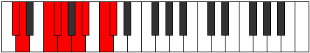
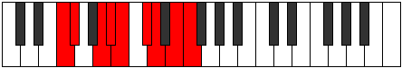
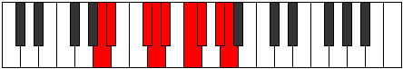

# Mode Zathyllic

## Links

- [Documentation](index.md)
- [Scales Index](Scales.md)
- [Modes Index](Modes.md)
- [Chords Index](Chords.md)

## Parent Scale

[Dydyllic](ScaleDydyllic.md)

## Number

[2931](https://ianring.com/musictheory/scales/2931)

## Perfection

- 6 Perfect notes
- 2 Perfect notes

## Perfection Profile

[false true true true true false true true]

## Permutations

| Tonic | Notes | Signature | Illustration | Audio |
|-------|-------|-----------|--------------|-------|
| [C](ModeCNaturalZathyllic.md) | **C**, C#, E, F, F#, **G#**, A, B, **C** | C |  | [midi](https://github.com/edipermadi/music/blob/main/docs/ModeCNaturalZathyllic.mid?raw=true) |
| [C#](ModeCSharpZathyllic.md) | **C#**, D, F, F#, G, **A**, A#, C, **C#** | C |  | [midi](https://github.com/edipermadi/music/blob/main/docs/ModeCSharpZathyllic.mid?raw=true) |
| [Db](ModeDFlatZathyllic.md) | **Db**, D, F, Gb, G, **A**, Bb, C, **Db** | C |  | [midi](https://github.com/edipermadi/music/blob/main/docs/ModeDFlatZathyllic.mid?raw=true) |
| [D](ModeDNaturalZathyllic.md) | **D**, D#, F#, G, G#, **A#**, B, C#, **D** | C |  | [midi](https://github.com/edipermadi/music/blob/main/docs/ModeDNaturalZathyllic.mid?raw=true) |
| [D#](ModeDSharpZathyllic.md) | **D#**, E, G, G#, A, **B**, C, D, **D#** | C |  | [midi](https://github.com/edipermadi/music/blob/main/docs/ModeDSharpZathyllic.mid?raw=true) |
| [Eb](ModeEFlatZathyllic.md) | **Eb**, E, G, Ab, A, **B**, C, D, **Eb** | C |  | [midi](https://github.com/edipermadi/music/blob/main/docs/ModeEFlatZathyllic.mid?raw=true) |
| [E](ModeENaturalZathyllic.md) | **E**, F, G#, A, A#, **C**, C#, D#, **E** | C |  | [midi](https://github.com/edipermadi/music/blob/main/docs/ModeENaturalZathyllic.mid?raw=true) |
| [F](ModeFNaturalZathyllic.md) | **F**, F#, A, A#, B, **C#**, D, E, **F** | C |  | [midi](https://github.com/edipermadi/music/blob/main/docs/ModeFNaturalZathyllic.mid?raw=true) |
| [F#](ModeFSharpZathyllic.md) | **F#**, G, A#, B, C, **D**, D#, F, **F#** | C |  | [midi](https://github.com/edipermadi/music/blob/main/docs/ModeFSharpZathyllic.mid?raw=true) |
| [Gb](ModeGFlatZathyllic.md) | **Gb**, G, Bb, B, C, **D**, Eb, F, **Gb** | C |  | [midi](https://github.com/edipermadi/music/blob/main/docs/ModeGFlatZathyllic.mid?raw=true) |
| [G](ModeGNaturalZathyllic.md) | **G**, G#, B, C, C#, **D#**, E, F#, **G** | C |  | [midi](https://github.com/edipermadi/music/blob/main/docs/ModeGNaturalZathyllic.mid?raw=true) |
| [G#](ModeGSharpZathyllic.md) | **G#**, A, C, C#, D, **E**, F, G, **G#** | C |  | [midi](https://github.com/edipermadi/music/blob/main/docs/ModeGSharpZathyllic.mid?raw=true) |
| [Ab](ModeAFlatZathyllic.md) | **Ab**, A, C, Db, D, **E**, F, G, **Ab** | C |  | [midi](https://github.com/edipermadi/music/blob/main/docs/ModeAFlatZathyllic.mid?raw=true) |
| [A](ModeANaturalZathyllic.md) | **A**, A#, C#, D, D#, **F**, F#, G#, **A** | C |  | [midi](https://github.com/edipermadi/music/blob/main/docs/ModeANaturalZathyllic.mid?raw=true) |
| [A#](ModeASharpZathyllic.md) | **A#**, B, D, D#, E, **F#**, G, A, **A#** | C |  | [midi](https://github.com/edipermadi/music/blob/main/docs/ModeASharpZathyllic.mid?raw=true) |
| [Bb](ModeBFlatZathyllic.md) | **Bb**, B, D, Eb, E, **Gb**, G, A, **Bb** | C |  | [midi](https://github.com/edipermadi/music/blob/main/docs/ModeBFlatZathyllic.mid?raw=true) |
| [B](ModeBNaturalZathyllic.md) | **B**, C, D#, E, F, **G**, G#, A#, **B** | C |  | [midi](https://github.com/edipermadi/music/blob/main/docs/ModeBNaturalZathyllic.mid?raw=true) |
