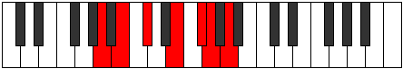

# Mode Zeracrimic

## Links

- [Documentation](index.md)
- [Scales Index](Scales.md)
- [Modes Index](Modes.md)
- [Chords Index](Chords.md)

## Parent Scale

[Phracrimic](ScalePhracrimic.md)

## Number

[1685](https://ianring.com/musictheory/scales/1685)

## Perfection

- 4 Perfect notes
- 2 Perfect notes

## Perfection Profile

[true true false true true false]

## Permutations

| Tonic | Notes | Signature | Illustration | Audio |
|-------|-------|-----------|--------------|-------|
| [C](ModeCNaturalZeracrimic.md) | C, D, **E**, F##, G##, **A#**, C | C |  | [midi](ModeCNaturalZeracrimic.mid) [ogg](ModeCNaturalZeracrimic.ogg) |
| [C#](ModeCSharpZeracrimic.md) | C#, D#, **E#**, F###, G###, **A##**, C# | C |  | [midi](ModeCSharpZeracrimic.mid) [ogg](ModeCSharpZeracrimic.ogg) |
| [Db](ModeDFlatZeracrimic.md) | Db, Eb, **F**, G#, A#, **B**, Db | C |  | [midi](ModeDFlatZeracrimic.mid) [ogg](ModeDFlatZeracrimic.ogg) |
| [D](ModeDNaturalZeracrimic.md) | D, E, **F#**, G##, A##, **B#**, D | C |  | [midi](ModeDNaturalZeracrimic.mid) [ogg](ModeDNaturalZeracrimic.ogg) |
| [D#](ModeDSharpZeracrimic.md) | D#, E#, **F##**, G###, A###, **B##**, D# | C |  | [midi](ModeDSharpZeracrimic.mid) [ogg](ModeDSharpZeracrimic.ogg) |
| [Eb](ModeEFlatZeracrimic.md) | Eb, F, **G**, A#, B#, **C#**, Eb | C |  | [midi](ModeEFlatZeracrimic.mid) [ogg](ModeEFlatZeracrimic.ogg) |
| [E](ModeENaturalZeracrimic.md) | E, F#, **G#**, A##, B##, **C##**, E | C |  | [midi](ModeENaturalZeracrimic.mid) [ogg](ModeENaturalZeracrimic.ogg) |
| [F](ModeFNaturalZeracrimic.md) | F, G, **A**, B#, C##, **D#**, F | C |  | [midi](ModeFNaturalZeracrimic.mid) [ogg](ModeFNaturalZeracrimic.ogg) |
| [F#](ModeFSharpZeracrimic.md) | F#, G#, **A#**, B##, C###, **D##**, F# | C |  | [midi](ModeFSharpZeracrimic.mid) [ogg](ModeFSharpZeracrimic.ogg) |
| [Gb](ModeGFlatZeracrimic.md) | Gb, Ab, **Bb**, C#, D#, **E**, Gb | C |  | [midi](ModeGFlatZeracrimic.mid) [ogg](ModeGFlatZeracrimic.ogg) |
| [G](ModeGNaturalZeracrimic.md) | G, A, **B**, C##, D##, **E#**, G | C |  | [midi](ModeGNaturalZeracrimic.mid) [ogg](ModeGNaturalZeracrimic.ogg) |
| [G#](ModeGSharpZeracrimic.md) | G#, A#, **B#**, C###, D###, **E##**, G# | C |  | [midi](ModeGSharpZeracrimic.mid) [ogg](ModeGSharpZeracrimic.ogg) |
| [Ab](ModeAFlatZeracrimic.md) | Ab, Bb, **C**, D#, E#, **F#**, Ab | C |  | [midi](ModeAFlatZeracrimic.mid) [ogg](ModeAFlatZeracrimic.ogg) |
| [A](ModeANaturalZeracrimic.md) | A, B, **C#**, D##, E##, **F##**, A | C |  | [midi](ModeANaturalZeracrimic.mid) [ogg](ModeANaturalZeracrimic.ogg) |
| [A#](ModeASharpZeracrimic.md) | A#, B#, **C##**, D###, E###, **F###**, A# | C |  | [midi](ModeASharpZeracrimic.mid) [ogg](ModeASharpZeracrimic.ogg) |
| [Bb](ModeBFlatZeracrimic.md) | Bb, C, **D**, E#, F##, **G#**, Bb | C |  | [midi](ModeBFlatZeracrimic.mid) [ogg](ModeBFlatZeracrimic.ogg) |
| [B](ModeBNaturalZeracrimic.md) | B, C#, **D#**, E##, F###, **G##**, B | C |  | [midi](ModeBNaturalZeracrimic.mid) [ogg](ModeBNaturalZeracrimic.ogg) |
