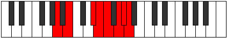

# Mode Zocrian

## Links

- [Documentation](README.md)
- [Scales Index](Scales.md)
- [Modes Index](Modes.md)
- [Chords Index](Chords.md)

## Parent Scale

[Katacrian](ScaleKatacrian.md)

## Number

[3525](https://ianring.com/musictheory/scales/3525)

## Transposition

2, 4, 1, 1, 2, 1, 1

## Chord Pattern

v⁰, v⁰

## Perfection

- 3 Perfect notes
- 4 Perfect notes

## Perfection Profile

[true false false true false false true]

## Permutations

| Tonic | Notes | Signature | Illustration | Audio |
|-------|-------|-----------|--------------|-------|
| [C](ModeCNaturalZocrian.md) | C, **D**, **E##**, F##, **G#**, **A#**, B, C | C |  | [midi](https://github.com/edipermadi/music/blob/main/docs/ModeCNaturalZocrian.mid?raw=true) |
| [C#](ModeCSharpZocrian.md) | C#, **D#**, **E###**, F###, **G##**, **A##**, B#, C# | C |  | [midi](https://github.com/edipermadi/music/blob/main/docs/ModeCSharpZocrian.mid?raw=true) |
| [Db](ModeDFlatZocrian.md) | Db, **Eb**, **F##**, G#, **A**, **B**, C, Db | C |  | [midi](https://github.com/edipermadi/music/blob/main/docs/ModeDFlatZocrian.mid?raw=true) |
| [D](ModeDNaturalZocrian.md) | D, **E**, **F###**, G##, **A#**, **B#**, C#, D | C |  | [midi](https://github.com/edipermadi/music/blob/main/docs/ModeDNaturalZocrian.mid?raw=true) |
| [D#](ModeDSharpZocrian.md) | D#, **E#**, **Cbbb**, Cbb, **Dbbb**, **Ebbb**, Fbbb, D# | C |  | [midi](https://github.com/edipermadi/music/blob/main/docs/ModeDSharpZocrian.mid?raw=true) |
| [Eb](ModeEFlatZocrian.md) | Eb, **F**, **G##**, A#, **B**, **C#**, D, Eb | C |  | [midi](https://github.com/edipermadi/music/blob/main/docs/ModeEFlatZocrian.mid?raw=true) |
| [E](ModeENaturalZocrian.md) | E, **F#**, **G###**, A##, **B#**, **C##**, D#, E | C |  | [midi](https://github.com/edipermadi/music/blob/main/docs/ModeENaturalZocrian.mid?raw=true) |
| [F](ModeFNaturalZocrian.md) | F, **G**, **A##**, B#, **C#**, **D#**, E, F | C |  | [midi](https://github.com/edipermadi/music/blob/main/docs/ModeFNaturalZocrian.mid?raw=true) |
| [F#](ModeFSharpZocrian.md) | F#, **G#**, **A###**, B##, **C##**, **D##**, E#, F# | C |  | [midi](https://github.com/edipermadi/music/blob/main/docs/ModeFSharpZocrian.mid?raw=true) |
| [Gb](ModeGFlatZocrian.md) | Gb, **Ab**, **B#**, C#, **D**, **E**, F, Gb | C |  | [midi](https://github.com/edipermadi/music/blob/main/docs/ModeGFlatZocrian.mid?raw=true) |
| [G](ModeGNaturalZocrian.md) | G, **A**, **B##**, C##, **D#**, **E#**, F#, G | C |  | [midi](https://github.com/edipermadi/music/blob/main/docs/ModeGNaturalZocrian.mid?raw=true) |
| [G#](ModeGSharpZocrian.md) | G#, **A#**, **B###**, C###, **D##**, **E##**, F##, G# | C |  | [midi](https://github.com/edipermadi/music/blob/main/docs/ModeGSharpZocrian.mid?raw=true) |
| [Ab](ModeAFlatZocrian.md) | Ab, **Bb**, **C##**, D#, **E**, **F#**, G, Ab | C |  | [midi](https://github.com/edipermadi/music/blob/main/docs/ModeAFlatZocrian.mid?raw=true) |
| [A](ModeANaturalZocrian.md) | A, **B**, **C###**, D##, **E#**, **F##**, G#, A | C |  | [midi](https://github.com/edipermadi/music/blob/main/docs/ModeANaturalZocrian.mid?raw=true) |
| [A#](ModeASharpZocrian.md) | A#, **B#**, **D##**, E#, **F#**, **G#**, A, A# | C |  | [midi](https://github.com/edipermadi/music/blob/main/docs/ModeASharpZocrian.mid?raw=true) |
| [Bb](ModeBFlatZocrian.md) | Bb, **C**, **D##**, E#, **F#**, **G#**, A, Bb | C |  | [midi](https://github.com/edipermadi/music/blob/main/docs/ModeBFlatZocrian.mid?raw=true) |
| [B](ModeBNaturalZocrian.md) | B, **C#**, **D###**, E##, **F##**, **G##**, A#, B | C |  | [midi](https://github.com/edipermadi/music/blob/main/docs/ModeBNaturalZocrian.mid?raw=true) |
