# Mode Zodian

## Links

- [Documentation](README.md)
- [Scales Index](Scales.md)
- [Modes Index](Modes.md)
- [Chords Index](Chords.md)

## Parent Scale

[Ranian](ScaleRanian.md)

## Number

[3251](https://ianring.com/musictheory/scales/3251)

## Interval Pattern

1, 3, 1, 2, 3, 1, 1

## Chord Pattern

I, iii

## Perfection

- 4 Perfect notes
- 3 Perfect notes

## Perfection Profile

[true false true true false true false]

## Permutations

| Tonic | Notes | Signature | Illustration | Audio |
|-------|-------|-----------|--------------|-------|
| [C](ModeCNaturalZodian.md) | C, **Db**, E, F, **G**, A#, **B**, C | C | 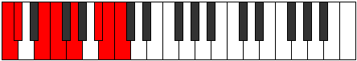 | [midi](https://github.com/edipermadi/music/blob/main/docs/ModeCNaturalZodian.mid?raw=true) |
| [C#](ModeCSharpZodian.md) | C#, **D**, E#, F#, **G#**, A##, **B#**, C# | C | 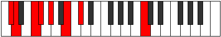 | [midi](https://github.com/edipermadi/music/blob/main/docs/ModeCSharpZodian.mid?raw=true) |
| [Db](ModeDFlatZodian.md) | Db, **Ebb**, F, Gb, **Ab**, B, **C**, Db | C | 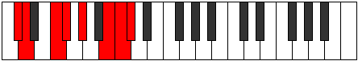 | [midi](https://github.com/edipermadi/music/blob/main/docs/ModeDFlatZodian.mid?raw=true) |
| [D](ModeDNaturalZodian.md) | D, **Eb**, F#, G, **A**, B#, **C#**, D | C | 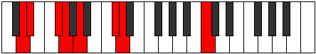 | [midi](https://github.com/edipermadi/music/blob/main/docs/ModeDNaturalZodian.mid?raw=true) |
| [D#](ModeDSharpZodian.md) | D#, **E**, F##, G#, **A#**, B##, **C##**, D# | C | 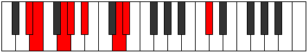 | [midi](https://github.com/edipermadi/music/blob/main/docs/ModeDSharpZodian.mid?raw=true) |
| [Eb](ModeEFlatZodian.md) | Eb, **Fb**, G, Ab, **Bb**, C#, **D**, Eb | C | 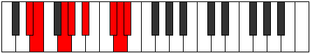 | [midi](https://github.com/edipermadi/music/blob/main/docs/ModeEFlatZodian.mid?raw=true) |
| [E](ModeENaturalZodian.md) | E, **F**, G#, A, **B**, C##, **D#**, E | C |  | [midi](https://github.com/edipermadi/music/blob/main/docs/ModeENaturalZodian.mid?raw=true) |
| [F](ModeFNaturalZodian.md) | F, **Gb**, A, Bb, **C**, D#, **E**, F | C |  | [midi](https://github.com/edipermadi/music/blob/main/docs/ModeFNaturalZodian.mid?raw=true) |
| [F#](ModeFSharpZodian.md) | F#, **G**, A#, B, **C#**, D##, **E#**, F# | C | 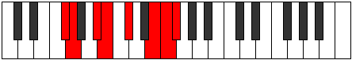 | [midi](https://github.com/edipermadi/music/blob/main/docs/ModeFSharpZodian.mid?raw=true) |
| [Gb](ModeGFlatZodian.md) | Gb, **Abb**, Bb, Cb, **Db**, E, **F**, Gb | C |  | [midi](https://github.com/edipermadi/music/blob/main/docs/ModeGFlatZodian.mid?raw=true) |
| [G](ModeGNaturalZodian.md) | G, **Ab**, B, C, **D**, E#, **F#**, G | C | 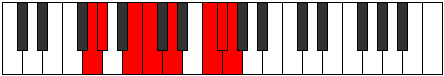 | [midi](https://github.com/edipermadi/music/blob/main/docs/ModeGNaturalZodian.mid?raw=true) |
| [G#](ModeGSharpZodian.md) | G#, **A**, B#, C#, **D#**, E##, **F##**, G# | C | 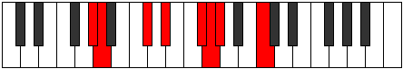 | [midi](https://github.com/edipermadi/music/blob/main/docs/ModeGSharpZodian.mid?raw=true) |
| [Ab](ModeAFlatZodian.md) | Ab, **Bbb**, C, Db, **Eb**, F#, **G**, Ab | C | 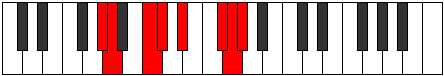 | [midi](https://github.com/edipermadi/music/blob/main/docs/ModeAFlatZodian.mid?raw=true) |
| [A](ModeANaturalZodian.md) | A, **Bb**, C#, D, **E**, F##, **G#**, A | C | 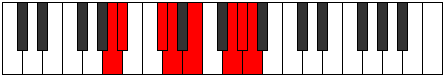 | [midi](https://github.com/edipermadi/music/blob/main/docs/ModeANaturalZodian.mid?raw=true) |
| [A#](ModeASharpZodian.md) | A#, **B**, C##, D#, **E#**, F###, **G##**, A# | C | 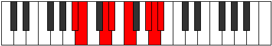 | [midi](https://github.com/edipermadi/music/blob/main/docs/ModeASharpZodian.mid?raw=true) |
| [Bb](ModeBFlatZodian.md) | Bb, **Cb**, D, Eb, **F**, G#, **A**, Bb | C |  | [midi](https://github.com/edipermadi/music/blob/main/docs/ModeBFlatZodian.mid?raw=true) |
| [B](ModeBNaturalZodian.md) | B, **C**, D#, E, **F#**, G##, **A#**, B | C | 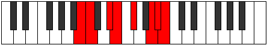 | [midi](https://github.com/edipermadi/music/blob/main/docs/ModeBNaturalZodian.mid?raw=true) |
