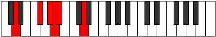
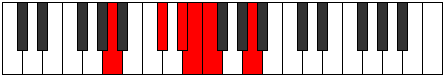

# Mode Zoditonic

## Links

- [Documentation](README.md)
- [Scales Index](Scales.md)
- [Modes Index](Modes.md)
- [Chords Index](Chords.md)

## Parent Scale

[Zylitonic](ScaleZylitonic.md)

## Number

[465](https://ianring.com/musictheory/scales/465)

## Interval Pattern

4, 2, 1, 1, 4

## Chord Pattern

## Perfection

- 1 Perfect notes
- 4 Perfect notes

## Perfection Profile

[true false false false false]

## Permutations

| Tonic | Notes | Signature | Illustration | Audio |
|-------|-------|-----------|--------------|-------|
| [C](ModeCNaturalZoditonic.md) | C, **E**, **F#**, **G**, **G#**, C | C |  | [midi](https://github.com/edipermadi/music/blob/main/docs/ModeCNaturalZoditonic.mid?raw=true) |
| [C#](ModeCSharpZoditonic.md) | C#, **F**, **G**, **G#**, **A**, C# | C |  | [midi](https://github.com/edipermadi/music/blob/main/docs/ModeCSharpZoditonic.mid?raw=true) |
| [Db](ModeDFlatZoditonic.md) | Db, **F**, **G**, **Ab**, **A**, Db | C |  | [midi](https://github.com/edipermadi/music/blob/main/docs/ModeDFlatZoditonic.mid?raw=true) |
| [D](ModeDNaturalZoditonic.md) | D, **F#**, **G#**, **A**, **A#**, D | C |  | [midi](https://github.com/edipermadi/music/blob/main/docs/ModeDNaturalZoditonic.mid?raw=true) |
| [D#](ModeDSharpZoditonic.md) | D#, **G**, **A**, **A#**, **B**, D# | C |  | [midi](https://github.com/edipermadi/music/blob/main/docs/ModeDSharpZoditonic.mid?raw=true) |
| [Eb](ModeEFlatZoditonic.md) | Eb, **G**, **A**, **Bb**, **B**, Eb | C |  | [midi](https://github.com/edipermadi/music/blob/main/docs/ModeEFlatZoditonic.mid?raw=true) |
| [E](ModeENaturalZoditonic.md) | E, **G#**, **A#**, **B**, **C**, E | C |  | [midi](https://github.com/edipermadi/music/blob/main/docs/ModeENaturalZoditonic.mid?raw=true) |
| [F](ModeFNaturalZoditonic.md) | F, **A**, **B**, **C**, **C#**, F | C |  | [midi](https://github.com/edipermadi/music/blob/main/docs/ModeFNaturalZoditonic.mid?raw=true) |
| [F#](ModeFSharpZoditonic.md) | F#, **A#**, **C**, **C#**, **D**, F# | C |  | [midi](https://github.com/edipermadi/music/blob/main/docs/ModeFSharpZoditonic.mid?raw=true) |
| [Gb](ModeGFlatZoditonic.md) | Gb, **Bb**, **C**, **Db**, **D**, Gb | C |  | [midi](https://github.com/edipermadi/music/blob/main/docs/ModeGFlatZoditonic.mid?raw=true) |
| [G](ModeGNaturalZoditonic.md) | G, **B**, **C#**, **D**, **D#**, G | C |  | [midi](https://github.com/edipermadi/music/blob/main/docs/ModeGNaturalZoditonic.mid?raw=true) |
| [G#](ModeGSharpZoditonic.md) | G#, **C**, **D**, **D#**, **E**, G# | C |  | [midi](https://github.com/edipermadi/music/blob/main/docs/ModeGSharpZoditonic.mid?raw=true) |
| [Ab](ModeAFlatZoditonic.md) | Ab, **C**, **D**, **Eb**, **E**, Ab | C |  | [midi](https://github.com/edipermadi/music/blob/main/docs/ModeAFlatZoditonic.mid?raw=true) |
| [A](ModeANaturalZoditonic.md) | A, **C#**, **D#**, **E**, **F**, A | C |  | [midi](https://github.com/edipermadi/music/blob/main/docs/ModeANaturalZoditonic.mid?raw=true) |
| [A#](ModeASharpZoditonic.md) | A#, **D**, **E**, **F**, **F#**, A# | C |  | [midi](https://github.com/edipermadi/music/blob/main/docs/ModeASharpZoditonic.mid?raw=true) |
| [Bb](ModeBFlatZoditonic.md) | Bb, **D**, **E**, **F**, **Gb**, Bb | C |  | [midi](https://github.com/edipermadi/music/blob/main/docs/ModeBFlatZoditonic.mid?raw=true) |
| [B](ModeBNaturalZoditonic.md) | B, **D#**, **F**, **F#**, **G**, B | C |  | [midi](https://github.com/edipermadi/music/blob/main/docs/ModeBNaturalZoditonic.mid?raw=true) |
